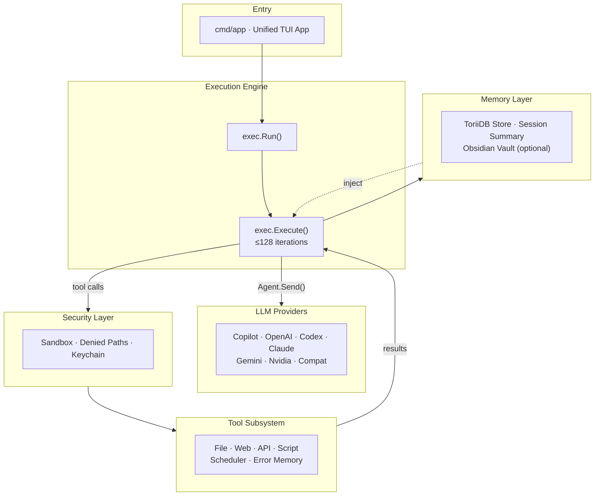

> [!NOTE]
> This README was generated by [SKILL](https://github.com/pardnchiu/skill-readme-generate), get the ZH version from [here](./doc/README.zh.md).<br>
> Tests are generated by [SKILL](https://github.com/pardnchiu/skill-coverage-generate).

***

<p align="center">
<picture>

</picture>
</p>

<p align="center">
  <strong>BUILD YOUR OWN OPENCLAW WITH AGENVOY!</strong>
</p>

<p align="center">
<a href="https://pkg.go.dev/github.com/pardnchiu/agenvoy"></a>
<a href="https://app.codecov.io/github/pardnchiu/agenvoy/tree/master"></a>
<a href="LICENSE"></a>
<a href="https://github.com/pardnchiu/agenvoy/releases"></a>
<a href="https://discord.gg/CHTtXmh7Ca"></a>
</p>

***

# Agenvoy

> A Go AI agent framework with self-improving error memory, intelligent multi-provider routing, Python/JS/REST API tool extensions, and OS-native sandbox execution

The agent learns from past failures across sessions, routes each task to the right LLM provider automatically, and lets you extend its toolset by dropping a script or JSON file — all running inside an OS-native sandbox.


> Terminal UI consolidating CLI, Discord bot, and REST API into a single local interface — filesystem browser, session content viewer, and live log stream.

## Table of Contents

- [Architecture](#architecture)
- [Features](#features)
- [Concepts](#concepts)
- [File Structure](#file-structure)
- [Version History](#version-history)
- [License](#license)
- [Author](#author)
- [Stars](#stars)

## Architecture

> [Full Architecture](./doc/architecture.md)


```mermaid
graph TB
    subgraph Entry ["Entry"]
        App["cmd/app · Unified TUI App"]
    end

    subgraph Engine ["Execution Engine"]
        Run["exec.Run()"]
        Execute["exec.Execute()\n≤128 iterations"]
    end

    subgraph Providers ["LLM Providers"]
        P["Copilot · OpenAI · Codex · Claude\nGemini · Nvidia · Compat"]
    end

    subgraph Security ["Security Layer"]
        S["Sandbox · Denied Paths · Keychain"]
    end

    subgraph Tools ["Tool Subsystem"]
        T["File · Web · API · Script\nScheduler · Error Memory"]
    end

    subgraph Memory ["Memory Layer"]
        M["ToriiDB Store · Session Summary\nObsidian Vault (optional)"]
    end

    App --> Run
    Run --> Execute
    Execute -->|"Agent.Send()"| Providers
    Execute -->|"tool calls"| Security
    Security --> Tools
    Tools -->|"results"| Execute
    Execute --> Memory
    Memory -.->|"inject"| Execute
```

## Features

> `make build` · `agen` (unified CLI / TUI / Discord / REST API) · [Documentation](./doc/doc.md)

### TUI Dashboard with Vim-Style Controls

Consolidates CLI, Discord bot, and REST API into a single terminal interface with vim-style navigation keys and a `:` command input mode.

### Multi-Provider LLM with Intelligent Routing

Seven backends (Copilot / OpenAI / Codex / Claude / Gemini / Nvidia / Compat) behind a unified `Agent` interface, with a planner LLM picking the right provider per task.

### Script & API Tool Extensions

Drop a `tool.json` + `script.js`/`script.py` to register a script tool, or a JSON file to wire any HTTP API as a tool — no Go code, no recompilation.

### OS-Native Sandbox Isolation

All commands run inside bubblewrap (Linux) or `sandbox-exec` (macOS), with path escapes and sensitive files blocked at the OS level.

### Persistent Error Memory

Tool failures are SHA-256 indexed into a knowledge base that the agent recalls and reuses across sessions.

### Obsidian Vault Memory Integration

When connected to Obsidian Local REST API, `memory_search` / `memory_search_tag` / `memory_tags` / `memory_list` provide cross-session semantic and tag-based recall directly against the vault.

### ToriiDB Storage Layer

Session history, error memory, and `fetch_page` / `search_web` / `google_rss` caches are backed by ToriiDB, replacing scattered JSON file storage.

### Chunked Multi-Pass Summarization

Summary generation runs on an hourly cron with chunked multi-pass processing so long sessions never overflow the context window in a single call.

### Deferred Tool Loading via search_tools

`search_tools` is always on — the agent injects tools on demand through fuzzy search, `select:<name>` direct activation, or `+term` required-match syntax, with no upfront schema load.

### Prompt Caching Across All Providers

Repeated system prompts and context segments are cached at the Claude, Gemini, and Copilot endpoints, cutting latency and token cost on subsequent calls within the same context.

### External Agent Verification & Internal Review

`review_result` runs a priority-ordered internal model for self-review, `verify_with_external_agent` dispatches the result to all declared external agents in parallel and merges feedback, and `call_external_agent` delegates an entire task to a named agent.

## Concepts

Three prior projects from the same author directly informed Agenvoy's architecture:

### Embedded Store as Memory Backbone — [pardnchiu/ToriiDB](https://github.com/pardnchiu/ToriiDB)

[pardnchiu/ToriiDB](https://github.com/pardnchiu/ToriiDB) is a lightweight embedded key-value store designed around the idea that process-local state should be durable, observable, and free of external dependencies. Agenvoy adopts it as the single backbone for all persistence — session history, error memory, and web tool caches (`fetch_page` / `search_web` / `fetch_google_rss`) all live behind a thin `filesystem/store` wrapper instead of scattered JSON files. This collapses what used to be per-subsystem file formats into one indexed, atomic store, lets `search_history` and `search_errors` scan sessions without walking the filesystem, and makes cache invalidation a matter of deleting a key rather than orchestrating file locks.

### Script Tool as FaaS — [pardnchiu/go-faas](https://github.com/pardnchiu/go-faas)

[pardnchiu/go-faas](https://github.com/pardnchiu/go-faas) is a lightweight Function-as-a-Service platform that accepts Python, JavaScript, and TypeScript code via HTTP, executes each function inside a Bubblewrap sandbox with full Linux namespace isolation, and streams results. Agenvoy's script tool subsystem (`scriptAdapter`) adopts this model directly: each script tool is a stateless function invoked via stdin/stdout JSON, isolated to its own process, with the agent acting as the caller rather than an HTTP client.

### Cognitive Imperfect Memory — [pardnchiu/cim-prototype](https://github.com/pardnchiu/cim-prototype)

[pardnchiu/cim-prototype](https://github.com/pardnchiu/cim-prototype) argues that perfect memory is a cognitive burden — based on research showing multi-turn LLM performance drops 39% when full conversation history is replayed verbatim ([LLMs Get Lost In Multi-Turn Conversation](https://arxiv.org/abs/2505.06120)). The system maintains a structured rolling summary and retrieves relevant fragments via fuzzy search only when triggered, mirroring how humans selectively recall rather than replay. Agenvoy's session layer reflects this directly: `trimMessages()` enforces a token budget rather than replaying full history, `summary` is persisted and deep-merged across turns, and `search_history` / `memory_search` provide keyword-triggered recall rather than injecting all past context.

## File Structure

```
agenvoy/
├── cmd/
│   └── app/                    # Unified entry: CLI + TUI + Discord bot + REST API
├── configs/
│   ├── jsons/                  # Provider model defs, denied_map, whitelist
│   └── prompts/                # Embedded system prompts and selectors
├── extensions/
│   ├── apis/                   # Embedded API extensions (12+ JSON)
│   ├── scripts/                # Bundled script tools (Threads, yt-dlp)
│   └── skills/                 # Embedded skill extensions (Markdown)
├── internal/
│   ├── agents/                 # Execution engine, 7 provider backends, Agent interface
│   ├── discord/                # Discord slash commands + file attachments
│   ├── filesystem/
│   │   ├── keychain/           # OS Keychain API key storage
│   │   ├── store/              # ToriiDB store wrapper
│   │   └── obsidian.go         # Obsidian Local REST API client
│   ├── routes/                 # Gin router and REST API handlers
│   ├── sandbox/                # bubblewrap / sandbox-exec isolation
│   ├── scheduler/              # cron / one-time tasks + script runner
│   ├── session/                # Session state, config, rolling summary
│   ├── skill/                  # Markdown skill scanner
│   ├── toolAdapter/            # api / script tool translation and dispatch
│   ├── tools/                  # 30+ self-registering tools + external agent + search_tools
│   └── tui/                    # Terminal UI (tview) with vim-style shortcuts
├── install_threads.sh          # Cross-platform installer for Threads script tools
├── install_youtube.sh          # Cross-platform installer for yt-dlp script tools
├── go.mod
└── LICENSE
```

## Version History

- **v0.18.0** (unreleased) — Add vim-style TUI navigation keys and `:` command input mode. Migrate session history, error memory, and `fetch_page` / `search_web` / `google_rss` caches to the ToriiDB store. Replace per-request summary with an hourly cron running chunked multi-pass generation. Consolidate `cmd/cli` and `cmd/server` into a single `cmd/app` entry and rename the binary to `agen`. Add Obsidian Local REST API memory integration (`memory_search` / `memory_search_tag` / `memory_tags` / `memory_list`).
- **v0.17.4** — Add OpenAI Codex as a standalone OAuth provider (Device Code Flow with auto-refresh, default model `gpt-5.3-codex`). Add `read_image` tool to read local image files as base64 data URLs — supports JPEG, PNG, GIF, WebP up to 10 MB, decoded and re-encoded as JPEG. Restore Yahoo Finance as a native Go tool (`fetch_yahoo_finance`) with concurrent dual-endpoint fetch (query1/query2) replacing the removed JSON API extensions. Fix summary generation reliability by completing the summary workflow before final completion signaling. Fix tool fallback handling for `search_history` and `fetch_google_rss` when models send `query` instead of `keyword`. Fix event logging crashes on tool errors without `Err`. Fix stale `discussion_log` retention by filtering entries older than the oldest active context. Fix nil-safe operations and fill missing CRUD coverage in scheduler task and cron flows.
- **v0.17.3** — Add `search_tools` deferred tool loading — agents discover and activate tools on demand using keyword fuzzy search or `select:<name>` direct selection, reducing context overhead on large tool sets. Add `exclude_tools` parameter to `/v1/send` for per-request tool filtering. Add prompt caching across Claude, Gemini, and Copilot providers to reduce latency and token cost. Auto-prompt LLM to record error patterns after successful tool retry. Refactor scheduler into `crons/` / `tasks/` / `script/` sub-packages with file-based state persistence; replace network skill sync with embedded FS copy.
- **v0.17.2** — Add `call_external_agent`, `verify_with_external_agent`, and `review_result` tools for external delegation and internal priority-model review. Refactor session message assembly into 4 fixed segments (SystemPrompts / OldHistories / UserInput / ToolHistories) with reactive context trimming on context-length errors. Add `model` field to `/v1/send` request to bypass automatic agent selection.
- **v0.17.1** — Fix build break caused by importing the missing `externalAgent` package before it existed in the repository.
- **v0.17.0** — Full REST API layer with `/v1/send` (SSE + non-SSE), `/v1/key`, `/v1/tools`, `/v1/tool/:name` endpoints. TUI dashboard complete with file browser, session viewer, and live log stream. Discord bot and REST API unified under `cmd/app`. Copilot token migrated to system keychain. Renamed `browser` package to `fetchPage`.

<details>
<summary>Earlier versions</summary>

- **v0.16.1** — Bundled Threads and yt-dlp script tool extensions with cross-platform `install_threads.sh` / `install_youtube.sh`. Refactor `toolAdapter` into `api/` and `script/` sub-packages; move session management to `internal/session`; split filesystem into single-responsibility files. Fix Darwin sandbox keychain directory access.
- **v0.16.0** — Script tool runtime (`scriptAdapter`): drop a `tool.json` + `script.js`/`script.py` into `~/.config/agenvoy/script_tools/` and it is auto-discovered as a `script_`-prefixed tool; stdin/stdout JSON protocol mirrors API tool contract. Copilot token auto-relogin on 401.
- **v0.15.2** — Add YouTube metadata fetch tool (`analyze_youtube`); Discord Modal-based API key management; per-model token usage tracking via `usageManager`; configurable reasoning level across all providers; browser iteration limits configurable via `MAX_TOOL_ITERATIONS`, `MAX_SKILL_ITERATIONS`, `MAX_EMPTY_RESPONSES`.
- **v0.15.1** — Fix Copilot Claude/Gemini image validation failure: all uploaded images are decoded and re-encoded as JPEG; summary regex split into three independent patterns; system prompts moved after history to improve model instruction adherence.
- **v0.15.0** — Copilot Responses API support (GPT-5.4 and Codex models auto-switch endpoint); session-level token-budget message trimming; sensitive path denial rules for macOS and Linux sandbox; Linux bwrap restores `--unshare-all` namespace isolation.
- **v0.14.0** — OS-native sandbox isolation (bubblewrap on Linux, sandbox-exec on macOS); per-request token usage tracking accumulated across all tool-call iterations; symlink-safe path resolution in `GetAbsPath`.
- **v0.13.0** — Self-registering tool Registry replacing switch-based routing; scheduler persistent JSON storage with full CRUD; keychain migrated under `filesystem`; absolute path restriction to user home directory.
- **v0.12.0** — Full scheduler subsystem (cron + one-time tasks with Discord callbacks); centralize `filesystem` + `configs` packages; replace custom cron parser with `go-scheduler`.
- **v0.11.2** — Fix bidirectional error-memory keyword matching; fix Claude multi-system-prompt merge; pre-tool text suppression rule in system prompt.
- **v0.11.1** — Tool execution error tracking (hash-based `tool_errors/`); atomic writes (`utils.WriteFile`); Gemini multipart message fix; 8 new public API extensions.
- **v0.11.0** — Declarative Extension architecture — built-in Go API tools migrated to JSON extensions; `SyncSkills` from GitHub; switch license to **Apache-2.0**.
- **v0.10.2** — Fix `temperature` for OpenAI reasoning models; `no_temperature` model flag; `planner` CLI command; `makefile`.
- **v0.10.1** — Provider model registry with embedded JSON configs; interactive model selection UI; uniform `temperature=0.2` across all providers.
- **v0.10.0** — Discord bot mode with full slash command support; `download_page` browser tool; multi-layer sensitive path security (`denied.json`); HTML-to-Markdown converter.
- **v0.9.0** — File injection (`--file`), image input (`--image`); `remember_error` / `search_errors` tools; web search SHA-256 cache (1-hour TTL); `remove` command; public API (`GetSession`, `SelectAgent`, `SelectSkill`).
- **v0.8.0** — Rename to **Agenvoy** (AGPL-3.0); OS Keychain integration for secure API key storage; named `compat[{name}]` instances; GitHub Actions CI + unit tests.
- **v0.7.2** — Split CLI entry into focused modules; `mergeSummary` deep-merge strategy; API example configs (exchange-rate, ip-api).
- **v0.7.1** — Fix race conditions across all providers (instance-level `model` field); fix Context chain in `runCommand` / `moveToTrash`.
- **v0.7.0** — LLM-driven automatic agent routing; OpenAI-compatible (`compat`) provider / Ollama support; `search_history` tool; file-locking for concurrent sessions; split monolithic `exec.go` into sub-package.
- **v0.6.0** — Summary-based persistent memory; session history (`history.json`); tool action logging; centralized `utils.ConfigDir()`.
- **v0.5.0** — Add `fetch_page` (headless Chrome + stealth JS), `search_web` (Brave + DDG concurrent), `calculate`; Context propagation through the full tool chain.
- **v0.4.0** — Built-in API tools (weather, stock, news, HTTP); JSON-driven API adapter; `patch_edit` tool; skill auto-matching engine; `io.Writer` → Event Channel output model.
- **v0.3.0** — Multi-agent backend support: OpenAI, Claude, Gemini, Nvidia; unified `Agent` interface; concurrent goroutine skill scanner.
- **v0.2.0** — Add full filesystem toolchain (`list_files`, `glob_files`, `write_file`, `search_content`, `run_command`), command whitelist, interactive confirmation, `--allow` flag.
- **v0.1.0** — Initial release — GitHub Copilot CLI with skill execution loop and automatic token refresh.

</details>

## License

This project is licensed under the [Apache-2.0 LICENSE](LICENSE).

## Author


<h4 style="padding-top: 0">邱敬幃 Pardn Chiu</h4>

<a href="mailto:dev@pardn.io" target="_blank">

</a> <a href="https://linkedin.com/in/pardnchiu" target="_blank">

</a>

## Stars

[](https://www.star-history.com/#pardnchiu/agenvoy&Date)

***

©️ 2026 [邱敬幃 Pardn Chiu](https://linkedin.com/in/pardnchiu)
