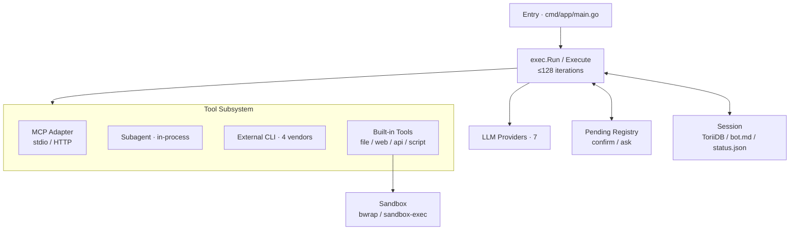

> [!NOTE]
> This README was generated by [SKILL](https://github.com/pardnchiu/skill-readme-generate), get the ZH version from [here](./doc/README.zh.md).<br>
> Tests are generated by [SKILL](https://github.com/pardnchiu/skill-coverage-generate).

***

<p align="center">
  <picture style="margin-down: 1rem">
    
  </picture>
</p>

<p align="center">
  <strong>One command. Multiple models. Each playing to its strength.</strong>
</p>

<p align="center">
  Go-native dispatcher · Planner routes each step to the best-fit model · Subagents collaborate in one process
</p>

<p align="center">
  <a href="https://pkg.go.dev/github.com/pardnchiu/agenvoy"></a>
  <a href="https://app.codecov.io/github/pardnchiu/agenvoy/tree/master"></a>
  <a href="LICENSE"></a>
  <a href="https://github.com/pardnchiu/agenvoy/releases"></a>
</p>

***

## Quick install

```bash
curl -fsSL https://cloud.agenvoy.com/install.sh | bash
```

One line. Single binary at `/usr/local/bin/agen`. macOS / Linux.

## Why Agenvoy

- **Why not let one model do everything?** Claude excels at planning, GPT at diff reasoning, Gemini at long-context critique — why pile every step onto a single vendor?
- **What does "model collaboration" cost?** Sub-agents over HTTP / RPC, or goroutines living in one process?
- **Where does the sandbox boundary sit?** Around the agent's own bash tool, or around every model and CLI you dispatch?

Agenvoy answers with one idea: a single command splits the work, hands each step to the model that does it best, and merges the results — all in one process.

|  | Agenvoy | Claude Code | Codex CLI | Gemini CLI | OpenClaw | Hermes |
|---|---|---|---|---|---|---|
| Runtime | Go | Node.js | Rust | Node.js | Node.js | Python |
| Providers | 7 + planner | 1 | 1 | 1 | Multi | 18+ |
| Sandbox scope | Framework + delegated CLIs | Own bash tool | Own shell exec | Own shell exec | Skill / shell | Terminal backend |
| Model dispatch | Planner picks per call · goroutine fan-out | Single vendor | Single vendor | Single vendor | Sub-agents over HTTP | Sub-agents over HTTP / RPC |
| Cross-model verify | codex / claude / copilot / gemini · ≤3 rounds | ✗ | ✗ | ✗ | ✗ | ✗ |
| Error memory | ToriiDB · 90d TTL · semantic | Vendor history | Vendor rollouts | Vendor history | Memory wiki | Skills + history search |
| Distribution | Single binary | npm + native | npm (Rust) | npm | npm + daemon | curl script |

The row that matters most is **Model dispatch**. Other frameworks pin you to one vendor (Claude Code, Codex, Gemini CLI) or push sub-agents through HTTP / RPC (OpenClaw, Hermes). Agenvoy keeps it all in one process: a planner picks among seven providers per call, `invoke_subagent` fans out as goroutines, results merge through a single event stream. **Cross-model verification** stacks on top — four external CLIs cross-check one result for up to three rounds. **Sandbox** is the floor — every delegated CLI sits inside one `go-pkg/sandbox` boundary, one policy.

## Features

> `make build` · installs to `/usr/local/bin/agen` · [Documentation](https://github.com/pardnchiu/agenvoy/wiki)

- **Right model for the right job**<br>
  A planner reads each task and routes it to the best-fit provider; `invoke_subagent` enums all seven providers with `Concurrent: true`, so the parent fans out Claude / GPT / Gemini in one goroutine batch — no HTTP between them, results merge in one event stream. `cross_review_with_external_agents` stacks codex / claude / copilot / gemini on top for up to three review rounds.
- **Pluggable tools, one sandbox**<br>
  Drop `extensions/apis/*.json` or `extensions/scripts/<name>/` to register a tool; MCP (stdio + HTTP/SSE) merges global and per-session config. Every command, script, and external CLI runs inside `go-pkg/sandbox` (bwrap / sandbox-exec).
- **Cross-session error memory**<br>
  ToriiDB indexes tool failures and turns with a 90-day TTL that refreshes on hit; `search_error_memory` and `search_conversation_history` run keyword + semantic in parallel — the same trap isn't hit twice.

## Architecture

> [Full Architecture](https://github.com/pardnchiu/agenvoy/wiki/Architecture)


```mermaid
graph TB
    Entry[Entry · cmd/app/main.go]
    Engine[exec.Run / Execute<br/>≤128 iterations]
    Providers[LLM Providers · 7]
    Pending[Pending Registry<br/>confirm / ask]

    subgraph Tools[Tool Subsystem]
        MCP[MCP Adapter<br/>stdio / HTTP]
        Sub[Subagent · in-process]
        Ext[External CLI · 4 vendors]
        Builtin[Built-in Tools<br/>file / web / api / script]
    end

    Sandbox[Sandbox<br/>bwrap / sandbox-exec]
    Session[Session<br/>ToriiDB / bot.md / status.json]

    Entry --> Engine
    Engine --> Providers
    Engine --> Tools
    Engine <--> Pending
    Engine <--> Session
    Builtin --> Sandbox
```

## License

This project is licensed under the [Apache License 2.0](LICENSE).

## Contributor

Just [open an issue](https://github.com/pardnchiu/agenvoy/issues/new) to share an idea.

<a href="https://github.com/pardnchiu/agenvoy/graphs/contributors">
  
</a>

## Star History

<a href="https://star-history.com/#pardnchiu/agenvoy&Date">
  <picture>
    <source media="(prefers-color-scheme: dark)" srcset="https://api.star-history.com/svg?repos=pardnchiu/agenvoy&type=Date&theme=dark&cache_bust=2026-05-05" />
    <source media="(prefers-color-scheme: light)" srcset="https://api.star-history.com/svg?repos=pardnchiu/agenvoy&type=Date&cache_bust=2026-05-05" />
    
  </picture>
</a>

When the curve trends up — that's the signal we want to see. Hit ★ to push it along.

***

©️ 2026 [邱敬幃 Pardn Chiu](https://www.linkedin.com/in/pardnchiu)
