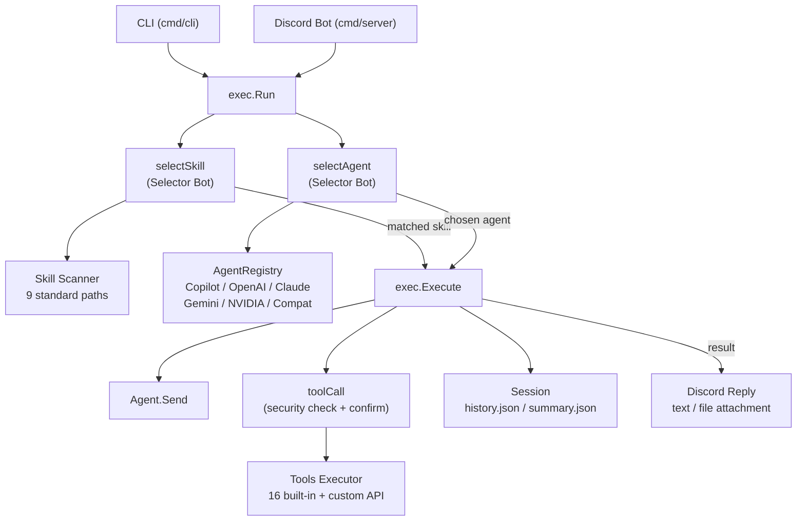

> [!NOTE]
> This README was generated by [SKILL](https://github.com/pardnchiu/skill-readme-generate), get the ZH version from [here](./doc/README.zh.md).<br>
> Tests are generated by [SKILL](https://github.com/pardnchiu/skill-coverage-generate).


# Agenvoy

[](https://pkg.go.dev/github.com/pardnchiu/agenvoy)
[](https://goreportcard.com/report/github.com/pardnchiu/agenvoy)
[](https://app.codecov.io/github/pardnchiu/agenvoy/tree/master)
[](LICENSE)
[](https://github.com/pardnchiu/agenvoy/releases)

> A Go agentic AI platform with skill routing, multi-provider intelligent dispatch, Discord bot integration, and security-first shared agent design

## Table of Contents

- [Features](#features)
- [Architecture](#architecture)
- [File Structure](#file-structure)
- [License](#license)
- [Author](#author)
- [Stars](#stars)

## Features

> `go install github.com/pardnchiu/agenvoy/cmd/cli@latest` · [Documentation](./doc/doc.md)

### Dual-Layer Routing Agentic Execution Engine

Before each execution, a lightweight Selector Bot runs two concurrent LLM routing decisions: it matches the best Skill from markdown files scanned across 9 standard paths, and picks the most suitable backend from the Agent Registry. The execution loop runs up to 16 iterations (general mode) or 128 iterations (Skill mode), deduplicates cached tool calls, and automatically triggers a summarization pass when the iteration limit is reached — always returning a coherent final response.

### Discord Bot with Slash Commands and File Attachment

The platform ships a standalone Discord server mode alongside the CLI. It handles both direct messages and mention-triggered channel messages, responds with an immediate acknowledgment before processing, and executes the same full agentic loop in the background. Agents can send local files back to Discord by embedding a `[SEND_FILE:/path]` marker in their reply — images, text files, and any binary are supported. Slash commands register instantly against a Guild ID during development and globally for production.

### Security-First Shared Agent Design

A multi-layer access control system blocks sensitive path access at both the file tool and shell command layers using a single declarative `denied.json` config. It covers SSH keys, shell history and config files, cloud credential directories (`.aws`, `.gcloud`, `.docker`), private key extensions (`.pem`, `.key`, `.p12`), and `.env` files. The `rm` command is intercepted and redirected to `.Trash` instead of permanent deletion, and API credentials are stored in the OS-native keychain rather than environment variables.

## Architecture


```mermaid
graph TB
    CLI["CLI (cmd/cli)"] --> Run["exec.Run"]
    Discord["Discord Bot (cmd/server)"] --> Run
    Run --> SelSkill["selectSkill\n(Selector Bot)"]
    Run --> SelAgent["selectAgent\n(Selector Bot)"]
    SelSkill --> Skills["Skill Scanner\n9 standard paths"]
    SelAgent --> Registry["AgentRegistry\nCopilot / OpenAI / Claude\nGemini / NVIDIA / Compat"]
    SelSkill -- "matched skill" --> Execute["exec.Execute"]
    SelAgent -- "chosen agent" --> Execute
    Execute --> Agent["Agent.Send"]
    Execute --> ToolCall["toolCall\n(security check + confirm)"]
    ToolCall --> Tools["Tools Executor\n16 built-in + custom API"]
    Execute --> Session["Session\nhistory.json / summary.json"]
    Execute -- "result" --> Reply["Discord Reply\ntext / file attachment"]
```

## File Structure

```
agenvoy/
├── cmd/
│   ├── cli/
│   │   ├── main.go                  # CLI entry point
│   │   ├── addProvider.go           # Interactive provider setup
│   │   ├── getAgentRegistry.go      # Multi-provider Agent Registry init
│   │   └── runEvents.go             # Event loop and interactive confirm
│   └── server/
│       └── main.go                  # Discord bot server entry point
├── internal/
│   ├── agents/
│   │   ├── exec/                    # Execution core (routing, tool loop, session)
│   │   ├── provider/                # AI backends (copilot/openai/claude/gemini/nvidia/compat)
│   │   └── types/                   # Shared interfaces (Agent, Message, Event)
│   ├── discord/
│   │   ├── command/                 # Slash command definitions and handler
│   │   ├── types/                   # Discord-specific types
│   │   ├── run.go                   # Agentic loop for Discord messages
│   │   ├── reply.go                 # Text and file attachment reply
│   │   └── session.go               # Discord session and history management
│   ├── keychain/                    # OS keychain credential storage
│   ├── skill/                       # Concurrent skill scanning and parsing
│   ├── tools/
│   │   ├── file/
│   │   │   └── embed/denied.json    # Sensitive path access control config
│   │   ├── browser/                 # JS-rendered page fetch and download
│   │   ├── apiAdapter/              # JSON-config-driven custom API tools
│   │   └── apis/                    # Finance, RSS, Weather tools
│   └── utils/
├── examples/apis/                   # Sample custom API configs
├── go.mod
└── README.md
```

## License

This project is licensed under the [AGPL-3.0 LICENSE](LICENSE).

## Author


<h4 style="padding-top: 0">邱敬幃 Pardn Chiu</h4>

<a href="mailto:dev@pardn.io" target="_blank">

</a> <a href="https://linkedin.com/in/pardnchiu" target="_blank">

</a>

## Stars

[](https://www.star-history.com/#pardnchiu/agenvoy&Date)

***

©️ 2026 [邱敬幃 Pardn Chiu](https://linkedin.com/in/pardnchiu)
