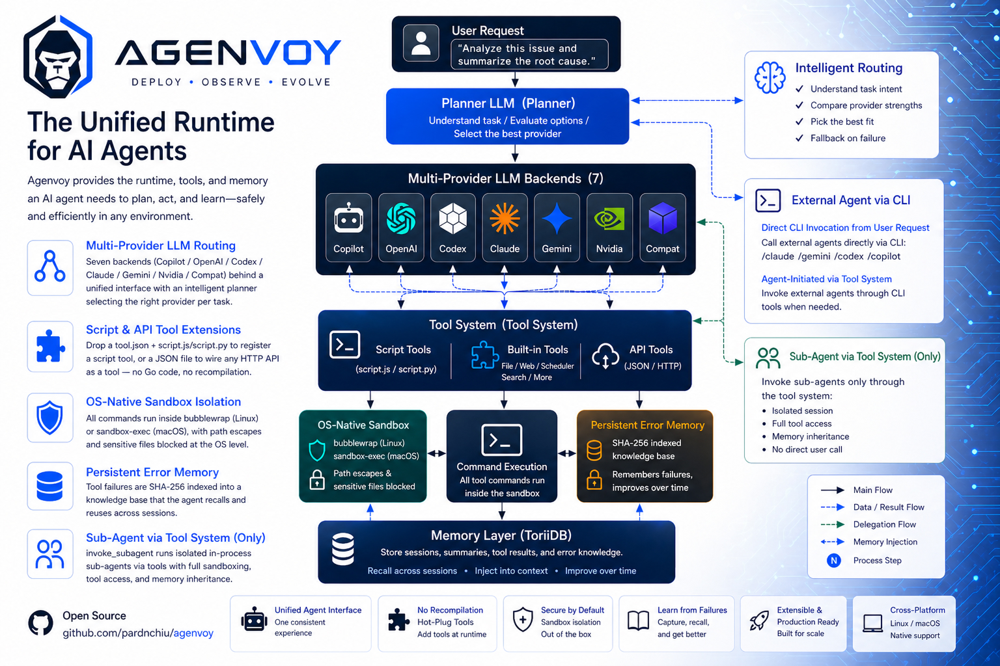
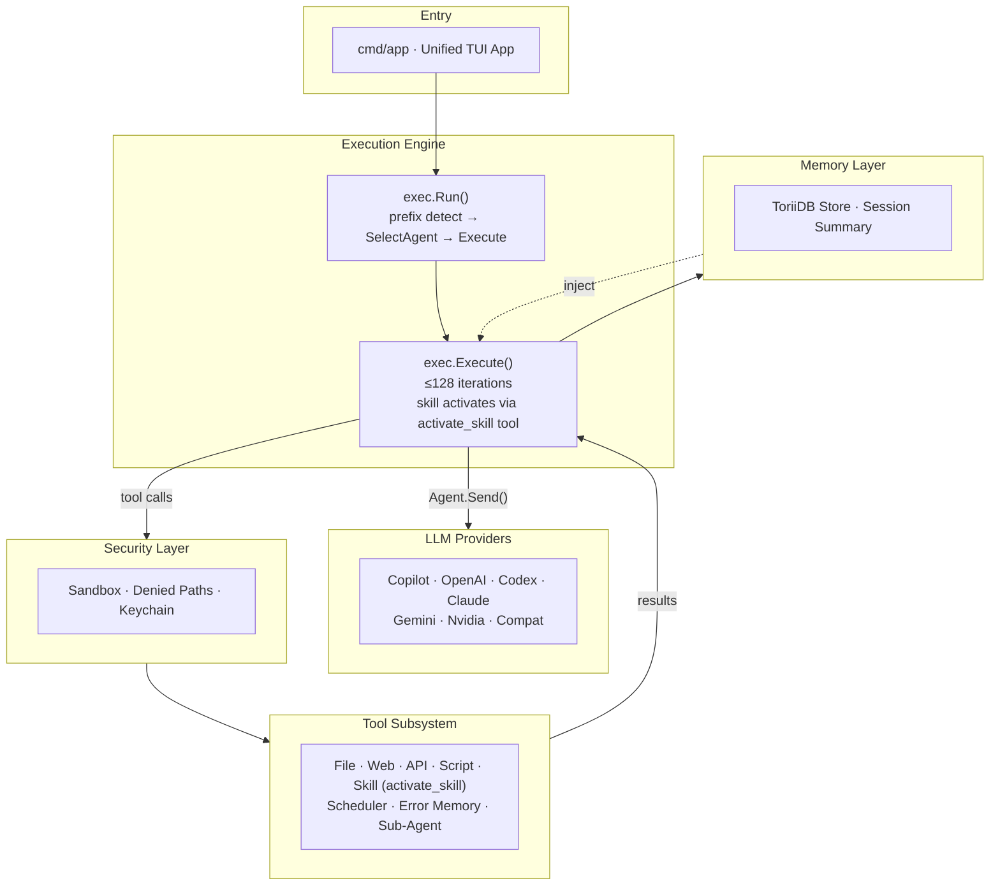

> [!NOTE]
> This README was generated by [SKILL](https://github.com/pardnchiu/skill-readme-generate), get the ZH version from [here](./doc/README.zh.md). 
> Tests are generated by [SKILL](https://github.com/pardnchiu/skill-coverage-generate).

***

<picture style="margin-down: 1rem">

</picture>

<strong>BUILD YOUR OWN OPENCLAW WITH AGENVOY!</strong>

  
Logo and cover illustrations were generated with ChatGPT Image 2.0.

***

# Agenvoy

> A Go AI agent framework with self-improving error memory, intelligent multi-provider routing, Python/JS/REST API tool extensions, and OS-native sandbox execution

The agent learns from past failures across sessions, routes each task to the right LLM provider automatically, and lets you extend its toolset by dropping a script or JSON file — all running inside an OS-native sandbox.

## Table of Contents

- [Architecture](#architecture)
- [Features](#features)
- [Dependencies](#dependencies)
- [Concepts](#concepts)
- [Version History](#version-history)
- [License](#license)
- [Author](#author)
- [Stars](#stars)

## Architecture

> [Full Architecture](./doc/architecture.md)

```mermaid
graph TB
    subgraph Entry ["Entry"]
        App["cmd/app · Unified TUI App"]
    end

    subgraph Engine ["Execution Engine"]
        Run["exec.Run()\nprefix detect → SelectAgent → Execute"]
        Execute["exec.Execute()\n≤128 iterations\nskill activates via activate_skill tool"]
    end

    subgraph Providers ["LLM Providers"]
        P["Copilot · OpenAI · Codex · Claude\nGemini · Nvidia · Compat"]
    end

    subgraph Security ["Security Layer"]
        S["Sandbox · Denied Paths · Keychain"]
    end

    subgraph Tools ["Tool Subsystem"]
        T["File · Web · API · Script · Skill (activate_skill)\nScheduler · Error Memory · Sub-Agent"]
    end

    subgraph Memory ["Memory Layer"]
        M["ToriiDB Store · Session Summary"]
    end

    App --> Run
    Run --> Execute
    Execute -->|"Agent.Send()"| Providers
    Execute -->|"tool calls"| Security
    Security --> Tools
    Tools -->|"results"| Execute
    Execute --> Memory
    Memory -.->|"inject"| Execute
```

## Features

> `make build` · `agen` (unified CLI / TUI / Discord / REST API) · [Documentation](./doc/doc.md)

- **Multi-Provider LLM with Intelligent Routing** — Seven backends (Copilot / OpenAI / Codex / Claude / Gemini / Nvidia / Compat) behind a unified `Agent` interface, with a planner LLM picking the right provider per task.
- **Script & API Tool Extensions** — Drop a `tool.json` + `script.js`/`script.py` to register a script tool, or a JSON file to wire any HTTP API as a tool — no Go code, no recompilation.
- **OS-Native Sandbox Isolation** — All commands run inside bubblewrap (Linux) or `sandbox-exec` (macOS), with path escapes and sensitive files blocked at the OS level.
- **Persistent Error Memory** — Tool failures are SHA-256 indexed into a knowledge base that the agent recalls and reuses across sessions.
- **In-Process Sub-Agent Delegation** — `invoke_subagent` spawns an isolated sub-agent directly inside the host process — independent session, optional model / system-prompt / tool overrides, forced self-exclusion to prevent recursion, and no HTTP hop.

## Dependencies

First-party packages Agenvoy pulls in directly from its author's ecosystem.

- **Embedded Store as Memory Backbone — [pardnchiu/ToriiDB](https://github.com/pardnchiu/ToriiDB)** — A lightweight embedded key-value store that serves as Agenvoy's single persistence backbone. Session history, error memory, and web tool caches (`fetch_page` / `search_web` / `fetch_google_rss`) all live behind a thin `internal/filesystem/store` wrapper instead of scattered JSON files. This collapses per-subsystem file formats into one indexed, atomic store, lets `search_conversation_history` and `search_error_memory` scan sessions without walking the filesystem, and reduces cache invalidation to a single key delete.
- **Shared Utility Library — [pardnchiu/go-utils](https://github.com/pardnchiu/go-utils)** — A cross-cutting utility package providing the HTTP, browser, sandbox, keychain, and helper primitives Agenvoy builds on. `go-utils/http` supplies the generic `GET[T]` / `POST[T]` / `PUT[T]` / `PATCH[T]` / `DELETE[T]` client used by every provider (`claude` / `openai` / `copilot` / `compat` / `gemini` / `nvidia`) and every native API tool (`yahooFinance` / `youtube` / `googleRSS` / `searchWeb`). `go-utils/rod` owns the headless-Chrome stack behind `fetch_page` — stealth JS, listener-settle detection, viewport handling, typed `FetchError{Status}`, `KeepLinks`, and a process-singleton browser with idle-TTL eviction. `go-utils/sandbox` owns the OS-native process isolation wrapped around `run_command` and every script tool — macOS `sandbox-exec` seatbelt profiles, Linux `bwrap` bubblewrap with auto-probed `--unshare-*` namespaces, `CheckDependence()` auto-installing `bubblewrap` on Linux, and a one-time `New(denyMapJSON)` to seed sensitive-path denylists sourced from `configs/jsons/denied_map.json`. `go-utils/filesystem/keychain` powers credential storage (macOS `security` / Linux `secret-tool` / file fallback), and `go-utils/utils.UUID()` provides the shared ID generator.
- **Native Cron Engine — [pardnchiu/go-scheduler](https://github.com/pardnchiu/go-scheduler)** — An in-process cron runtime that makes recurring schedules a first-class primitive inside the `agen` binary — no system `crontab`, no `systemd` timer, no external daemon. `internal/scheduler` wraps `goCron.New(...)` behind a process singleton (`once.Do`) with a minimal `schedulerCron` interface (`Start` / `Stop` / `Add(spec, action, args...)` / `Remove`), so the same engine powers both the hourly summary cron and agent-created schedules. This is surfaced to the LLM as four pairs of tools — `add_cron` / `list_crons` / `get_cron` / `remove_cron` for cron-expression schedules, and `add_task` / `list_tasks` / `get_task` / `remove_task` for one-shot `time.Timer`-backed tasks — both persisted through `internal/filesystem` and reloaded on startup. Because everything runs inside the agent process, schedule state, tool availability, and execution context stay consistent across TUI / CLI / Discord / REST modes; stop the binary and every pending firing stops with it (`Stop()` cancels every timer and drains the cron via `c.Stop()`).

## Concepts

Two prior projects from the same author directly informed Agenvoy's architecture:

- **Script Tool as FaaS — [pardnchiu/go-faas](https://github.com/pardnchiu/go-faas)** — A lightweight Function-as-a-Service platform that accepts Python, JavaScript, and TypeScript code via HTTP, executes each function inside a Bubblewrap sandbox with full Linux namespace isolation, and streams results. Agenvoy's script tool subsystem (`scriptAdapter`) adopts this model directly: each script tool is a stateless function invoked via stdin/stdout JSON, isolated to its own process, with the agent acting as the caller rather than an HTTP client.
- **Cognitive Imperfect Memory — [pardnchiu/cim-prototype](https://github.com/pardnchiu/cim-prototype)** — Argues that perfect memory is a cognitive burden — based on research showing multi-turn LLM performance drops 39% when full conversation history is replayed verbatim ([LLMs Get Lost In Multi-Turn Conversation](https://arxiv.org/abs/2505.06120)). The system maintains a structured rolling summary and retrieves relevant fragments via fuzzy search only when triggered, mirroring how humans selectively recall rather than replay. Agenvoy's session layer reflects this directly: `trimMessages()` enforces a token budget rather than replaying full history, `summary` is persisted and deep-merged across turns, and `search_conversation_history` provides keyword-triggered recall rather than injecting all past context.

## Version History

- **v0.19.8** — Add per-session concurrency cap (`MAX_SESSION_TASKS`, default 3, hard cap 10) plus two new endpoints: `GET /v1/session/:session_id/status` (reads `status.json` for online/idle state and active task list) and `GET /v1/session/:session_id/log` (SSE-streams `action.log` by polling the trailing 100 lines once per second with last-line dedup). Add per-session `action.log` recording user input and key tool/error events for human audit (1 MB rotation, never enters ToriiDB/embedder). Make `invoke_subagent` (`MAX_SUBAGENT_TIMEOUT_MIN`) and external CLI agents (`MAX_EXTERNAL_AGENT_TIMEOUT_MIN`) timeouts env-tunable, default 10 min, hard cap 60. Fix `invoke_subagent` to resume an existing persistent session by id (existence-checked, no auto-create).
- **v0.19.7** — Tool registry hardening: tool descriptions and JSON schemas now follow the reviewer ruleset (single-sentence English, defaults on every optional field), tool identifiers are renamed to canonical snake_case (`patch_edit`→`patch_file`, `analyze_youtube`→`fetch_youtube_transcript`, `select_skill`→`activate_skill`, `read_tool_error`→`read_error_memory`, plus `script_*` separator normalization), scheduler and agent tool packages are reorganized into per-domain subpackages, Gemini joins the external agent roster, and the new `tool-reviewer` and `code-reviewer` skills land alongside a code-reviewer entropy bugfix.
- **v0.19.6** — Add `ask_user` tool (free-text / single-select / multi-select via `promptui`) for CLI-only interactive prompts; switch `run_command` to argv-only schema (`argv: string[]`, no shell-string parsing) — multi-word args no longer suffer quote-mixing bugs, shell features available via explicit `["sh","-c","..."]`. Add semantic TTL-backed error memory: `Save` writes via `SetVector` with 90-day TTL, `Search` falls back to keyword scan when embedder unavailable, every hit refreshes TTL via `db.Expire`. Move `search_web` rate limiting from per-batch toolCall throttle to package-level `sync.Mutex` + `ddgMinGap=2s` global gap (covers retry / cross-iteration / cross-session); switch `api_*` throttling to per-name global mutex (`apiMinGap=1s`) so different api names never block each other. Bundle `commit-generate`, `readme-generate`, and `version-generate` skills.

## License

This project is licensed under the [Apache-2.0 LICENSE](LICENSE).

## Author

<h4 style="padding-top: 0">邱敬幃 Pardn Chiu</h4>

<a href="mailto:dev@pardn.io">dev@pardn.io</a> 
<a href="https://linkedin.com/in/pardnchiu">https://linkedin.com/in/pardnchiu</a>

## Stars

***

©️ 2026 [邱敬幃 Pardn Chiu](https://linkedin.com/in/pardnchiu)
