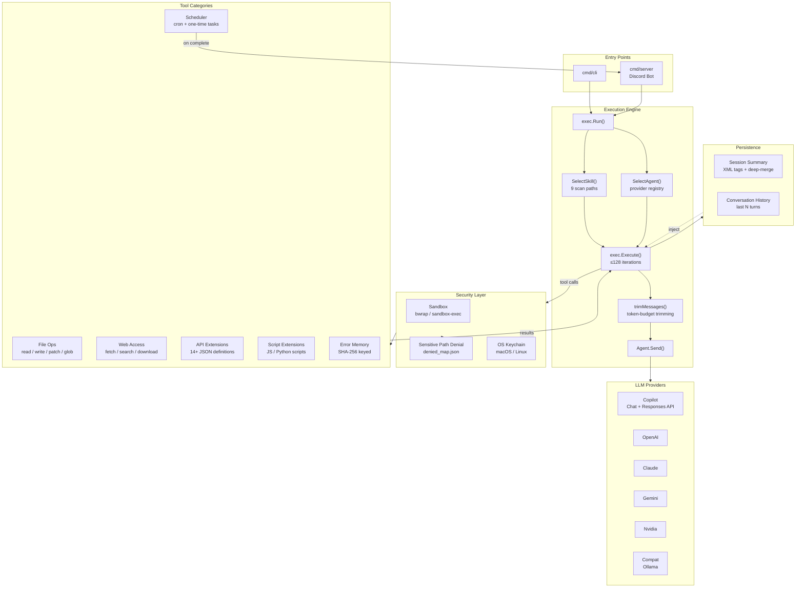

> [!NOTE]
> This README was generated by [SKILL](https://github.com/pardnchiu/skill-readme-generate), get the ZH version from [here](./doc/README.zh.md).<br>
> Tests are generated by [SKILL](https://github.com/pardnchiu/skill-coverage-generate).


# Agenvoy

[](https://pkg.go.dev/github.com/pardnchiu/agenvoy)
[](https://goreportcard.com/report/github.com/pardnchiu/agenvoy)
[](https://app.codecov.io/github/pardnchiu/agenvoy/tree/master)
[](LICENSE)
[](https://github.com/pardnchiu/agenvoy/releases)

> A Go multi-provider AI agent framework with intelligent routing, sandbox-isolated execution, and skill-driven workflows

Stop wiring each AI provider separately — Agenvoy routes any task to the right model, executes tools inside an OS-native sandbox, and remembers what went wrong across sessions.

## Table of Contents

- [Architecture](#architecture)
- [Features](#features)
- [Concepts](#concepts)
- [File Structure](#file-structure)
- [Version History](#version-history)
- [License](#license)
- [Author](#author)
- [Stars](#stars)

## Architecture


```mermaid
graph TB
    subgraph Entry ["Entry Points"]
        CLI["cmd/cli"]
        Discord["cmd/server\nDiscord Bot"]
    end

    subgraph Core ["Execution Engine"]
        Run["exec.Run()"]
        SkillSelect["SelectSkill()\n9 scan paths"]
        AgentSelect["SelectAgent()\nprovider registry"]
        TrimMsg["trimMessages()\ntoken-budget trimming"]
        Execute["exec.Execute()\n≤128 iterations"]
        Send["Agent.Send()"]
    end

    subgraph Providers ["LLM Providers"]
        Copilot["Copilot\nChat + Responses API"]
        OpenAI["OpenAI"]
        Claude["Claude"]
        Gemini["Gemini"]
        Nvidia["Nvidia"]
        Compat["Compat\nOllama"]
    end

    subgraph Security ["Security Layer"]
        Sandbox["Sandbox\nbwrap / sandbox-exec"]
        DeniedPaths["Sensitive Path Denial\ndenied_map.json"]
        Keychain["OS Keychain\nmacOS / Linux"]
    end

    subgraph Tools ["Tool Categories"]
        FileOps["File Ops\nread / write / patch / glob"]
        WebAccess["Web Access\nfetch / search / download"]
        APIExt["API Extensions\n14+ JSON definitions"]
        ScriptExt["Script Extensions\nJS / Python scripts"]
        Scheduler["Scheduler\ncron + one-time tasks"]
        ErrorMem["Error Memory\nSHA-256 keyed"]
    end

    subgraph Persistence ["Persistence"]
        Session["Session Summary\nXML tags + deep-merge"]
        History["Conversation History\nlast N turns"]
    end

    CLI --> Run
    Discord --> Run
    Run --> SkillSelect
    Run --> AgentSelect
    SkillSelect --> Execute
    AgentSelect --> Execute
    Execute --> TrimMsg
    TrimMsg --> Send
    Send --> Providers
    Execute -->|"tool calls"| Security
    Security --> DeniedPaths
    Security --> Tools
    Tools -->|"results"| Execute
    Scheduler -->|"on complete"| Discord
    Execute --> Persistence
    Persistence -.->|"inject"| Execute
```

## Features

> `go install github.com/pardnchiu/agenvoy/cmd/cli@latest` · [Documentation](./doc/doc.md)

### Multi-Provider LLM with Intelligent Routing

Six backends behind one interface — a dedicated planner LLM picks the right provider per request and trims the context window automatically.

<details>
<summary>Details</summary>

GitHub Copilot, Claude, OpenAI, Gemini, Nvidia NIM, and any OpenAI-compatible endpoint (Compat/Ollama) — all behind a unified `Agent` interface. A planner LLM automatically selects the best provider per request. Token-budget trimming prevents context window overflow, and per-provider configurable reasoning levels are supported.

</details>

### OS-Native Sandbox Isolation

Commands run inside bubblewrap (Linux) or `sandbox-exec` (macOS) — escaped paths and sensitive files are blocked at the OS level.

<details>
<summary>Details</summary>

All commands and scripts execute inside bubblewrap on Linux (with dynamic namespace probing) or `sandbox-exec` on macOS. Sensitive path denial is loaded from an embedded deny list, credentials are stored in the OS keychain, and symlink-safe path validation restricts access to the user's home directory only.

</details>

### Skill-Driven Agentic Workflows

Write a Markdown file to define a task; the agent selects the best match from 9 scan paths and runs up to 128 tool iterations until done.

<details>
<summary>Details</summary>

Declarative Markdown skills with YAML frontmatter define task prompts and tool allowlists. A Selector LLM auto-matches the best skill, then drives a tool-call loop with hash-based deduplication — up to 128 iterations — until the task completes.

</details>

### Copilot Dual-Protocol Auto-Switch

GPT-5.4 and Codex route to the Responses API automatically; all other Copilot models use Chat Completions — no configuration needed.

<details>
<summary>Details</summary>

The Copilot provider detects model type at runtime. GPT-5.4 and Codex models route to the Responses API; all others use Chat Completions. Cross-provider image normalization re-encodes all formats as JPEG for universal vision support.

</details>

### Script Tool Runtime

Drop a `tool.json` + `script.js` or `script.py` into a directory and the agent discovers and invokes it as a first-class tool — no Go code, no recompilation.

<details>
<summary>Details</summary>

On startup, the executor scans `~/.config/agenvoy/script_tools/` and `<workdir>/.config/agenvoy/script_tools/` for subdirectories containing a `tool.json` manifest (name, description, parameters schema) paired with an executable `script.js` or `script.py`. Each discovered tool is registered with the `script_` prefix and dispatched via stdin/stdout JSON — identical to the API tool contract. The `script-tool-creator` skill scaffolds new tools automatically.

</details>

### Skill Git Tools

Three tools let agents commit, inspect history, and roll back changes inside skill workflows without leaving the agent loop.

<details>
<summary>Details</summary>

`skill_git_commit`, `skill_git_log`, and `skill_git_rollback` operate on the skill repository path. They enable skills like `readme-generate` or `script-tool-creator` to version their own output atomically, inspect change history, and undo mistakes — all within a single agent execution.

</details>

### Declarative JSON API Extensions

Add any HTTP API as a tool by dropping a JSON file — no Go code required.

<details>
<summary>Details</summary>

14+ embedded public API tools (CoinGecko, Wikipedia, Open-Meteo, Yahoo Finance, YouTube metadata, etc.) are defined as pure JSON. User-defined extensions in `~/.config/agenvoy/apis/` are loaded at startup with no compilation step.

</details>

### Persistent Error Memory

Tool failures are SHA-256 indexed per session; the agent recalls past errors and reuses resolutions across sessions.

<details>
<summary>Details</summary>

When any tool call fails, the error is persisted to `tool_errors/{hash}.json`. The agent can recall past failures via `search_errors` and persist resolution decisions via `remember_error` — enabling cross-session learning without manual intervention.

</details>

### Persistent Task Scheduler

Full CRUD for cron and one-time tasks — persisted to JSON, restored on restart, with Discord callbacks on completion.

<details>
<summary>Details</summary>

Recurring cron tasks and one-time scheduled tasks are stored as JSON and restored automatically on restart. When a task completes, its result is posted to the configured Discord channel.

</details>

### Discord Bot Integration

Slash commands share the same execution engine as the CLI, with per-channel session isolation and Modal-based API key setup.

<details>
<summary>Details</summary>

Per-channel session isolation, file attachment handling, inline file-send protocol, and scheduled task result posting. API keys for all providers can be configured directly in Discord via Modal inputs (`/add-gemini`, `/add-openai`, `/add-claude`, `/add-nim`).

</details>

## Concepts

Two prior projects from the same author directly informed Agenvoy's architecture:

### Script Tool as FaaS — [pardnchiu/go-faas](https://github.com/pardnchiu/go-faas)

[pardnchiu/go-faas](https://github.com/pardnchiu/go-faas) is a lightweight Function-as-a-Service platform that accepts Python, JavaScript, and TypeScript code via HTTP, executes each function inside a Bubblewrap sandbox with full Linux namespace isolation, and streams results. Agenvoy's script tool subsystem (`scriptAdapter`) adopts this model directly: each script tool is a stateless function invoked via stdin/stdout JSON, isolated to its own process, with the agent acting as the caller rather than an HTTP client.

### Cognitive Imperfect Memory — [pardnchiu/cim-prototype](https://github.com/pardnchiu/cim-prototype)

[pardnchiu/cim-prototype](https://github.com/pardnchiu/cim-prototype) argues that perfect memory is a cognitive burden — based on research showing multi-turn LLM performance drops 39% when full conversation history is replayed verbatim ([LLMs Get Lost In Multi-Turn Conversation](https://arxiv.org/abs/2505.06120)). The system maintains a structured rolling summary and retrieves relevant fragments via fuzzy search only when triggered, mirroring how humans selectively recall rather than replay. Agenvoy's session layer reflects this directly: `trimMessages()` enforces a token budget rather than replaying full history, `summary` is persisted and deep-merged across turns, and `search_history` provides keyword-triggered recall rather than injecting all past context.

## File Structure

```
agenvoy/
├── cmd/
│   ├── cli/                # CLI: add / remove / list / run
│   └── server/             # Discord bot entry point
├── configs/
│   ├── jsons/              # Provider model defs, denied_map, whitelist
│   └── prompts/            # Embedded system prompts and selectors
├── extensions/
│   ├── apis/               # Embedded API extensions (14+ JSON)
│   ├── scripts/            # Example script tools (JS / Python + tool.json)
│   └── skills/             # Embedded skill extensions (Markdown)
├── internal/
│   ├── agents/
│   │   ├── exec/           # Execution engine, token trimming, summary extraction
│   │   ├── provider/       # 6 AI provider backends + Responses API
│   │   └── types/          # Agent interface + message / usage types
│   ├── apiAdapter/         # HTTP API tool translation and dispatch
│   ├── discord/            # Discord slash commands + file attachments
│   ├── filesystem/         # Path validation, session manager, keychain, and usage tracking
│   ├── sandbox/            # Sandbox isolation + sensitive path denial
│   ├── scheduler/          # Persistent one-time and recurring task scheduler
│   ├── scriptAdapter/      # Script tool scanner, executor, and stdin/stdout JSON bridge
│   ├── skill/              # Markdown skill scanner and parser
│   └── tools/              # 26+ self-registering tools + git / scheduler tools
├── go.mod
└── LICENSE
```

## Version History

- **v0.16.0** — Script tool runtime (`scriptAdapter`): drop a `tool.json` + `script.js`/`script.py` into `~/.config/agenvoy/script_tools/` and it is auto-discovered as a `script_`-prefixed tool; stdin/stdout JSON protocol mirrors API tool contract. Refactor `tools/apis/adapter` → `apiAdapter`, `tools/apis` → `tools/api`. Add `skill_git_commit`, `skill_git_log`, `skill_git_rollback` for skill-internal versioning. Copilot token auto-relogin on 401. Fix Discord file upload failure for non-ASCII filenames; add 10MB pre-upload size guard with user-facing warning.
- **v0.15.2** — Add YouTube metadata fetch tool (`analyze_youtube`); Discord Modal-based API key management (`/add-gemini`, `/add-openai`, `/add-claude`, `/add-nim`); per-model token usage tracking via `usageManager`; configurable reasoning level across all providers; browser iteration limits and same-domain link traversal now configurable via `MAX_TOOL_ITERATIONS`, `MAX_SKILL_ITERATIONS`, `MAX_EMPTY_RESPONSES`; fix Makefile pass-through args
- **v0.15.1** — Fix Copilot Claude/Gemini image validation failure: all uploaded images are decoded and re-encoded as JPEG (`image.Decode` + `jpeg.Encode`, supporting PNG/GIF/WebP sources), `ImageURL` gains `detail` field; summary regex split from one monolithic expression into three independent patterns (fenced block, `<summary>` tag, `[summary]` bracket); system prompts moved after history to improve model instruction adherence; Discord prompt takes priority over base system prompt

<details>
<summary>Earlier versions</summary>

- **v0.15.0** — Copilot Responses API support (GPT-5.4 and Codex models auto-switch endpoint); session-level token-budget message trimming (budget calculated via `MaxInputTokens()`, preserving system prompt + summary + latest user message); sensitive path denial rules for macOS and Linux sandbox (loaded from embedded `denied_map.json`); Linux bwrap restores `--unshare-all` namespace isolation (with graceful fallback probing) and `--new-session` process isolation; `MAX_HISTORY_MESSAGES` environment variable support; summary delimiter switched to XML tags; lite models excluded from agent selection
- **v0.14.0** — OS-native sandbox isolation (bubblewrap on Linux with auto-install, sandbox-exec on macOS); per-request token usage tracking accumulated across all tool-call iterations; tool handlers restructured into individually named files; exclude logic and file walk/list moved into `filesystem` package; symlink-safe path resolution in `GetAbsPath`
- **v0.13.0** — Self-registering tool Registry replacing switch-based routing and embedded JSON definitions; scheduler persistent JSON storage with full CRUD (add/update/delete for tasks and crons); keychain migrated under `filesystem`; absolute path restriction to user home directory; trimmed history ellipsis markers
- **v0.12.0** — Full scheduler subsystem (cron + one-time tasks with Discord callbacks); centralize `filesystem` + `configs` packages; replace custom cron parser with `go-scheduler`; `schedule-task` skill
- **v0.11.2** — Fix bidirectional error-memory keyword matching; fix Claude multi-system-prompt merge; pre-tool text suppression rule in system prompt
- **v0.11.1** — Tool execution error tracking (hash-based `tool_errors/`); atomic writes (`utils.WriteFile`); Gemini multipart message fix; 8 new public API extensions; `get_tool_error` tool
- **v0.11.0** — Declarative Extension architecture — built-in Go API tools migrated to JSON extensions; `SyncSkills` from GitHub; switch license to **Apache-2.0**
- **v0.10.2** — Fix `temperature` for OpenAI reasoning models (`gpt-5`, `gpt-4.1`); `no_temperature` model flag; `planner` CLI command; `makefile`
- **v0.10.1** — Provider model registry with embedded JSON configs; interactive model selection UI; uniform `temperature=0.2` across all providers
- **v0.10.0** — Discord bot mode with full slash command support; `download_page` browser tool; multi-layer sensitive path security (`denied.json`); HTML-to-Markdown converter
- **v0.9.0** — File injection (`--file`), image input (`--image`); `remember_error` / `search_errors` tools; web search SHA-256 cache (1-hour TTL); `remove` command; public API (`GetSession`, `SelectAgent`, `SelectSkill`)
- **v0.8.0** — Rename to **Agenvoy** (AGPL-3.0); OS Keychain integration for secure API key storage; named `compat[{name}]` instances; GitHub Actions CI + unit tests
- **v0.7.2** — Split CLI entry into focused modules; `mergeSummary` deep-merge strategy; API example configs (exchange-rate, ip-api)
- **v0.7.1** — Fix race conditions across all providers (instance-level `model` field); fix Context chain in `runCommand` / `moveToTrash`; replace `strconv.Unquote` with `json.Unmarshal` for Unicode handling
- **v0.7.0** — LLM-driven automatic agent routing; OpenAI-compatible (`compat`) provider / Ollama support; `search_history` tool; file-locking for concurrent sessions; split monolithic `exec.go` into sub-package
- **v0.6.0** — Summary-based persistent memory; session history (`history.json`); tool action logging; centralized `utils.ConfigDir()`
- **v0.5.0** — Add `fetch_page` (headless Chrome + stealth JS), `search_web` (Brave + DDG concurrent), `calculate`; Context propagation through the full tool chain
- **v0.4.0** — Built-in API tools (weather, stock, news, HTTP); JSON-driven API adapter; `patch_edit` tool; skill auto-matching engine; `io.Writer` → Event Channel output model
- **v0.3.0** — Multi-agent backend support: OpenAI, Claude, Gemini, Nvidia; unified `Agent` interface; concurrent goroutine skill scanner
- **v0.2.0** — Add full filesystem toolchain (`list_files`, `glob_files`, `write_file`, `search_content`, `run_command`), command whitelist, interactive confirmation, `--allow` flag
- **v0.1.0** — Initial release — GitHub Copilot CLI with skill execution loop and automatic token refresh

</details>

## License

This project is licensed under the [Apache-2.0 LICENSE](LICENSE).

## Author


<h4 style="padding-top: 0">邱敬幃 Pardn Chiu</h4>

<a href="mailto:dev@pardn.io" target="_blank">

</a> <a href="https://linkedin.com/in/pardnchiu" target="_blank">

</a>

## Stars

[](https://www.star-history.com/#pardnchiu/agenvoy&Date)

***

©️ 2026 [邱敬幃 Pardn Chiu](https://linkedin.com/in/pardnchiu)
