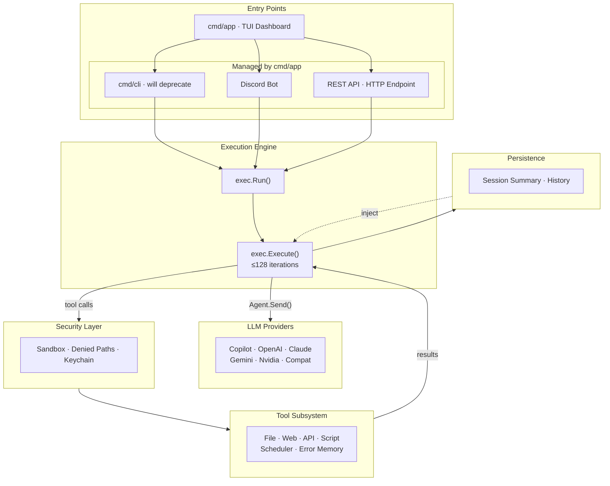

> [!NOTE]
> This README was generated by [SKILL](https://github.com/pardnchiu/skill-readme-generate), get the ZH version from [here](./doc/README.zh.md).<br>
> Tests are generated by [SKILL](https://github.com/pardnchiu/skill-coverage-generate).

*** 

<p align="center">
<picture>

</picture>
</p>

<p align="center">
  <strong>BUILD YOUR OWN OPENCLAW WITH AGENVOY!</strong>
</p>

<p align="center">
<a href="https://pkg.go.dev/github.com/pardnchiu/agenvoy"></a>
<a href="https://app.codecov.io/github/pardnchiu/agenvoy/tree/master"></a>
<a href="LICENSE"></a>
<a href="https://github.com/pardnchiu/agenvoy/releases"></a>
<a href="https://discord.gg/CHTtXmh7Ca"></a>
</p>

***

# Agenvoy
> A Go AI agent framework with self-improving error memory, intelligent multi-provider routing, Python/JS/REST API tool extensions, and OS-native sandbox execution

The agent learns from past failures across sessions, routes each task to the right LLM provider automatically, and lets you extend its toolset by dropping a script or JSON file — all running inside an OS-native sandbox.


> Terminal UI consolidating CLI, Discord bot, and REST API into a single local interface — filesystem browser, session content viewer, and live log stream.

## Table of Contents

- [Architecture](#architecture)
- [Features](#features)
- [Concepts](#concepts)
- [File Structure](#file-structure)
- [Version History](#version-history)
- [License](#license)
- [Author](#author)
- [Stars](#stars)

## Architecture

> Detailed diagrams for each subsystem: [doc/architecture.md](./doc/architecture.md)


```mermaid
graph TB
    subgraph Entry ["Entry Points"]
        App["cmd/app · TUI Dashboard"]
        subgraph Managed ["Managed by cmd/app"]
            CLI["cmd/cli · will deprecate"]
            Discord["Discord Bot"]
            API["REST API · HTTP Endpoint"]
        end
    end

    subgraph Engine ["Execution Engine"]
        Run["exec.Run()"]
        Execute["exec.Execute()\n≤128 iterations"]
    end

    subgraph Providers ["LLM Providers"]
        P["Copilot · OpenAI · Claude\nGemini · Nvidia · Compat"]
    end

    subgraph Security ["Security Layer"]
        S["Sandbox · Denied Paths · Keychain"]
    end

    subgraph Tools ["Tool Subsystem"]
        T["File · Web · API · Script\nScheduler · Error Memory"]
    end

    subgraph Persistence ["Persistence"]
        PS["Session Summary · History"]
    end

    App --> CLI
    App --> Discord
    App --> API
    CLI --> Run
    Discord --> Run
    API --> Run
    Run --> Execute
    Execute -->|"Agent.Send()"| Providers
    Execute -->|"tool calls"| Security
    Security --> Tools
    Tools -->|"results"| Execute
    Execute --> Persistence
    Persistence -.->|"inject"| Execute
```

## Features

> `go install github.com/pardnchiu/agenvoy/cmd/cli@latest` · [Documentation](./doc/doc.md)

### TUI Dashboard

A terminal UI that consolidates CLI execution, Discord bot management, and the REST API endpoint into a single local interface — browse config files, view session content, and stream logs from one window.

### Multi-Provider LLM with Intelligent Routing

Six backends behind one interface — a dedicated planner LLM picks the right provider per request and trims the context window automatically.

<details>
<summary>Details</summary>

GitHub Copilot, Claude, OpenAI, Gemini, Nvidia NIM, and any OpenAI-compatible endpoint (Compat/Ollama) — all behind a unified `Agent` interface. A planner LLM automatically selects the best provider per request. Token-budget trimming prevents context window overflow, and per-provider configurable reasoning levels are supported.

</details>

### Script & API Tool Extensions

Drop a `tool.json` + `script.js`/`script.py` to register a custom script tool, or a JSON file to add any HTTP API as a tool — no Go code, no recompilation required.

<details>
<summary>Details</summary>

**Script tools:** On startup, the executor scans `~/.config/agenvoy/script_tools/` for subdirectories containing a `tool.json` manifest paired with an executable script. Each tool is registered with the `script_` prefix and dispatched via stdin/stdout JSON.

**API tools:** 14+ embedded public API tools (CoinGecko, Wikipedia, Open-Meteo, Yahoo Finance, etc.) are defined as pure JSON. User-defined extensions in `~/.config/agenvoy/apis/` are loaded at startup with no compilation step.

</details>

### OS-Native Sandbox Isolation

Commands run inside bubblewrap (Linux) or `sandbox-exec` (macOS) — escaped paths and sensitive files are blocked at the OS level.

<details>
<summary>Details</summary>

All commands and scripts execute inside bubblewrap on Linux (with dynamic namespace probing) or `sandbox-exec` on macOS. Sensitive path denial is loaded from an embedded deny list, credentials are stored in the OS keychain, and symlink-safe path validation restricts access to the user's home directory only.

</details>

### Persistent Error Memory

Tool failures are SHA-256 indexed per session; the agent recalls past errors and reuses resolutions across sessions.

<details>
<summary>Details</summary>

When any tool call fails, the error is persisted to `tool_errors/{hash}.json`. The agent can recall past failures via `search_errors` and persist resolution decisions via `remember_error` — enabling cross-session learning without manual intervention.

</details>

## Concepts

Two prior projects from the same author directly informed Agenvoy's architecture:

### Script Tool as FaaS — [pardnchiu/go-faas](https://github.com/pardnchiu/go-faas)

[pardnchiu/go-faas](https://github.com/pardnchiu/go-faas) is a lightweight Function-as-a-Service platform that accepts Python, JavaScript, and TypeScript code via HTTP, executes each function inside a Bubblewrap sandbox with full Linux namespace isolation, and streams results. Agenvoy's script tool subsystem (`scriptAdapter`) adopts this model directly: each script tool is a stateless function invoked via stdin/stdout JSON, isolated to its own process, with the agent acting as the caller rather than an HTTP client.

### Cognitive Imperfect Memory — [pardnchiu/cim-prototype](https://github.com/pardnchiu/cim-prototype)

[pardnchiu/cim-prototype](https://github.com/pardnchiu/cim-prototype) argues that perfect memory is a cognitive burden — based on research showing multi-turn LLM performance drops 39% when full conversation history is replayed verbatim ([LLMs Get Lost In Multi-Turn Conversation](https://arxiv.org/abs/2505.06120)). The system maintains a structured rolling summary and retrieves relevant fragments via fuzzy search only when triggered, mirroring how humans selectively recall rather than replay. Agenvoy's session layer reflects this directly: `trimMessages()` enforces a token budget rather than replaying full history, `summary` is persisted and deep-merged across turns, and `search_history` provides keyword-triggered recall rather than injecting all past context.

## File Structure

```
agenvoy/
├── cmd/
│   ├── app/                # Unified entry point: TUI dashboard + Discord bot + REST API
│   ├── cli/                # CLI: add / remove / list / run
│   └── server/             # Discord bot entry point
├── configs/
│   ├── jsons/              # Provider model defs, denied_map, whitelist
│   └── prompts/            # Embedded system prompts and selectors
├── extensions/
│   ├── apis/               # Embedded API extensions (14+ JSON)
│   ├── scripts/            # Bundled script tools (Threads, yt-dlp + install scripts)
│   └── skills/             # Embedded skill extensions (Markdown)
├── install_threads.sh      # Cross-platform installer for Threads script tools
├── install_youtube.sh      # Cross-platform installer for yt-dlp script tools
├── internal/
│   ├── agents/
│   │   ├── exec/           # Execution engine, token trimming, summary extraction
│   │   ├── provider/       # 6 AI provider backends + Responses API
│   │   └── types/          # Agent interface + message / usage types
│   ├── discord/            # Discord slash commands + file attachments
│   ├── filesystem/         # Path validation, keychain, and usage tracking
│   ├── routes/             # HTTP REST API routing (Gin)
│   ├── store/              # Session persistence, search, atomic writes
│   ├── tui/                # Terminal UI (rivo/tview) — file browser, logs, content viewer
│   ├── sandbox/            # Sandbox isolation + sensitive path denial
│   ├── scheduler/          # Persistent one-time and recurring task scheduler
│   ├── session/            # Session state, config, and rolling summary
│   ├── skill/              # Markdown skill scanner and parser
│   ├── toolAdapter/
│   │   ├── api/            # HTTP API tool translation and dispatch
│   │   └── script/         # Script tool executor and stdin/stdout JSON bridge
│   └── tools/              # 26+ self-registering tools + git / scheduler tools
├── go.mod
└── LICENSE
```

## Version History

- **v0.17.0** — Full REST API layer with `/v1/send` (SSE + non-SSE), `/v1/key`, `/v1/tools`, `/v1/tool/:name` endpoints. TUI dashboard complete with file browser, session viewer, and live log stream. Discord bot and REST API unified under `cmd/app`. Copilot token migrated to system keychain. Renamed `browser` package to `fetchPage`. Updated `schedule-task` and `script-tool-creator` skills to invoke tools via Agenvoy API instead of direct external calls.
- **v0.16.1** — Bundled Threads (publish text/image/carousel, quota, token refresh) and yt-dlp (video info, download) script tool extensions with cross-platform `install_threads.sh` / `install_youtube.sh`. Refactor `toolAdapter` into `api/` and `script/` sub-packages; move session management to `internal/session`; split filesystem into single-responsibility files. Fix Darwin sandbox keychain directory access. Restrict tool call throttle to `api_` prefix; improve `AbsPath` tilde expansion and exclude logic deduplication.
- **v0.16.0** — Script tool runtime (`scriptAdapter`): drop a `tool.json` + `script.js`/`script.py` into `~/.config/agenvoy/script_tools/` and it is auto-discovered as a `script_`-prefixed tool; stdin/stdout JSON protocol mirrors API tool contract. Refactor `tools/apis/adapter` → `apiAdapter`, `tools/apis` → `tools/api`. Add `skill_git_commit`, `skill_git_log`, `skill_git_rollback` for skill-internal versioning. Copilot token auto-relogin on 401. Fix Discord file upload failure for non-ASCII filenames; add 10MB pre-upload size guard with user-facing warning.

<details>
<summary>Earlier versions</summary>

- **v0.15.2** — Add YouTube metadata fetch tool (`analyze_youtube`); Discord Modal-based API key management (`/add-gemini`, `/add-openai`, `/add-claude`, `/add-nim`); per-model token usage tracking via `usageManager`; configurable reasoning level across all providers; browser iteration limits and same-domain link traversal now configurable via `MAX_TOOL_ITERATIONS`, `MAX_SKILL_ITERATIONS`, `MAX_EMPTY_RESPONSES`; fix Makefile pass-through args
- **v0.15.1** — Fix Copilot Claude/Gemini image validation failure: all uploaded images are decoded and re-encoded as JPEG (`image.Decode` + `jpeg.Encode`, supporting PNG/GIF/WebP sources), `ImageURL` gains `detail` field; summary regex split from one monolithic expression into three independent patterns (fenced block, `<summary>` tag, `[summary]` bracket); system prompts moved after history to improve model instruction adherence; Discord prompt takes priority over base system prompt
- **v0.15.0** — Copilot Responses API support (GPT-5.4 and Codex models auto-switch endpoint); session-level token-budget message trimming (budget calculated via `MaxInputTokens()`, preserving system prompt + summary + latest user message); sensitive path denial rules for macOS and Linux sandbox (loaded from embedded `denied_map.json`); Linux bwrap restores `--unshare-all` namespace isolation (with graceful fallback probing) and `--new-session` process isolation; `MAX_HISTORY_MESSAGES` environment variable support; summary delimiter switched to XML tags; lite models excluded from agent selection
- **v0.14.0** — OS-native sandbox isolation (bubblewrap on Linux with auto-install, sandbox-exec on macOS); per-request token usage tracking accumulated across all tool-call iterations; tool handlers restructured into individually named files; exclude logic and file walk/list moved into `filesystem` package; symlink-safe path resolution in `GetAbsPath`
- **v0.13.0** — Self-registering tool Registry replacing switch-based routing and embedded JSON definitions; scheduler persistent JSON storage with full CRUD (add/update/delete for tasks and crons); keychain migrated under `filesystem`; absolute path restriction to user home directory; trimmed history ellipsis markers
- **v0.12.0** — Full scheduler subsystem (cron + one-time tasks with Discord callbacks); centralize `filesystem` + `configs` packages; replace custom cron parser with `go-scheduler`; `schedule-task` skill
- **v0.11.2** — Fix bidirectional error-memory keyword matching; fix Claude multi-system-prompt merge; pre-tool text suppression rule in system prompt
- **v0.11.1** — Tool execution error tracking (hash-based `tool_errors/`); atomic writes (`utils.WriteFile`); Gemini multipart message fix; 8 new public API extensions; `get_tool_error` tool
- **v0.11.0** — Declarative Extension architecture — built-in Go API tools migrated to JSON extensions; `SyncSkills` from GitHub; switch license to **Apache-2.0**
- **v0.10.2** — Fix `temperature` for OpenAI reasoning models (`gpt-5`, `gpt-4.1`); `no_temperature` model flag; `planner` CLI command; `makefile`
- **v0.10.1** — Provider model registry with embedded JSON configs; interactive model selection UI; uniform `temperature=0.2` across all providers
- **v0.10.0** — Discord bot mode with full slash command support; `download_page` browser tool; multi-layer sensitive path security (`denied.json`); HTML-to-Markdown converter
- **v0.9.0** — File injection (`--file`), image input (`--image`); `remember_error` / `search_errors` tools; web search SHA-256 cache (1-hour TTL); `remove` command; public API (`GetSession`, `SelectAgent`, `SelectSkill`)
- **v0.8.0** — Rename to **Agenvoy** (AGPL-3.0); OS Keychain integration for secure API key storage; named `compat[{name}]` instances; GitHub Actions CI + unit tests
- **v0.7.2** — Split CLI entry into focused modules; `mergeSummary` deep-merge strategy; API example configs (exchange-rate, ip-api)
- **v0.7.1** — Fix race conditions across all providers (instance-level `model` field); fix Context chain in `runCommand` / `moveToTrash`; replace `strconv.Unquote` with `json.Unmarshal` for Unicode handling
- **v0.7.0** — LLM-driven automatic agent routing; OpenAI-compatible (`compat`) provider / Ollama support; `search_history` tool; file-locking for concurrent sessions; split monolithic `exec.go` into sub-package
- **v0.6.0** — Summary-based persistent memory; session history (`history.json`); tool action logging; centralized `utils.ConfigDir()`
- **v0.5.0** — Add `fetch_page` (headless Chrome + stealth JS), `search_web` (Brave + DDG concurrent), `calculate`; Context propagation through the full tool chain
- **v0.4.0** — Built-in API tools (weather, stock, news, HTTP); JSON-driven API adapter; `patch_edit` tool; skill auto-matching engine; `io.Writer` → Event Channel output model
- **v0.3.0** — Multi-agent backend support: OpenAI, Claude, Gemini, Nvidia; unified `Agent` interface; concurrent goroutine skill scanner
- **v0.2.0** — Add full filesystem toolchain (`list_files`, `glob_files`, `write_file`, `search_content`, `run_command`), command whitelist, interactive confirmation, `--allow` flag
- **v0.1.0** — Initial release — GitHub Copilot CLI with skill execution loop and automatic token refresh

</details>

## License

This project is licensed under the [Apache-2.0 LICENSE](LICENSE).

## Author


<h4 style="padding-top: 0">邱敬幃 Pardn Chiu</h4>

<a href="mailto:dev@pardn.io" target="_blank">

</a> <a href="https://linkedin.com/in/pardnchiu" target="_blank">

</a>

## Stars

[](https://www.star-history.com/#pardnchiu/agenvoy&Date)

***

©️ 2026 [邱敬幃 Pardn Chiu](https://linkedin.com/in/pardnchiu)
