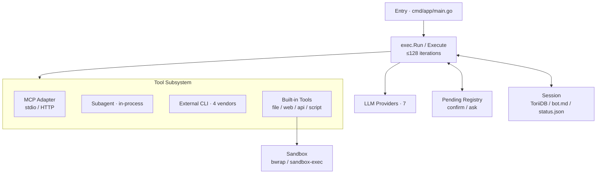

> [!NOTE]
> This README was generated by [SKILL](https://github.com/pardnchiu/skill-readme-generate), get the ZH version from [here](./doc/README.zh.md). 
> Tests are generated by [SKILL](https://github.com/pardnchiu/skill-coverage-generate).

***

<picture style="margin-down: 1rem">

</picture>

<strong>BUILD YOUR OWN OPENCLAW WITH AGENVOY!</strong>

Logo and cover illustrations were generated with ChatGPT Image 2.0.

***

> A Go AI agent framework with multi-provider routing, MCP client adapter, in-process subagents, and OS-native sandboxing

Routes tasks across multiple LLM providers automatically, talks to MCP servers over stdio or HTTP, replaces HTTP fan-out with in-process subagents, and runs everything inside an OS-native sandbox.

## Table of Contents

- [Features](#features)
- [Architecture](#architecture)
- [License](#license)
- [Contributor](#contributor)
- [Star History](#star-history)

## Features

> `make build` · installs to `/usr/local/bin/agen` · [Documentation](https://github.com/agenvoy/Agenvoy/wiki)

- **Multi-agent orchestration** 
  Seven LLM providers (Copilot / OpenAI / Codex / Claude / Gemini / Nvidia / Compat) behind one interface with planner-based dispatch; `invoke_subagent` calls `exec.Execute` directly without HTTP, inheriting `AllowAll` / `WorkDir` from the parent ctx; `cross_review_with_external_agents` chains codex / claude / copilot / gemini through up to three rounds; a pending channel registry funnels every confirm and ask through one human interaction point.
- **Pluggable tools and OS-native sandbox** 
  Drop a JSON under `extensions/apis/` or a script under `extensions/scripts/<name>/` and it registers as a tool; the MCP client adapter speaks stdio and HTTP/SSE, merging global and per-session `mcp.json` automatically with `agen mcp` for interactive management; `run_command` / script / scheduler tools all route through `go-pkg/sandbox` (Linux bwrap, macOS sandbox-exec) with policy injected once in `init()`.
- **Self-improving cross-session error memory** 
  ToriiDB stores entries with 90-day TTL and refreshes on hit via `Expire`; `search_error_memory` and `search_conversation_history` run keyword + semantic search side by side (OpenAI text-embedding-3-small) and pad context with a 2-before / 1-after window, so the same trap is never stepped on twice.

## Architecture

> [Full Architecture](https://github.com/agenvoy/Agenvoy/wiki/Architecture)

```mermaid
graph TB
    Entry[Entry · cmd/app/main.go]
    Engine[exec.Run / Execute<br/>≤128 iterations]
    Providers[LLM Providers · 7]
    Pending[Pending Registry<br/>confirm / ask]

    subgraph Tools[Tool Subsystem]
        MCP[MCP Adapter<br/>stdio / HTTP]
        Sub[Subagent · in-process]
        Ext[External CLI · 4 vendors]
        Builtin[Built-in Tools<br/>file / web / api / script]
    end

    Sandbox[Sandbox<br/>bwrap / sandbox-exec]
    Session[Session<br/>ToriiDB / bot.md / status.json]

    Entry --> Engine
    Engine --> Providers
    Engine --> Tools
    Engine <--> Pending
    Engine <--> Session
    Builtin --> Sandbox
```

## License

This project is licensed under the [Apache License 2.0](LICENSE).

## Contributor

Just [open an issue](https://github.com/pardnchiu/agenvoy/issues/new) to share an idea.

## Star History

<a href="https://star-history.com/#pardnchiu/agenvoy&Date">
  <picture>
    <source media="(prefers-color-scheme: dark)" srcset="https://api.star-history.com/svg?repos=pardnchiu/agenvoy&type=Date&theme=dark&cache_bust=2026-05-05" />
    <source media="(prefers-color-scheme: light)" srcset="https://api.star-history.com/svg?repos=pardnchiu/agenvoy&type=Date&cache_bust=2026-05-05" />
    
  </picture>
</a>

When the curve trends up — that's the signal we want to see. Hit ★ to push it along.

***

©️ 2026 [邱敬幃 Pardn Chiu](https://www.linkedin.com/in/pardnchiu)
