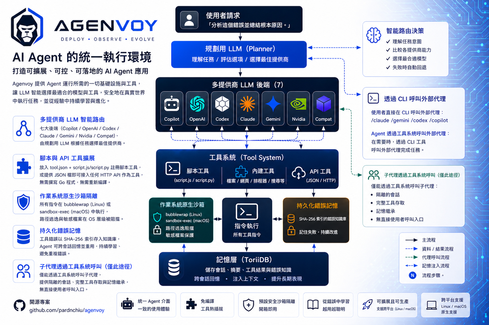
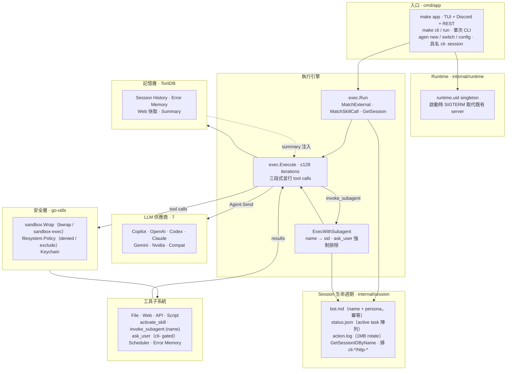

> [!NOTE]
> 此 README 由 [SKILL](https://github.com/pardnchiu/skill-readme-generate) 生成，英文版請參閱 [這裡](../README.md)。 
> 測試由 [SKILL](https://github.com/pardnchiu/skill-coverage-generate) 生成。

***

<picture style="margin-down: 1rem">

</picture>

<strong>BUILD YOUR OWN OPENCLAW WITH AGENVOY!</strong>

Logo 與封面插圖由 ChatGPT Image 2.0 生成。

***

# Agenvoy

> Go AI agent 框架，具備自我進化錯誤記憶、智慧多供應商路由、Python/JS/REST 工具擴充與 OS 原生沙箱執行

agent 會跨 session 從過去的失敗中學習、自動將每個任務路由到最適合的 LLM 供應商，並讓你透過丟一個 script 或 JSON 檔案擴充工具集 — 全部執行在 OS 原生 sandbox 內。

## 目錄

- [架構](#架構)
- [功能特點](#功能特點)
- [依賴套件](#依賴套件)
- [概念](#概念)
- [版本歷史](#版本歷史)
- [授權](#授權)
- [Author](#author)
- [Stars](#stars)

## 架構

> [完整架構](./architecture.zh.md)

## 功能特點

> `make build` · `agen`（統一 CLI / TUI / Discord / REST API）· [完整文件](./doc.zh.md)

- **多供應商 LLM 智慧路由** — 七種後端（Copilot / OpenAI / Codex / Claude / Gemini / Nvidia / Compat）透過統一 `Agent` 介面，由 planner LLM 依任務自動挑選最適合的供應商。
- **Script 與 API 工具擴充** — 丟入 `tool.json` + `script.js`/`script.py` 即註冊 script 工具，或丟入 JSON 即將任意 HTTP API 接為工具，無需寫 Go、無需重新編譯。
- **OS 原生 Sandbox 隔離** — 所有指令在 bubblewrap（Linux）或 `sandbox-exec`（macOS）中執行，敏感路徑與路徑逃逸皆在 OS 層級被阻擋。
- **持久化錯誤記憶** — 工具失敗會以 SHA-256 寫入錯誤知識庫，agent 可跨 session 回憶並複用先前的解法。
- **In-Process 子 Agent 委派** — `invoke_subagent` 直接在主 process 內開出獨立子 agent：獨立 session、可覆寫 model／system prompt／排除工具、強制排除自身以避免無限巢狀，且不走 HTTP。

## 依賴套件

直接引入自作者生態系的第一方套件。

- **嵌入式儲存作為記憶骨幹 — [pardnchiu/ToriiDB](https://github.com/pardnchiu/ToriiDB)** — 輕量的嵌入式 KV store，作為 Agenvoy 所有持久化層的單一骨幹。session 歷史、錯誤記憶、以及 `fetch_page` / `search_web` / `fetch_google_rss` 的 web 工具快取皆透過薄的 `internal/filesystem/store` wrapper 收斂至此，取代先前散落於各子系統的 JSON 檔案格式。這讓 `search_conversation_history` 與 `search_error_memory` 不再需要走檔案系統掃描即可跨 session 查詢，快取失效也從「協調檔案鎖」收斂為「刪除一把 key」。
- **共用工具函式庫 — [pardnchiu/go-utils](https://github.com/pardnchiu/go-utils)** — 橫向切面的工具套件，提供 HTTP、瀏覽器、sandbox、keychain 與輔助原語。`go-utils/http` 提供泛型 `GET[T]` / `POST[T]` / `PUT[T]` / `PATCH[T]` / `DELETE[T]` client，供所有 provider（`claude` / `openai` / `copilot` / `compat` / `gemini` / `nvidia`）與原生 API 工具（`yahooFinance` / `youtube` / `googleRSS` / `searchWeb`）共用。`go-utils/rod` 收斂 `fetch_page` 背後的 headless Chrome 堆疊 — stealth JS、listener-settle 偵測、viewport、typed `FetchError{Status}`、`KeepLinks`，process-singleton 瀏覽器加上 idle-TTL 汰除。`go-utils/sandbox` 收斂 `run_command` 與所有 script 工具的 OS 原生 process 隔離 — macOS `sandbox-exec` seatbelt profile、Linux `bwrap` bubblewrap 並自動探測可用的 `--unshare-*` namespace、`CheckDependence()` 在 Linux 缺 bubblewrap 時自動安裝，以 `New(denyMapJSON)` 一次性載入來自 `configs/jsons/denied_map.json` 的敏感路徑黑名單。`go-utils/filesystem/keychain` 驅動憑證儲存（macOS `security` / Linux `secret-tool` / 檔案 fallback），`go-utils/utils.UUID()` 為共用 ID 產生器。
- **原生 Cron 引擎 — [pardnchiu/go-scheduler](https://github.com/pardnchiu/go-scheduler)** — `agen` binary 內建的 in-process cron runtime，將週期性排程做為一等公民 — 不依賴系統 `crontab`、不依賴 `systemd` timer、不需要任何外部 daemon。`internal/scheduler` 以 `once.Do` 把 `goCron.New(...)` 包裝成 process singleton，對外暴露最小介面 `schedulerCron`（`Start` / `Stop` / `Add(spec, action, args...)` / `Remove`），同一套引擎同時驅動每小時摘要 cron 與 agent 主動建立的排程。對 LLM 暴露為四組工具 — `add_cron` / `list_crons` / `get_cron` / `remove_cron` 處理 cron 表達式排程、`add_task` / `list_tasks` / `get_task` / `remove_task` 處理由 `time.Timer` 支援的一次性任務 — 兩者皆透過 `internal/filesystem` 持久化並於啟動時重載。所有排程都在 agent process 內執行，TUI／CLI／Discord／REST 四個模式共享同一份排程狀態、工具可用性與執行 context；binary 結束即全部停止（`Stop()` 會取消所有 timer 並透過 `c.Stop()` 排空 cron）。

## 概念

此專案直接承接作者先前兩個專案的架構思路：

- **Script 工具作為 FaaS — [pardnchiu/go-faas](https://github.com/pardnchiu/go-faas)** — 一個輕量 Function-as-a-Service 平台，透過 HTTP 接收 Python / JavaScript / TypeScript 程式碼，在 Bubblewrap sandbox 中以 Linux namespace 隔離執行並串流結果。Agenvoy 的 script 工具子系統（`scriptAdapter`）直接採用此模型：每個 script 工具都是無狀態 function、透過 stdin/stdout JSON 呼叫、在獨立 process 中隔離，agent 扮演呼叫端而非 HTTP client。
- **認知式不完美記憶 — [pardnchiu/cim-prototype](https://github.com/pardnchiu/cim-prototype)** — 主張完美記憶是認知負擔 — 基於 LLM 在完整歷史重播下多輪表現下降 39% 的研究（[LLMs Get Lost In Multi-Turn Conversation](https://arxiv.org/abs/2505.06120)）。它以結構化 rolling summary 維持狀態，只在被觸發時以 fuzzy search 取出相關片段，模仿人類選擇性回憶。Agenvoy 的 session 層直接反映此思路：`trimMessages()` 強制 token 預算而非重播完整歷史、`summary` 在每輪之間 deep-merge 並持久化、`search_conversation_history` 提供關鍵字觸發的回憶而非注入所有過往 context。

## 版本歷史

- **v0.20.0** — Session 加入友善名稱層：每個 session 寫入 `bot.md`（YAML frontmatter `name` + agent persona body，`SaveBot` 冪等，預設 body 由 `configs/prompts/default_session_prompt.md` embed）。CLI 新增三條以該 name 為主鍵的指令：`agen new [name]` 建立 `cli-` session 並切換主指標、`agen switch <name>` 依 name 切換、`agen config` 以 `$EDITOR` 編輯當前 session 的 `bot.md`。`invoke_subagent` 新增 `name="<X>"` 參數可分派到具名 `cli-`／`http-` session（`session.GetSessionIDByName` 解析），system prompt 新增 forced-routing 規則涵蓋「呼叫 X 來 Y」「ask X to」等中英自然語句。`persist=true` 的 HTTP session（`http-<uuid>`）真正永久化——從 cleanup 白名單移除，僅 `temp-*` 在 1 小時 idle 後清理。新增 `internal/runtime` 寫入 `~/.config/agenvoy/runtime.uid` UID／PID singleton，`runApp` 啟動時 SIGTERM（5 秒寬限）→ SIGKILL 取代既有 server，再串聯 `CleanupSessions` + `ClearAllActive`。`ask_user` 改以 `cli-*` 前綴 gate：非 `cli-` session（subagent／Discord／HTTP）回傳引導訊息要求 LLM 改以回覆文字向使用者問問題。`invoke_subagent` 強制排除集新增 `ask_user`——架構合約上 subagent 從進場到落地只能輸出單一 final text，無法暫停等待使用者輸入。go-utils 升級至 v0.9.4，tool event log 細節同步調整。
- **v0.19.8** — 新增每 session 併發上限（`MAX_SESSION_TASKS`，預設 3、硬上限 10），並新增兩支端點：`GET /v1/session/:session_id/status`（讀 `status.json` 取 online／idle 狀態與進行中任務清單）與 `GET /v1/session/:session_id/log`（SSE 串流 `action.log`：每秒讀尾端 100 行、以 last-line 比對推播新增行）；新增每 session `action.log` 紀錄使用者輸入與關鍵 tool／錯誤事件供人工稽核（1 MB rotation，不進 ToriiDB／embedder）；`invoke_subagent`（`MAX_SUBAGENT_TIMEOUT_MIN`）與外部 CLI agent（`MAX_EXTERNAL_AGENT_TIMEOUT_MIN`）超時改為 env 可調，預設 10 分鐘、硬上限 60 分鐘；修正 `invoke_subagent` 支援以 session id 續用既有持久化 session（已存在性檢查、不自動建立）。
- **v0.19.7** — 工具註冊強化：tool description 與 JSON schema 全面對齊 reviewer 規範（單句英文、optional 欄位一律帶 default）；tool 識別字統一改為標準 snake_case（`patch_edit`→`patch_file`、`analyze_youtube`→`fetch_youtube_transcript`、`select_skill`→`activate_skill`、`read_tool_error`→`read_error_memory`、`script_*` 系列分隔符正規化）；scheduler 與 agent tool package 依領域拆分子套件；Gemini 加入外部 agent 行列；同時新增 `tool-reviewer` 與 `code-reviewer` 兩支 skill 並修正 code-reviewer entropy 誤判。
- **v0.19.6** — 新增 `ask_user` 工具（自由輸入／單選／多選，由 `promptui` 驅動），僅供 CLI 模式互動；`run_command` 切換為 argv-only schema（`argv: string[]`，不再做 shell 字串解析）— 多字含空格參數零 quote-bug，shell 功能改由顯式 `["sh","-c","..."]` 觸發。新增帶 TTL 的語意化 error memory：`Save` 透過 `SetVector` 寫入並設 90 天 TTL，無 embedder 時 `Search` fallback 至 keyword scan，每次命中皆透過 `db.Expire` 續期。將 `search_web` 限流由每批 toolCall throttle 改為 package-level `sync.Mutex` + `ddgMinGap=2s` 全域 gap（覆蓋 retry／跨 iteration／跨 session）；`api_*` 限流改為 per-name 全域互斥鎖（`apiMinGap=1s`），不同 api name 互不阻塞。內建 `commit-generate`、`readme-generate`、`version-generate` 三支 skill。

## 授權

本專案採用 [Apache-2.0 LICENSE](../LICENSE)。

## Author

<h4 style="padding-top: 0">邱敬幃 Pardn Chiu</h4>

<a href="mailto:dev@pardn.io">dev@pardn.io</a> 
<a href="https://linkedin.com/in/pardnchiu">https://linkedin.com/in/pardnchiu</a>

## Stars

***

©️ 2026 [邱敬幃 Pardn Chiu](https://linkedin.com/in/pardnchiu)
