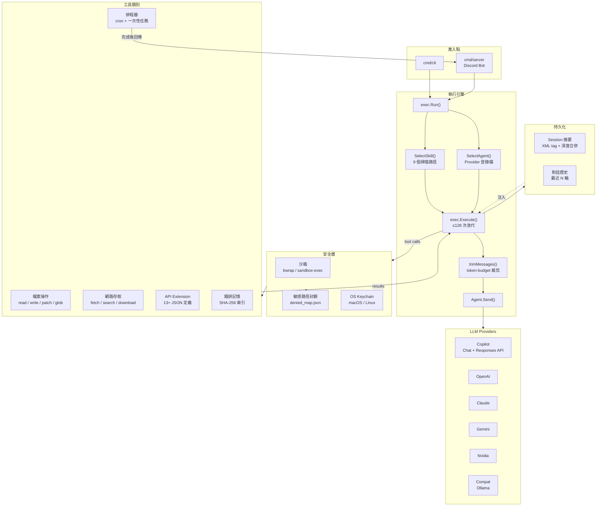

> [!NOTE]
> 此 README 由 [SKILL](https://github.com/pardnchiu/skill-readme-generate) 生成，英文版請參閱 [這裡](../README.md)。<br>
> 測試由 [SKILL](https://github.com/pardnchiu/skill-coverage-generate) 生成。


# Agenvoy

[](https://pkg.go.dev/github.com/pardnchiu/agenvoy)
[](https://goreportcard.com/report/github.com/pardnchiu/agenvoy)
[](https://app.codecov.io/github/pardnchiu/agenvoy/tree/master)
[](LICENSE)
[](https://github.com/pardnchiu/agenvoy/releases)

> Agenvoy 以 [OpenClaw](https://openclaw.ai) 為靈感，基於 Go 標準庫，專注於多模型智能調度與安全優先的設計理念

## 目錄

- [功能特點](#功能特點)
- [架構](#架構)
- [檔案結構](#檔案結構)
- [版本歷史](#版本歷史)
- [授權](#授權)
- [Author](#author)
- [Stars](#stars)

## 功能特點

> `go install github.com/pardnchiu/agenvoy/cmd/cli@latest` · [完整文件](./doc.zh.md)

### 多 Provider LLM 智能路由

Agenvoy 將七個 AI 後端 — GitHub Copilot、Claude、OpenAI、Gemini、Nvidia NIM，以及任意 OpenAI 相容端點（Compat/Ollama）— 統一於單一 `Agent` 介面之後。專屬 Planner LLM 針對每個請求自動選出最適合的 Provider，並根據模型的 input token 上限進行 token-budget 裁剪，確保歷史訊息不會溢出 context window。Copilot Provider 支援 GPT-5.4 系列的 Responses API 端點，自動偵測模型類型並切換通訊協定。

### 沙箱隔離安全執行

所有外部指令與腳本在作業系統原生沙箱中執行。Linux 使用 bubblewrap（`bwrap`）搭配動態 namespace 探測（`--unshare-user`、`--unshare-pid` 等逐一驗證可用性），macOS 使用 `sandbox-exec` 搭配 Seatbelt Profile。雙平台均從嵌入式 `denied_map.json` 載入敏感路徑封鎖清單，阻止存取 SSH 金鑰、雲端憑證、Shell 設定檔與私鑰格式。API 金鑰儲存於系統原生 Keychain 而非環境變數，所有路徑解析使用 `filepath.EvalSymlinks` 防止捷徑繞過邊界。

### Skill 驅動的 Agentic 工作流

Skill 是帶有 YAML Frontmatter 的 Markdown 定義檔，描述任務的 System Prompt 與工具允許清單。執行時 Selector LLM 從 9 個標準掃描路徑中挑選最符合的 Skill，隨後驅動最多 128 次迭代的工具呼叫迴圈直至任務完成。內建 25+ 工具涵蓋檔案操作、網路存取、排程器、錯誤記憶與 13+ JSON 驅動 API Extension，所有 `rm` 導向 `.Trash`、所有寫入使用原子性 tmp-then-rename。Discord Bot 模式支援 Slash Command、per-channel Session 狀態與排程任務回傳。

## 架構



## 檔案結構

```
agenvoy/
├── cmd/
│   ├── cli/                # CLI：add / remove / list / run
│   └── server/             # Discord Bot 進入點
├── configs/
│   ├── jsons/              # Provider 模型定義、denied_map、白名單
│   └── prompts/            # 嵌入式 System Prompt 與選擇器
├── extensions/
│   ├── apis/               # 內嵌 API Extension（13+ JSON）
│   └── skills/             # 內嵌 Skill Extension（Markdown）
├── internal/
│   ├── agents/
│   │   ├── exec/           # 執行引擎、token 裁剪、摘要擷取
│   │   ├── provider/       # 6 個 AI Provider 後端 + Responses API
│   │   └── types/          # Agent 介面 + Message / Usage 類型
│   ├── discord/            # Discord Slash Command + 檔案附件
│   ├── filesystem/         # 路徑驗證、Session 管理與 Keychain
│   ├── sandbox/            # 沙箱隔離 + 敏感路徑封鎖
│   ├── scheduler/          # 持久化一次性與週期性任務排程器
│   ├── skill/              # Markdown Skill 掃描器與解析器
│   └── tools/              # 25+ 自註冊工具 + API Extension 適配器
├── go.mod
└── LICENSE
```

## 版本歷史

- **v0.15.0** — Copilot Responses API 支援（GPT-5.4 與 Codex 模型自動切換端點）；Session 層級 token-budget 訊息裁剪（依 `MaxInputTokens()` 計算預算，保留 system prompt + summary + 最新使用者訊息）；macOS 與 Linux 沙箱新增敏感路徑存取拒絕規則（從嵌入式 `denied_map.json` 載入）；Linux bwrap 恢復 `--unshare-all` namespace 隔離（含 graceful fallback 探測）與 `--new-session` process 隔離；`MAX_HISTORY_MESSAGES` 環境變數支援；Summary delimiter 改為 XML tag；輕量模型排除於 Agent 選擇
- **v0.14.0** — 作業系統原生沙箱隔離（Linux bubblewrap 自動安裝、macOS sandbox-exec）；每次請求的 token 用量追蹤（跨所有工具呼叫迭代累計）；工具處理器重構為獨立命名檔案；exclude 邏輯與 file walk/list 移至 `filesystem` package；`GetAbsPath` 新增 symlink 安全路徑解析
- **v0.13.0** — 自註冊 Tool Registry 取代 switch routing 與嵌入式 JSON 定義；排程器持久化 JSON 儲存含完整 CRUD（tasks 與 crons 的新增/更新/刪除）；Keychain 遷移至 `filesystem` 下；絕對路徑限制僅允許使用者 Home 目錄；裁切歷史加入省略號標記
- **v0.12.0** — 完整排程子系統（Cron + 一次性任務含 Discord 回呼）；集中 `filesystem` + `configs` 套件；以 `go-scheduler` 取代自製 Cron 解析器；`schedule-task` Skill
- **v0.11.2** — 修正錯誤記憶雙向關鍵字比對；修正 Claude 多段 System Prompt 合併；System Prompt 新增工具呼叫前禁止輸出文字規則
- **v0.11.1** — 工具執行錯誤追蹤（hash 型 `tool_errors/`）；原子性寫入（`utils.WriteFile`）；Gemini 多部分訊息修正；8 個新公開 API Extension；`get_tool_error` 工具
- **v0.11.0** — 宣告式 Extension 架構 — 內建 Go API 工具遷移為 JSON Extension；`SyncSkills` 從 GitHub 同步；授權改為 **Apache-2.0**
- **v0.10.2** — 修正 OpenAI 推理模型（`gpt-5`、`gpt-4.1`）不支援 `temperature` 的問題；`no_temperature` 模型旗標；`planner` 指令；`makefile`
- **v0.10.1** — Provider 模型登錄檔（內嵌 JSON）；互動式模型選擇 UI；全 Provider 統一 `temperature=0.2`
- **v0.10.0** — Discord Bot 模式（完整 Slash Command 支援）；`download_page` 瀏覽器工具；多層敏感路徑安全限制（`denied.json`）；HTML 轉 Markdown 轉換器
- **v0.9.0** — 檔案注入（`--file`）、圖片輸入（`--image`）；`remember_error` / `search_errors` 工具；網路搜尋 SHA-256 快取（1 小時 TTL）；`remove` 指令；公開 API（`GetSession`、`SelectAgent`、`SelectSkill`）
- **v0.8.0** — 正式更名為 **Agenvoy**（AGPL-3.0）；OS Keychain 整合；具名 `compat[{name}]` 實例；GitHub Actions CI + 單元測試
- **v0.7.2** — CLI 入口拆分為職責模組；`mergeSummary` 深度合併策略；API 範例設定（exchange-rate、ip-api）
- **v0.7.1** — 修正全 Provider Race Condition（改為 struct 實例欄位）；修正 `runCommand` / `moveToTrash` 中的 Context 傳遞鏈；以 `json.Unmarshal` 取代 `strconv.Unquote` 處理 Unicode
- **v0.7.0** — LLM 驅動自動 Agent 路由；OpenAI 相容（`compat`）Provider / Ollama 支援；`search_history` 工具；Session 檔案鎖；單體 `exec.go` 拆分為子套件
- **v0.6.0** — 概要式持久化記憶；Session 歷史（`history.json`）；Tool Action 記錄；集中式 `utils.ConfigDir()`
- **v0.5.0** — 新增 `fetch_page`（無頭 Chrome + stealth JS）、`search_web`（Brave + DDG 並行）、`calculate`；全工具鏈 Context 傳遞
- **v0.4.0** — 內建 API 工具（天氣、股票、新聞、HTTP）；JSON 驅動 API 適配器；`patch_edit` 工具；Skill 自動匹配引擎；`io.Writer` → Event Channel 輸出模型
- **v0.3.0** — 多 Agent 後端支援：OpenAI、Claude、Gemini、Nvidia；統一 `Agent` 介面；Goroutine 並行 Skill 掃描器
- **v0.2.0** — 新增完整檔案系統工具鏈（`list_files`、`glob_files`、`write_file`、`search_content`、`run_command`）、指令白名單、互動式確認、`--allow` 旗標
- **v0.1.0** — 初始版本 — GitHub Copilot CLI，含 Skill 執行迴圈與自動 Token 刷新

## 授權

本專案採用 [Apache-2.0 LICENSE](../LICENSE)。

## Author


<h4 style="padding-top: 0">邱敬幃 Pardn Chiu</h4>

<a href="mailto:dev@pardn.io" target="_blank">

</a> <a href="https://linkedin.com/in/pardnchiu" target="_blank">

</a>

## Stars

[](https://www.star-history.com/#pardnchiu/agenvoy&Date)

***

©️ 2026 [邱敬幃 Pardn Chiu](https://linkedin.com/in/pardnchiu)
