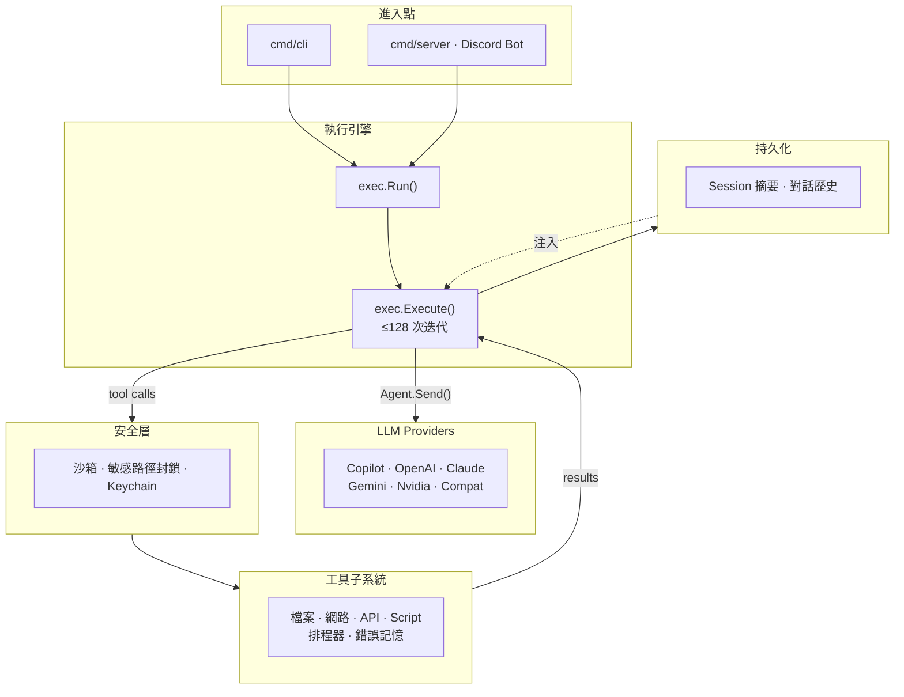

> [!NOTE]
> 此 README 由 [SKILL](https://github.com/pardnchiu/skill-readme-generate) 生成，英文版請參閱 [這裡](../README.md)。<br>
> 測試由 [SKILL](https://github.com/pardnchiu/skill-coverage-generate) 生成。

*** 

<p align="center">
<picture>

</picture>
</p>

<p align="center">
  <strong>BUILD YOUR OWN OPENCLAW WITH AGENVOY!</strong>
</p>

<p align="center">
<a href="https://pkg.go.dev/github.com/pardnchiu/agenvoy"></a>
<a href="https://app.codecov.io/github/pardnchiu/agenvoy/tree/master"></a>
<a href="../LICENSE"></a>
<a href="https://github.com/pardnchiu/agenvoy/releases"></a>
</p>

***

# Agenvoy
> Go 多 Provider AI Agent 框架，具備智能路由、沙箱隔離執行與 Skill 驅動工作流

不再為每個 AI Provider 單獨接線 — Agenvoy 將任務路由至最適模型、在 OS 原生沙箱中執行工具，並跨 Session 記住失敗原因。

## 目錄

- [架構](#架構)
- [功能特點](#功能特點)
- [概念來源](#概念來源)
- [檔案結構](#檔案結構)
- [版本歷史](#版本歷史)
- [授權](#授權)
- [Author](#author)
- [Stars](#stars)

## 架構

> 各子系統詳細圖表：[architecture.zh.md](./architecture.zh.md)



## 功能特點

> `go install github.com/pardnchiu/agenvoy/cmd/cli@latest` · [完整文件](./doc.zh.md)

### 多 Provider LLM 智能路由

六個後端統一於單一介面 — 專屬 Planner LLM 自動為每個請求挑選最適 Provider，並自動裁剪 Context Window。

<details>
<summary>詳細說明</summary>

GitHub Copilot、Claude、OpenAI、Gemini、Nvidia NIM，以及任意 OpenAI 相容端點（Compat/Ollama）— 統一於 `Agent` 介面。Planner LLM 自動選出最適 Provider，token-budget 裁剪防止 context window 溢出，各 Provider 支援獨立設定的推理層級（Reasoning Level）。

</details>

### 作業系統原生沙箱隔離

指令在 bubblewrap（Linux）或 `sandbox-exec`（macOS）中執行 — 路徑逃逸與敏感檔案存取在 OS 層封鎖。

<details>
<summary>詳細說明</summary>

所有指令與腳本在 Linux bubblewrap（搭配動態 namespace 探測）或 macOS `sandbox-exec` 中執行。敏感路徑封鎖清單從嵌入式 `denied_map.json` 載入，憑證儲存於 OS Keychain，symlink 安全路徑驗證將存取限制於使用者 Home 目錄內。

</details>

### Skill 驅動的 Agentic 工作流

寫一個 Markdown 檔定義任務；Agent 從 9 個掃描路徑自動選出最佳 Skill，最多執行 128 次工具迭代直至完成。

<details>
<summary>詳細說明</summary>

宣告式 Markdown Skill 搭配 YAML Frontmatter 定義任務 Prompt 與工具允許清單。Selector LLM 自動匹配最佳 Skill，隨後驅動工具呼叫迴圈（含 hash 去重），最多 128 次迭代直至任務完成。

</details>

### Copilot 雙協定自動切換

GPT-5.4 與 Codex 自動路由至 Responses API；其餘 Copilot 模型使用 Chat Completions — 無需任何設定。

<details>
<summary>詳細說明</summary>

Copilot Provider 在執行時偵測模型類型。GPT-5.4 與 Codex 路由至 Responses API，其餘使用 Chat Completions。跨 Provider 圖片正規化將所有格式 re-encode 為 JPEG，確保 Vision 通用支援。

</details>

### Script Tool 執行環境

在目錄中放入 `tool.json` + `script.js` 或 `script.py`，Agent 即自動發現並以一等工具身份呼叫 — 無需 Go 程式碼，無需重新編譯。

<details>
<summary>詳細說明</summary>

啟動時，執行器掃描 `~/.config/agenvoy/script_tools/` 與 `<workdir>/.config/agenvoy/script_tools/` 下的子目錄，找到包含 `tool.json`（name、description、parameters schema）與可執行 `script.js`/`script.py` 的目錄即自動載入。每個工具以 `script_` 前綴註冊並透過 stdin/stdout JSON 協定執行，與 API tool 契約完全一致。`script-tool-creator` Skill 可自動產生新工具骨架。

</details>

### 內建 Extension Script Tool 範例

Threads API（發布文字/圖片/輪播、配額查詢、Token 刷新）與 yt-dlp（影片資訊、下載含檔名正規化）隨附跨平台安裝腳本，一行指令即可完成部署。

<details>
<summary>詳細說明</summary>

`install_threads.sh` 與 `install_youtube.sh` 自動偵測作業系統、檢查 Python 相依套件，並將工具複製至 `~/.config/agenvoy/script_tools/`。Threads 工具在發布前本地驗證 500 字元上限、以獨立錯誤碼回報 Token 過期，並支援兩步驟容器/發布流程。yt-dlp 工具將檔名正規化為 NFC 並移除非 ASCII 字元，支援可設定的格式選擇與輸出路徑。

</details>

### Skill Git 工具

三個工具讓 Agent 在 Skill 工作流程中提交、查看歷史與回滾變更，無需離開執行迴圈。

<details>
<summary>詳細說明</summary>

`skill_git_commit`、`skill_git_log`、`skill_git_rollback` 作用於 Skill 儲存庫路徑。讓 `readme-generate`、`script-tool-creator` 等 Skill 能原子性地版本控制自己的輸出、查看變更歷史，並在出錯時回滾 — 全程在單次 Agent 執行中完成。

</details>

### 宣告式 JSON API Extension

放一個 JSON 檔即可新增任意 HTTP API 作為工具 — 無需撰寫 Go 程式碼。

<details>
<summary>詳細說明</summary>

14+ 內嵌公開 API 工具（CoinGecko、Wikipedia、Open-Meteo、Yahoo Finance、YouTube metadata 等）以純 JSON 定義。使用者自訂 Extension 放至 `~/.config/agenvoy/apis/` 即可於啟動時自動載入，無需重新編譯。

</details>

### 持久化錯誤記憶

工具失敗以 SHA-256 索引按 Session 儲存；Agent 可回溯過去錯誤並跨 Session 重用解決方案。

<details>
<summary>詳細說明</summary>

任何工具呼叫失敗時，錯誤持久化至 `tool_errors/{hash}.json`。Agent 可透過 `search_errors` 回溯過去失敗，並以 `remember_error` 持久化解決方案，實現無需人工介入的跨 Session 學習。

</details>

### 持久化任務排程器

完整 CRUD 支援 Cron 與一次性任務 — JSON 持久化、重啟自動恢復、完成時 Discord 回傳。

<details>
<summary>詳細說明</summary>

週期性 Cron 任務與一次性排程任務以 JSON 儲存，重啟後自動恢復。任務完成時，執行結果推送至指定的 Discord 頻道。

</details>

### Discord Bot 整合

Slash Command 與 CLI 共享同一執行引擎，per-channel Session 隔離，並支援 Modal 直接設定 API Key。

<details>
<summary>詳細說明</summary>

per-channel Session 隔離、檔案附件處理、inline 檔案傳送協定與排程任務結果推送。所有 Provider 的 API Key 均可直接透過 Discord Modal 輸入設定（`/add-gemini`、`/add-openai`、`/add-claude`、`/add-nim`）。

</details>

## 概念來源

以下兩個同作者的前置專案直接奠定了 Agenvoy 的架構設計：

### Script Tool 即 FaaS — [pardnchiu/go-faas](https://github.com/pardnchiu/go-faas)

[pardnchiu/go-faas](https://github.com/pardnchiu/go-faas) 是一個輕量 Function-as-a-Service 平台，透過 HTTP 接收 Python、JavaScript 與 TypeScript 程式碼，在具備完整 Linux namespace 隔離的 Bubblewrap 沙箱中執行，並串流回傳結果。Agenvoy 的 script tool 子系統（`scriptAdapter`）直接採用此模型：每個 script tool 是一個無狀態函式，透過 stdin/stdout JSON 協定呼叫，隔離於獨立 process，agent 扮演呼叫方而非 HTTP client。

### 認知不完美記憶 — [pardnchiu/cim-prototype](https://github.com/pardnchiu/cim-prototype)

[pardnchiu/cim-prototype](https://github.com/pardnchiu/cim-prototype) 論證完美記憶是認知負擔而非優勢 — 基於研究指出逐字重播完整對話歷史會導致 LLM 多輪對話效能下降 39%（[LLMs Get Lost In Multi-Turn Conversation](https://arxiv.org/abs/2505.06120)）。系統改為維護結構化滾動摘要，並僅在觸發關鍵字時透過模糊搜尋取回相關片段，模擬人類選擇性回溯而非重播的記憶機制。Agenvoy 的 Session 層直接反映此設計：`trimMessages()` 強制執行 token budget 而非重播完整歷史，`summary` 跨輪次持久化並深度合併，`search_history` 提供關鍵字觸發式回溯而非注入所有過去 context。

## 檔案結構

```
agenvoy/
├── cmd/
│   ├── cli/                # CLI：add / remove / list / run
│   └── server/             # Discord Bot 進入點
├── configs/
│   ├── jsons/              # Provider 模型定義、denied_map、白名單
│   └── prompts/            # 嵌入式 System Prompt 與選擇器
├── extensions/
│   ├── apis/               # 內嵌 API Extension（14+ JSON）
│   ├── scripts/            # 內建 Script Tool（Threads、yt-dlp + 安裝腳本）
│   └── skills/             # 內嵌 Skill Extension（Markdown）
├── install_threads.sh      # Threads Script Tool 跨平台安裝腳本
├── install_youtube.sh      # yt-dlp Script Tool 跨平台安裝腳本
├── internal/
│   ├── agents/
│   │   ├── exec/           # 執行引擎、token 裁剪、摘要擷取
│   │   ├── provider/       # 6 個 AI Provider 後端 + Responses API
│   │   └── types/          # Agent 介面 + Message / Usage 類型
│   ├── discord/            # Discord Slash Command + 檔案附件
│   ├── filesystem/         # 路徑驗證、Keychain 與用量追蹤
│   ├── sandbox/            # 沙箱隔離 + 敏感路徑封鎖
│   ├── scheduler/          # 持久化一次性與週期性任務排程器
│   ├── session/            # Session 狀態、設定與滾動摘要
│   ├── skill/              # Markdown Skill 掃描器與解析器
│   ├── toolAdapter/
│   │   ├── api/            # HTTP API 工具翻譯與 dispatch
│   │   └── script/         # Script Tool 執行器與 stdin/stdout JSON 橋接
│   └── tools/              # 26+ 自註冊工具 + git / 排程工具
├── go.mod
└── LICENSE
```

## 版本歷史

- **v0.16.1** — 內建 Threads（發布文字/圖片/輪播、配額、Token 刷新）與 yt-dlp（影片資訊、下載）Script Tool Extension，附跨平台 `install_threads.sh` / `install_youtube.sh`。重構 `toolAdapter` 為 `api/` 與 `script/` 子套件；Session 管理移至 `internal/session`；Filesystem 套件拆分為單一職責檔案。修正 Darwin 沙箱 Keychain 目錄存取。限制工具呼叫節流至 `api_` 前綴；改善 `AbsPath` tilde 展開與排除邏輯去重。
- **v0.16.0** — Script tool 執行環境（`scriptAdapter`）：在 `~/.config/agenvoy/script_tools/` 放入 `tool.json` + `script.js`/`script.py` 即自動載入為 `script_` 前綴工具，stdin/stdout JSON 協定與 API tool 一致。重構 `tools/apis/adapter` → `apiAdapter`，`tools/apis` → `tools/api`。新增 `skill_git_commit`、`skill_git_log`、`skill_git_rollback` 支援 Skill 內部版本控制。Copilot token 過期自動重新登入。修正 Discord 非 ASCII 檔名上傳失敗，新增 10MB 上限前置驗證並回報用戶。
- **v0.15.2** — 新增 YouTube metadata 擷取工具（`analyze_youtube`）；Discord Modal API Key 設定指令（`/add-gemini`、`/add-openai`、`/add-claude`、`/add-nim`）；逐模型 Token 用量追蹤（`usageManager`）；各 Provider 可設定推理層級（Reasoning Level）；瀏覽器迭代上限與同網域連結追蹤現可透過 `MAX_TOOL_ITERATIONS`、`MAX_SKILL_ITERATIONS`、`MAX_EMPTY_RESPONSES` 設定；修正 Makefile 參數傳遞

<details>
<summary>更早版本</summary>

- **v0.15.1** — 修正 Copilot Claude/Gemini 模型的圖片驗證失敗：所有上傳圖片統一 decode 後 re-encode 為 JPEG（`image.Decode` + `jpeg.Encode`，支援 PNG/GIF/WebP 來源），`ImageURL` 新增 `detail` 欄位；Summary regex 從單一表達式拆分為三個獨立 pattern（fenced block、`<summary>` tag、`[summary]` bracket）；System prompt 移至 history 之後以提升模型指令遵循度；Discord prompt 優先於基本 system prompt
- **v0.15.0** — Copilot Responses API 支援（GPT-5.4 與 Codex 模型自動切換端點）；Session 層級 token-budget 訊息裁剪（依 `MaxInputTokens()` 計算預算，保留 system prompt + summary + 最新使用者訊息）；macOS 與 Linux 沙箱新增敏感路徑存取拒絕規則（從嵌入式 `denied_map.json` 載入）；Linux bwrap 恢復 `--unshare-all` namespace 隔離（含 graceful fallback 探測）與 `--new-session` process 隔離；`MAX_HISTORY_MESSAGES` 環境變數支援；Summary delimiter 改為 XML tag；輕量模型排除於 Agent 選擇
- **v0.14.0** — 作業系統原生沙箱隔離（Linux bubblewrap 自動安裝、macOS sandbox-exec）；每次請求的 token 用量追蹤（跨所有工具呼叫迭代累計）；工具處理器重構為獨立命名檔案；exclude 邏輯與 file walk/list 移至 `filesystem` package；`GetAbsPath` 新增 symlink 安全路徑解析
- **v0.13.0** — 自註冊 Tool Registry 取代 switch routing 與嵌入式 JSON 定義；排程器持久化 JSON 儲存含完整 CRUD（tasks 與 crons 的新增/更新/刪除）；Keychain 遷移至 `filesystem` 下；絕對路徑限制僅允許使用者 Home 目錄；裁切歷史加入省略號標記
- **v0.12.0** — 完整排程子系統（Cron + 一次性任務含 Discord 回呼）；集中 `filesystem` + `configs` 套件；以 `go-scheduler` 取代自製 Cron 解析器；`schedule-task` Skill
- **v0.11.2** — 修正錯誤記憶雙向關鍵字比對；修正 Claude 多段 System Prompt 合併；System Prompt 新增工具呼叫前禁止輸出文字規則
- **v0.11.1** — 工具執行錯誤追蹤（hash 型 `tool_errors/`）；原子性寫入（`utils.WriteFile`）；Gemini 多部分訊息修正；8 個新公開 API Extension；`get_tool_error` 工具
- **v0.11.0** — 宣告式 Extension 架構 — 內建 Go API 工具遷移為 JSON Extension；`SyncSkills` 從 GitHub 同步；授權改為 **Apache-2.0**
- **v0.10.2** — 修正 OpenAI 推理模型（`gpt-5`、`gpt-4.1`）不支援 `temperature` 的問題；`no_temperature` 模型旗標；`planner` 指令；`makefile`
- **v0.10.1** — Provider 模型登錄檔（內嵌 JSON）；互動式模型選擇 UI；全 Provider 統一 `temperature=0.2`
- **v0.10.0** — Discord Bot 模式（完整 Slash Command 支援）；`download_page` 瀏覽器工具；多層敏感路徑安全限制（`denied.json`）；HTML 轉 Markdown 轉換器
- **v0.9.0** — 檔案注入（`--file`）、圖片輸入（`--image`）；`remember_error` / `search_errors` 工具；網路搜尋 SHA-256 快取（1 小時 TTL）；`remove` 指令；公開 API（`GetSession`、`SelectAgent`、`SelectSkill`）
- **v0.8.0** — 正式更名為 **Agenvoy**（AGPL-3.0）；OS Keychain 整合；具名 `compat[{name}]` 實例；GitHub Actions CI + 單元測試
- **v0.7.2** — CLI 入口拆分為職責模組；`mergeSummary` 深度合併策略；API 範例設定（exchange-rate、ip-api）
- **v0.7.1** — 修正全 Provider Race Condition（改為 struct 實例欄位）；修正 `runCommand` / `moveToTrash` 中的 Context 傳遞鏈；以 `json.Unmarshal` 取代 `strconv.Unquote` 處理 Unicode
- **v0.7.0** — LLM 驅動自動 Agent 路由；OpenAI 相容（`compat`）Provider / Ollama 支援；`search_history` 工具；Session 檔案鎖；單體 `exec.go` 拆分為子套件
- **v0.6.0** — 概要式持久化記憶；Session 歷史（`history.json`）；Tool Action 記錄；集中式 `utils.ConfigDir()`
- **v0.5.0** — 新增 `fetch_page`（無頭 Chrome + stealth JS）、`search_web`（Brave + DDG 並行）、`calculate`；全工具鏈 Context 傳遞
- **v0.4.0** — 內建 API 工具（天氣、股票、新聞、HTTP）；JSON 驅動 API 適配器；`patch_edit` 工具；Skill 自動匹配引擎；`io.Writer` → Event Channel 輸出模型
- **v0.3.0** — 多 Agent 後端支援：OpenAI、Claude、Gemini、Nvidia；統一 `Agent` 介面；Goroutine 並行 Skill 掃描器
- **v0.2.0** — 新增完整檔案系統工具鏈（`list_files`、`glob_files`、`write_file`、`search_content`、`run_command`）、指令白名單、互動式確認、`--allow` 旗標
- **v0.1.0** — 初始版本 — GitHub Copilot CLI，含 Skill 執行迴圈與自動 Token 刷新

</details>

## 授權

本專案採用 [Apache-2.0 LICENSE](../LICENSE)。

## Author


<h4 style="padding-top: 0">邱敬幃 Pardn Chiu</h4>

<a href="mailto:dev@pardn.io" target="_blank">

</a> <a href="https://linkedin.com/in/pardnchiu" target="_blank">

</a>

## Stars

[](https://www.star-history.com/#pardnchiu/agenvoy&Date)

***

©️ 2026 [邱敬幃 Pardn Chiu](https://linkedin.com/in/pardnchiu)
