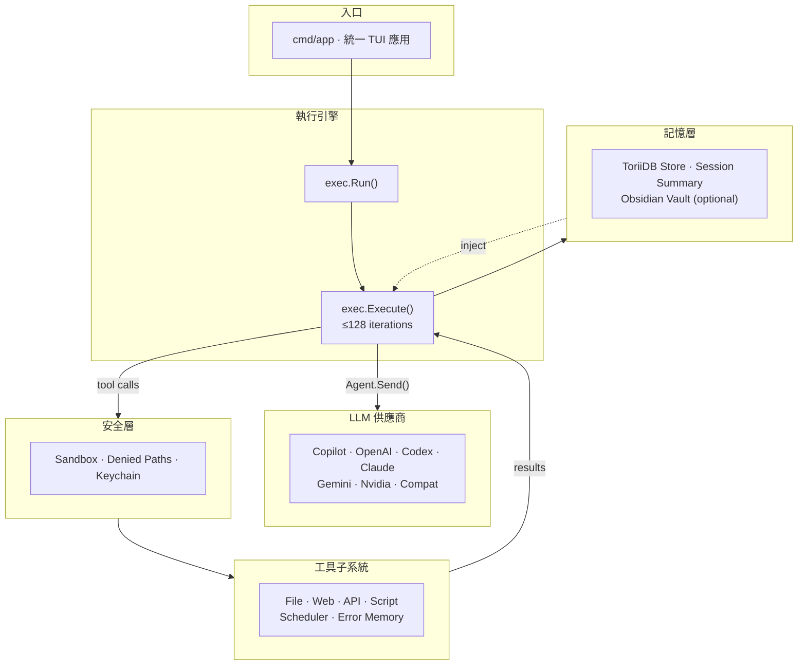

> [!NOTE]
> 此 README 由 [SKILL](https://github.com/pardnchiu/skill-readme-generate) 生成，英文版請參閱 [這裡](../README.md)。<br>
> 測試由 [SKILL](https://github.com/pardnchiu/skill-coverage-generate) 生成。

***

<p align="center">
<picture>

</picture>
</p>

<p align="center">
  <strong>BUILD YOUR OWN OPENCLAW WITH AGENVOY!</strong>
</p>

<p align="center">
<a href="https://pkg.go.dev/github.com/pardnchiu/agenvoy"></a>
<a href="https://app.codecov.io/github/pardnchiu/agenvoy/tree/master"></a>
<a href="LICENSE"></a>
<a href="https://github.com/pardnchiu/agenvoy/releases"></a>
<a href="https://discord.gg/CHTtXmh7Ca"></a>
</p>

***

# Agenvoy

> Go AI agent 框架，具備自我進化錯誤記憶、智慧多供應商路由、Python/JS/REST 工具擴充與 OS 原生沙箱執行

agent 會跨 session 從過去的失敗中學習、自動將每個任務路由到最適合的 LLM 供應商，並讓你透過丟一個 script 或 JSON 檔案擴充工具集 — 全部執行在 OS 原生 sandbox 內。


> 將 CLI、Discord bot 與 REST API 整合為單一本機介面的 Terminal UI — 檔案瀏覽器、session 內容檢視與即時 log 串流。

## 目錄

- [架構](#架構)
- [功能特點](#功能特點)
- [概念](#概念)
- [檔案結構](#檔案結構)
- [版本歷史](#版本歷史)
- [授權](#授權)
- [Author](#author)
- [Stars](#stars)

## 架構

> [完整架構](./architecture.zh.md)



## 功能特點

> `make build` · `agen`（統一 CLI / TUI / Discord / REST API）· [完整文件](./doc.zh.md)

### TUI Dashboard 與 vim 風格操作

將 CLI、Discord bot 與 REST API 整合至單一 terminal 介面，並支援 vim 風格導覽鍵與 `:` 命令輸入模式。

### 多供應商 LLM 智慧路由

七種後端（Copilot / OpenAI / Codex / Claude / Gemini / Nvidia / Compat）透過統一 `Agent` 介面，由 planner LLM 依任務自動挑選最適合的供應商。

### Script 與 API 工具擴充

丟入 `tool.json` + `script.js`/`script.py` 即註冊 script 工具，或丟入 JSON 即將任意 HTTP API 接為工具，無需寫 Go、無需重新編譯。

### OS 原生 Sandbox 隔離

所有指令在 bubblewrap（Linux）或 `sandbox-exec`（macOS）中執行，敏感路徑與路徑逃逸皆在 OS 層級被阻擋。

### 持久化錯誤記憶

工具失敗會以 SHA-256 寫入錯誤知識庫，agent 可跨 session 回憶並複用先前的解法。

### Obsidian Vault 記憶整合

連接 Obsidian Local REST API 後，`memory_search` / `memory_search_tag` / `memory_tags` / `memory_list` 直接在 vault 內做跨 session 的語義與標籤回溯。

### ToriiDB 儲存層

session 歷史、錯誤記憶、`fetch_page` / `search_web` / `google_rss` 快取統一由 ToriiDB 背書，取代分散的 JSON 檔案儲存。

### 分塊多階段摘要生成

摘要改由每小時 cron 觸發，分塊多階段處理長 session，避免單次生成超出 context window。

### 延遲載入的 search_tools

`search_tools` 永遠啟用，agent 透過 fuzzy 搜尋、`select:<name>` 直接啟用或 `+term` 必要關鍵字語法按需注入工具，不需預先載入所有工具 schema。

### 跨供應商 Prompt Caching

重複的 system prompt 與 context 片段在 Claude、Gemini、Copilot 端快取，同一 context 中的後續呼叫可降低延遲與 token 成本。

### 外部 Agent 驗證與內部覆核

`review_result` 以優先序內部模型對自身輸出做品質覆核，`verify_with_external_agent` 將結果平行送至所有宣告的外部 agent 並合併回饋，`call_external_agent` 則直接委派整個任務。

## 概念

此專案直接承接作者先前三個專案的架構思路：

### 嵌入式儲存作為記憶骨幹 — [pardnchiu/ToriiDB](https://github.com/pardnchiu/ToriiDB)

[pardnchiu/ToriiDB](https://github.com/pardnchiu/ToriiDB) 是一個輕量的嵌入式 KV store，核心主張是 process-local 狀態應該是持久、可觀察、且不依賴任何外部服務。Agenvoy 將它作為所有持久化層的單一骨幹 — session 歷史、錯誤記憶、以及 `fetch_page` / `search_web` / `fetch_google_rss` 的 web 工具快取皆改為透過薄的 `filesystem/store` wrapper 收斂至 ToriiDB，取代先前散落於各子系統的 JSON 檔案格式。這讓 `search_history` 與 `search_errors` 不再需要走檔案系統掃描即可跨 session 查詢，快取失效也從「協調檔案鎖」收斂為「刪除一把 key」。

### Script 工具作為 FaaS — [pardnchiu/go-faas](https://github.com/pardnchiu/go-faas)

[pardnchiu/go-faas](https://github.com/pardnchiu/go-faas) 是一個輕量 Function-as-a-Service 平台，透過 HTTP 接收 Python / JavaScript / TypeScript 程式碼，在 Bubblewrap sandbox 中以 Linux namespace 隔離執行並串流結果。Agenvoy 的 script 工具子系統（`scriptAdapter`）直接採用此模型：每個 script 工具都是無狀態 function、透過 stdin/stdout JSON 呼叫、在獨立 process 中隔離，agent 扮演呼叫端而非 HTTP client。

### 認知式不完美記憶 — [pardnchiu/cim-prototype](https://github.com/pardnchiu/cim-prototype)

[pardnchiu/cim-prototype](https://github.com/pardnchiu/cim-prototype) 主張完美記憶是認知負擔 — 基於 LLM 在完整歷史重播下多輪表現下降 39% 的研究（[LLMs Get Lost In Multi-Turn Conversation](https://arxiv.org/abs/2505.06120)）。它以結構化 rolling summary 維持狀態，只在被觸發時以 fuzzy search 取出相關片段，模仿人類選擇性回憶。Agenvoy 的 session 層直接反映此思路：`trimMessages()` 強制 token 預算而非重播完整歷史、`summary` 在每輪之間 deep-merge 並持久化、`search_history` 與 `memory_search` 提供關鍵字觸發的回憶而非注入所有過往 context。

## 檔案結構

```
agenvoy/
├── cmd/
│   └── app/                    # 統一入口：CLI + TUI + Discord bot + REST API
├── configs/
│   ├── jsons/                  # Provider 模型定義、denied_map、白名單
│   └── prompts/                # 嵌入的 system prompt 與 selector
├── extensions/
│   ├── apis/                   # 內建 API 擴充（12+ JSON）
│   ├── scripts/                # 內建 script 工具（Threads、yt-dlp）
│   └── skills/                 # 內建 skill 擴充（Markdown）
├── internal/
│   ├── agents/                 # 執行引擎、7 家 provider 後端、Agent 介面
│   ├── discord/                # Discord slash 指令 + 檔案附件
│   ├── filesystem/
│   │   ├── keychain/           # OS Keychain API key 儲存
│   │   ├── store/              # ToriiDB 儲存包裝層
│   │   └── obsidian.go         # Obsidian Local REST API client
│   ├── routes/                 # Gin 路由與 REST API handler
│   ├── sandbox/                # bubblewrap / sandbox-exec 隔離
│   ├── scheduler/              # cron / 一次性任務與腳本執行
│   ├── session/                # session 狀態、設定、rolling summary
│   ├── skill/                  # Markdown skill scanner
│   ├── toolAdapter/            # api / script 工具轉譯與派送
│   ├── tools/                  # 30+ 自註冊工具 + external agent + search_tools
│   └── tui/                    # Terminal UI（tview）+ vim 風格快捷鍵
├── install_threads.sh          # Threads script 工具跨平台安裝
├── install_youtube.sh          # yt-dlp script 工具跨平台安裝
├── go.mod
└── LICENSE
```

## 版本歷史

- **v0.18.0**（未發佈）— 新增 vim 風格 TUI 導覽鍵與 `:` 命令輸入模式；將 session 歷史、錯誤記憶、`fetch_page` / `search_web` / `google_rss` 快取遷移至 ToriiDB 儲存；將摘要生成改為每小時 cron 分塊多階段處理；整併 `cmd/cli` 與 `cmd/server` 至單一 `cmd/app` 入口，binary 更名為 `agen`；新增 Obsidian Local REST API 記憶整合（`memory_search` / `memory_search_tag` / `memory_tags` / `memory_list`）。
- **v0.17.4** — 新增 OpenAI Codex 為獨立 OAuth provider（Device Code Flow 自動刷新，預設 `gpt-5.3-codex`）；新增 `read_image` 工具以 base64 data URL 讀取本地圖片（JPEG/PNG/GIF/WebP，≤10 MB，統一解碼後重編為 JPEG）；將 Yahoo Finance 恢復為原生 Go 工具（`fetch_yahoo_finance`）採並行 query1/query2 雙端點；修復 summary 生成可靠性、`search_history` / `fetch_google_rss` 的 `query` 欄位 fallback、tool error 無 `Err` 時 event log crash 與過舊 `discussion_log` 殘留；補齊 scheduler task / cron CRUD 流程。
- **v0.17.3** — 新增 `search_tools` 延遲載入機制；`/v1/send` 新增 `exclude_tools` 過濾；Claude、Gemini、Copilot 端加入 prompt caching；工具重試成功後自動寫回錯誤模式；將 scheduler 拆為 `crons/` / `tasks/` / `script/` 子套件並採檔案持久化；skill sync 從網路改為嵌入 FS 複製。
- **v0.17.2** — 新增 `call_external_agent`、`verify_with_external_agent`、`review_result` 三項外部委派 / 內部覆核工具；session message 組裝重構為 4 段固定區塊，遇到 context length 錯誤時反應式裁剪；`/v1/send` 支援 `model` 欄位繞過自動 agent 選擇。
- **v0.17.1** — 修復 `externalAgent` package 在引入前尚未存在導致的 build break。
- **v0.17.0** — 完整 REST API 層（`/v1/send`、`/v1/key`、`/v1/tools`、`/v1/tool/:name`）；TUI dashboard 完成檔案瀏覽、session 檢視與即時 log 串流；Discord bot 與 REST API 統一至 `cmd/app`；Copilot token 遷移至系統 Keychain；`browser` 套件更名為 `fetchPage`。

<details>
<summary>更早版本</summary>

- **v0.16.1** — 內建 Threads 與 yt-dlp script 工具擴充與跨平台 `install_threads.sh` / `install_youtube.sh`；`toolAdapter` 拆為 `api/` 與 `script/`；session 管理遷移至 `internal/session`；`AbsPath` 波浪號展開與 exclude 去重修正。
- **v0.16.0** — Script 工具 runtime（`scriptAdapter`）：`~/.config/agenvoy/script_tools/` 下的 `tool.json` + `script.js`/`script.py` 自動註冊為 `script_` 前綴工具；Copilot token 401 自動重新登入。
- **v0.15.2** — `analyze_youtube`；Discord Modal API key 管理；`usageManager` 逐模型 token 追蹤；reasoning level 可設定；`MAX_TOOL_ITERATIONS` / `MAX_SKILL_ITERATIONS` / `MAX_EMPTY_RESPONSES` 環境變數。
- **v0.15.1** — Copilot Claude / Gemini 圖片驗證修復：全部解碼後重新編碼為 JPEG；摘要 regex 拆成三個獨立 pattern；system prompt 移至歷史之後以強化指令遵循。
- **v0.15.0** — Copilot Responses API（GPT-5.4 / Codex 自動切換）；session 級 token 預算訊息裁剪；macOS / Linux sandbox 敏感路徑拒絕規則；Linux bwrap 恢復 `--unshare-all` 命名空間隔離。
- **v0.14.0** — OS 原生 sandbox 隔離（bubblewrap / sandbox-exec）；跨 tool-call 迭代的 token 用量追蹤；`GetAbsPath` 的 symlink 安全路徑解析。
- **v0.13.0** — 自註冊工具 Registry 取代 switch routing；scheduler JSON 持久化 CRUD；keychain 遷入 `filesystem`；絕對路徑限制於使用者 home。
- **v0.12.0** — 完整 scheduler 子系統（cron + 一次性任務，含 Discord callback）；集中化 `filesystem` + `configs`；以 `go-scheduler` 取代自製 cron parser。
- **v0.11.2** — 錯誤記憶雙向關鍵字比對修正；Claude 多 system prompt 合併修正；pre-tool 文字壓制。
- **v0.11.1** — 工具錯誤追蹤（hash-based `tool_errors/`）；atomic writes；Gemini multipart 修正；新增 8 個公開 API 擴充。
- **v0.11.0** — 宣告式擴充架構 — Go API 工具遷至 JSON 擴充；`SyncSkills` 從 GitHub；授權切換至 **Apache-2.0**。
- **v0.10.2** — OpenAI 推理模型 `temperature` 修正；`no_temperature` 旗標；`planner` CLI；`makefile`。
- **v0.10.1** — 嵌入 JSON 設定的 provider 模型 registry；互動式模型選擇 UI；統一 `temperature=0.2`。
- **v0.10.0** — Discord bot 完整 slash command 支援；`download_page` browser 工具；多層敏感路徑安全（`denied.json`）；HTML → Markdown 轉換器。
- **v0.9.0** — 檔案注入（`--file`）、圖片輸入（`--image`）；`remember_error` / `search_errors`；web 搜尋 SHA-256 快取；`remove` 指令；公開 API（`GetSession`、`SelectAgent`、`SelectSkill`）。
- **v0.8.0** — 更名為 **Agenvoy**（AGPL-3.0）；OS Keychain 整合；具名 `compat[{name}]` instance；GitHub Actions CI。
- **v0.7.2** — 將 CLI 入口拆為獨立模組；`mergeSummary` deep-merge；API 範例設定（匯率、ip-api）。
- **v0.7.1** — 所有 provider 競態條件修正（instance 層 `model` 欄位）；`runCommand` / `moveToTrash` 的 Context 鏈修正。
- **v0.7.0** — LLM 驅動自動 agent 路由；OpenAI-compatible（`compat`）/ Ollama 支援；`search_history` 工具；並行 session 的檔案鎖；將單一 `exec.go` 拆為子套件。
- **v0.6.0** — 基於 summary 的持久化記憶；session 歷史（`history.json`）；工具動作 log；集中化 `utils.ConfigDir()`。
- **v0.5.0** — 新增 `fetch_page`（headless Chrome + stealth JS）、`search_web`（Brave + DDG 並行）、`calculate`；Context 穿透整條工具鏈。
- **v0.4.0** — 內建 API 工具（天氣、股票、新聞、HTTP）；JSON 驅動 API adapter；`patch_edit`；skill 自動比對引擎；`io.Writer` → Event Channel 輸出模型。
- **v0.3.0** — 多 agent 後端支援：OpenAI、Claude、Gemini、Nvidia；統一 `Agent` 介面；並行 goroutine skill scanner。
- **v0.2.0** — 新增完整 filesystem 工具鏈（`list_files`、`glob_files`、`write_file`、`search_content`、`run_command`）；指令白名單；互動式確認；`--allow`。
- **v0.1.0** — 初始版本 — 具備 skill 執行迴圈與自動 token 刷新的 GitHub Copilot CLI。

</details>

## 授權

本專案採用 [Apache-2.0 LICENSE](../LICENSE)。

## Author


<h4 style="padding-top: 0">邱敬幃 Pardn Chiu</h4>

<a href="mailto:dev@pardn.io" target="_blank">

</a> <a href="https://linkedin.com/in/pardnchiu" target="_blank">

</a>

## Stars

[](https://www.star-history.com/#pardnchiu/agenvoy&Date)

***

©️ 2026 [邱敬幃 Pardn Chiu](https://linkedin.com/in/pardnchiu)
