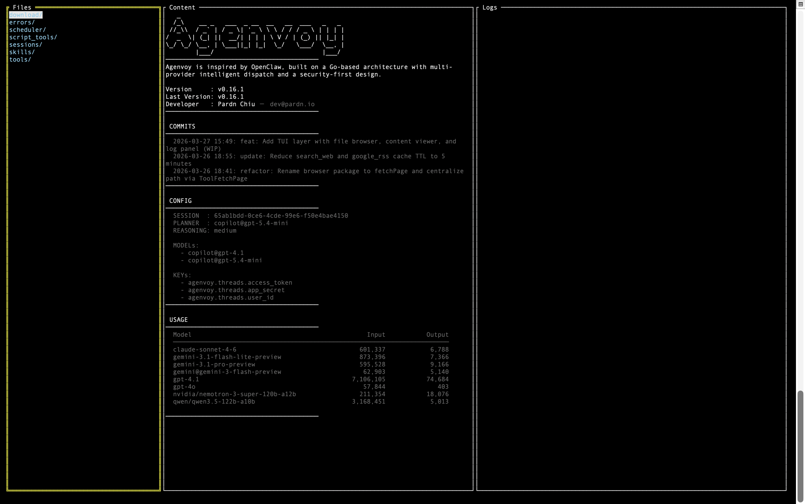
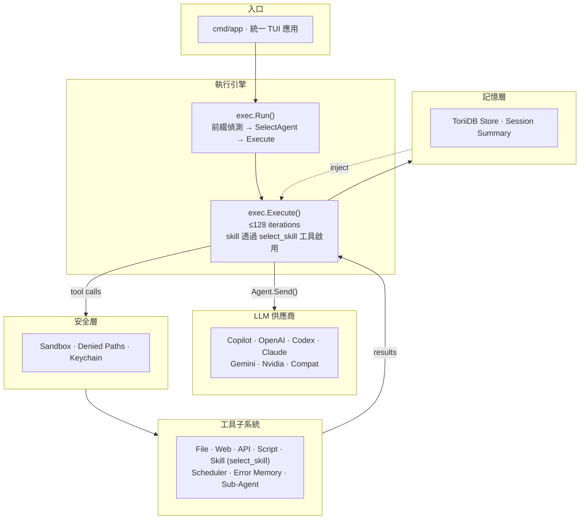

> [!NOTE]
> 此 README 由 [SKILL](https://github.com/pardnchiu/skill-readme-generate) 生成，英文版請參閱 [這裡](../README.md)。 
> 測試由 [SKILL](https://github.com/pardnchiu/skill-coverage-generate) 生成。

***

<picture>

</picture>

  <strong>BUILD YOUR OWN OPENCLAW WITH AGENVOY!</strong>

***

# Agenvoy

> Go AI agent 框架，具備自我進化錯誤記憶、智慧多供應商路由、Python/JS/REST 工具擴充與 OS 原生沙箱執行

agent 會跨 session 從過去的失敗中學習、自動將每個任務路由到最適合的 LLM 供應商，並讓你透過丟一個 script 或 JSON 檔案擴充工具集 — 全部執行在 OS 原生 sandbox 內。

> 將 CLI、Discord bot 與 REST API 整合為單一本機介面的 Terminal UI — 檔案瀏覽器、session 內容檢視與即時 log 串流。

## 目錄

- [架構](#架構)
- [功能特點](#功能特點)
- [依賴套件](#依賴套件)
- [概念](#概念)
- [版本歷史](#版本歷史)
- [授權](#授權)
- [Author](#author)
- [Stars](#stars)

## 架構

> [完整架構](./architecture.zh.md)

## 功能特點

> `make build` · `agen`（統一 CLI / TUI / Discord / REST API）· [完整文件](./doc.zh.md)

### 多供應商 LLM 智慧路由

七種後端（Copilot / OpenAI / Codex / Claude / Gemini / Nvidia / Compat）透過統一 `Agent` 介面，由 planner LLM 依任務自動挑選最適合的供應商。

### Script 與 API 工具擴充

丟入 `tool.json` + `script.js`/`script.py` 即註冊 script 工具，或丟入 JSON 即將任意 HTTP API 接為工具，無需寫 Go、無需重新編譯。

### OS 原生 Sandbox 隔離

所有指令在 bubblewrap（Linux）或 `sandbox-exec`（macOS）中執行，敏感路徑與路徑逃逸皆在 OS 層級被阻擋。

### 持久化錯誤記憶

工具失敗會以 SHA-256 寫入錯誤知識庫，agent 可跨 session 回憶並複用先前的解法。

### In-Process 子 Agent 委派

`invoke_subagent` 直接在主 process 內開出獨立子 agent：獨立 session、可覆寫 model／system prompt／排除工具、強制排除自身以避免無限巢狀，且不走 HTTP。

### 延遲載入的 search_tools

`search_tools` 永遠啟用，agent 透過 fuzzy 搜尋、`select:<name>` 直接啟用或 `+term` 必要關鍵字語法按需注入工具，不需預先載入所有工具 schema。

## 依賴套件

直接引入自作者生態系的第一方套件。

### 嵌入式儲存作為記憶骨幹 — [pardnchiu/ToriiDB](https://github.com/pardnchiu/ToriiDB)

輕量的嵌入式 KV store，作為 Agenvoy 所有持久化層的單一骨幹。session 歷史、錯誤記憶、以及 `fetch_page` / `search_web` / `fetch_google_rss` 的 web 工具快取皆透過薄的 `internal/filesystem/store` wrapper 收斂至此，取代先前散落於各子系統的 JSON 檔案格式。這讓 `search_history` 與 `search_errors` 不再需要走檔案系統掃描即可跨 session 查詢，快取失效也從「協調檔案鎖」收斂為「刪除一把 key」。

### 共用工具函式庫 — [pardnchiu/go-utils](https://github.com/pardnchiu/go-utils)

橫向切面的工具套件，提供 HTTP、瀏覽器、sandbox、keychain 與輔助原語。`go-utils/http` 提供泛型 `GET[T]` / `POST[T]` / `PUT[T]` / `PATCH[T]` / `DELETE[T]` client，供所有 provider（`claude` / `openai` / `copilot` / `compat` / `gemini` / `nvidia`）與原生 API 工具（`yahooFinance` / `youtube` / `googleRSS` / `searchWeb`）共用。`go-utils/rod` 收斂 `fetch_page` 背後的 headless Chrome 堆疊 — stealth JS、listener-settle 偵測、viewport、typed `FetchError{Status}`、`KeepLinks`，process-singleton 瀏覽器加上 idle-TTL 汰除。`go-utils/sandbox` 收斂 `run_command` 與所有 script 工具的 OS 原生 process 隔離 — macOS `sandbox-exec` seatbelt profile、Linux `bwrap` bubblewrap 並自動探測可用的 `--unshare-*` namespace、`CheckDependence()` 在 Linux 缺 bubblewrap 時自動安裝，以 `New(denyMapJSON)` 一次性載入來自 `configs/jsons/denied_map.json` 的敏感路徑黑名單。`go-utils/filesystem/keychain` 驅動憑證儲存（macOS `security` / Linux `secret-tool` / 檔案 fallback），`go-utils/utils.UUID()` 為共用 ID 產生器。

## 概念

此專案直接承接作者先前兩個專案的架構思路：

### Script 工具作為 FaaS — [pardnchiu/go-faas](https://github.com/pardnchiu/go-faas)

[pardnchiu/go-faas](https://github.com/pardnchiu/go-faas) 是一個輕量 Function-as-a-Service 平台，透過 HTTP 接收 Python / JavaScript / TypeScript 程式碼，在 Bubblewrap sandbox 中以 Linux namespace 隔離執行並串流結果。Agenvoy 的 script 工具子系統（`scriptAdapter`）直接採用此模型：每個 script 工具都是無狀態 function、透過 stdin/stdout JSON 呼叫、在獨立 process 中隔離，agent 扮演呼叫端而非 HTTP client。

### 認知式不完美記憶 — [pardnchiu/cim-prototype](https://github.com/pardnchiu/cim-prototype)

[pardnchiu/cim-prototype](https://github.com/pardnchiu/cim-prototype) 主張完美記憶是認知負擔 — 基於 LLM 在完整歷史重播下多輪表現下降 39% 的研究（[LLMs Get Lost In Multi-Turn Conversation](https://arxiv.org/abs/2505.06120)）。它以結構化 rolling summary 維持狀態，只在被觸發時以 fuzzy search 取出相關片段，模仿人類選擇性回憶。Agenvoy 的 session 層直接反映此思路：`trimMessages()` 強制 token 預算而非重播完整歷史、`summary` 在每輪之間 deep-merge 並持久化、`search_history` 提供關鍵字觸發的回憶而非注入所有過往 context。

## 版本歷史

- **v0.19.0** — 新增 in-process 子 agent 委派（`invoke_subagent`），獨立暫時 session、可覆寫 model／system prompt／排除工具，並強制排除自身；新增三段式並發 tool-call 分派器（registry `Concurrent` 旗標，`fetch_page` / `invoke_subagent` / `calculate` fan-out，同批 stub activation guard）；新增 provider 與 tool 的相同 payload 重試斷路器；Codex Responses API 加入 `prompt_cache_key`；`search_web` 由 `html.duckduckgo.com` 改為 `lite.duckduckgo.com/lite/` 並改寫 anchor／snippet parser，移除 DDG 不支援的日內時間區間；`fetch_page` 新增 `err=404/403/410` query param 的 soft 404 偵測；強化 agent 分級路由與 error memory 驅動的 tool 復原。
- **v0.18.0–v0.18.3** — 新增 vim 風格 TUI 導覽鍵與 `:` 命令輸入模式；將 session 歷史、錯誤記憶、`fetch_page` / `search_web` / `google_rss` 快取遷移至 ToriiDB 儲存；摘要生成改為每小時 cron 分塊多階段處理；整併 `cmd/cli` 與 `cmd/server` 至單一 `cmd/app` 入口，binary 更名為 `agen`；內部 keychain / HTTP client / `fetchPage` 內部實作改走 `go-utils` 套件；新增 stub tool 處理與由 schema 推導的 required 參數驗證。
- **v0.17.0–v0.17.4** — 完整 REST API 層（`/v1/send` 支援 SSE 與非 SSE、`/v1/key`、`/v1/tools`、`/v1/tool/:name`）；Discord bot 與 REST API 統一至 `cmd/app`，Copilot token 遷移至系統 Keychain；新增 `call_external_agent`、`verify_with_external_agent`、`review_result` 三項外部委派 / 內部覆核工具，`/v1/send` 支援 `model` 欄位繞過自動 agent 選擇；新增 `search_tools` 延遲載入（fuzzy 搜尋 + `select:<name>` 直接啟用）、`exclude_tools` 過濾與 Claude / Gemini / Copilot prompt caching；新增 OpenAI Codex 為獨立 OAuth provider（Device Code Flow）、`read_image` 本地圖片輸入，並將 Yahoo Finance 恢復為原生 Go 工具（`fetch_yahoo_finance`）採並行 query1/query2 雙端點；session message 組裝重構為 4 段固定區塊並支援反應式裁剪；scheduler 拆為 `crons/` / `tasks/` / `script/` 子套件；`browser` 套件更名為 `fetchPage`。
- **v0.16.0–v0.16.1** — 推出 script 工具 runtime（`scriptAdapter`）：`~/.config/agenvoy/script_tools/` 下的 `tool.json` + `script.js`/`script.py` 自動註冊為 `script_` 前綴工具，stdin/stdout JSON 協議對齊 API 工具契約；內建 Threads 與 yt-dlp script 擴充，含跨平台 `install_threads.sh` / `install_youtube.sh`；Copilot token 401 自動重新登入；`toolAdapter` 拆為 `api/` 與 `script/` 子套件，session 管理遷至 `internal/session`，filesystem 拆為單一職責檔案，修復 Darwin sandbox keychain 目錄存取。
- **v0.15.0–v0.15.2** — 新增 Copilot Responses API 支援（GPT-5.4 / Codex 自動切換 endpoint）、session 級 token 預算訊息裁剪、macOS / Linux sandbox 敏感路徑拒絕規則，並恢復 Linux bwrap `--unshare-all` 命名空間隔離；Copilot Claude / Gemini 圖片驗證修復（全部解碼後重新編碼為 JPEG）、摘要 regex 拆成三個獨立 pattern、system prompt 移至歷史之後以強化指令遵循；新增 `analyze_youtube` 影片 metadata 工具、Discord Modal API key 管理、`usageManager` 逐模型 token 追蹤、跨 provider 可設定的 reasoning level，以及 `MAX_TOOL_ITERATIONS` / `MAX_SKILL_ITERATIONS` / `MAX_EMPTY_RESPONSES` 迭代上限環境變數。

## 授權

本專案採用 [Apache-2.0 LICENSE](../LICENSE)。

## Author

<h4 style="padding-top: 0">邱敬幃 Pardn Chiu</h4>

 

## Stars

***

©️ 2026 [邱敬幃 Pardn Chiu](https://linkedin.com/in/pardnchiu)
