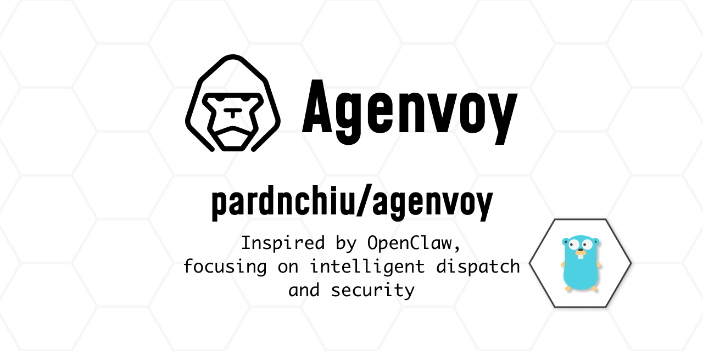
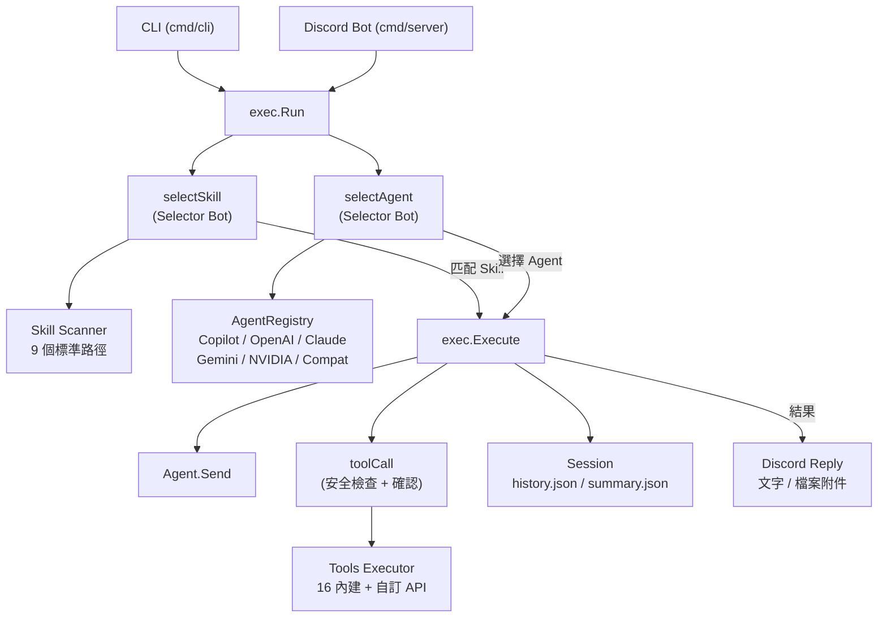

> [!NOTE]
> 此 README 由 [SKILL](https://github.com/pardnchiu/skill-readme-generate) 生成，英文版請參閱 [這裡](../README.md)。<br>
> 測試由 [SKILL](https://github.com/pardnchiu/skill-coverage-generate) 生成。



# Agenvoy

[](https://pkg.go.dev/github.com/pardnchiu/agenvoy)
[](https://goreportcard.com/report/github.com/pardnchiu/agenvoy)
[](https://app.codecov.io/github/pardnchiu/agenvoy/tree/master)
[](LICENSE)
[](https://github.com/pardnchiu/agenvoy/releases)

> Go 語言 Agentic AI 平台，具備技能路由、多 Provider 智能調度、Discord Bot 整合與安全優先的共用 Agent 設計

## 目錄

- [功能特點](#功能特點)
- [架構](#架構)
- [檔案結構](#檔案結構)
- [授權](#授權)
- [Author](#author)
- [Stars](#stars)

## 功能特點

> `go install github.com/pardnchiu/agenvoy/cmd/cli@latest` · [完整文件](./doc.zh.md)

### 雙層路由 Agentic 執行引擎

每次執行前，輕量 Selector Bot 同時進行兩項 LLM 路由決策：從 9 個標準路徑掃描的 Markdown 檔案中匹配最佳 Skill，並從 Agent Registry 中挑選最合適的後端。執行迴圈最多執行 16 次（一般模式）或 128 次（Skill 模式），對已快取的工具呼叫進行去重，並在達到迭代上限時自動觸發摘要流程——始終回傳完整的最終回應。

### Discord Bot 含 Slash Command 與檔案附件

平台除 CLI 外另提供獨立的 Discord server 模式。支援私訊與頻道 mention 觸發，收到訊息後立即回應確認再於背景執行完整的 Agentic 迴圈。Agent 可在回覆中嵌入 `[SEND_FILE:/path]` marker，系統自動將本地圖片、文字檔或任意二進位檔作為附件傳送至 Discord。Slash command 開發期間可指定 Guild ID 即時生效，上線後改為全域註冊。

### 安全優先的共用 Agent 設計

透過單一宣告式 `denied.json` 設定，在檔案工具與 shell 指令兩個層面封鎖敏感路徑存取。涵蓋 SSH 金鑰目錄與檔名、shell 歷史記錄與設定檔、雲端憑證目錄（`.aws`、`.gcloud`、`.docker`）、私鑰副檔名（`.pem`、`.key`、`.p12`）及 `.env` 檔案。`rm` 指令被攔截並重定向至 `.Trash` 目錄而非永久刪除，API 憑證存放於系統原生 Keychain 而非環境變數。

## 架構



## 檔案結構

```
agenvoy/
├── cmd/
│   ├── cli/
│   │   ├── main.go                  # CLI 進入點
│   │   ├── addProvider.go           # 互動式 Provider 設定
│   │   ├── getAgentRegistry.go      # 多 Provider Agent Registry 初始化
│   │   └── runEvents.go             # 事件迴圈與互動確認
│   └── server/
│       └── main.go                  # Discord Bot server 進入點
├── internal/
│   ├── agents/
│   │   ├── exec/                    # 執行核心（路由、工具迴圈、session 管理）
│   │   ├── provider/                # AI 後端（copilot/openai/claude/gemini/nvidia/compat）
│   │   └── types/                   # 共用介面（Agent、Message、Event）
│   ├── discord/
│   │   ├── command/                 # Slash command 定義與處理器
│   │   ├── types/                   # Discord 專用型別
│   │   ├── run.go                   # Discord 訊息的 Agentic 迴圈
│   │   ├── reply.go                 # 文字與檔案附件回覆
│   │   └── session.go               # Discord session 與歷史管理
│   ├── keychain/                    # 系統 Keychain 憑證存取
│   ├── skill/                       # 並行 Skill 掃描與解析
│   ├── tools/
│   │   ├── file/
│   │   │   └── embed/denied.json    # 敏感路徑存取控制設定
│   │   ├── browser/                 # JS 渲染頁面擷取與下載
│   │   ├── apiAdapter/              # JSON 設定驅動的自訂 API 工具
│   │   └── apis/                    # 財經、RSS、天氣工具
│   └── utils/
├── examples/apis/                   # 自訂 API 設定範例
├── go.mod
└── README.md
```

## 授權

本專案採用 [AGPL-3.0 LICENSE](LICENSE)。

## Author


<h4 style="padding-top: 0">邱敬幃 Pardn Chiu</h4>

<a href="mailto:dev@pardn.io" target="_blank">

</a> <a href="https://linkedin.com/in/pardnchiu" target="_blank">

</a>

## Stars

[](https://www.star-history.com/#pardnchiu/agenvoy&Date)

***

©️ 2026 [邱敬幃 Pardn Chiu](https://linkedin.com/in/pardnchiu)
