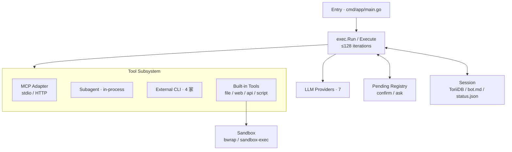

> [!NOTE]
> 此 README 由 [SKILL](https://github.com/pardnchiu/skill-readme-generate) 生成，英文版請參閱 [這裡](../README.md)。 
> 測試由 [SKILL](https://github.com/pardnchiu/skill-coverage-generate) 生成。

***

<picture style="margin-down: 1rem">

</picture>

<strong>一個指令，善用各種模型優勢，指派多個模型分工協作。</strong>

Go-native dispatcher · Planner 將每個步驟派給最適合的模型 · Subagent 在同一 process 內協作

***

## 為什麼 Agenvoy

- **為什麼不要一個模型跑全部？** Claude 擅長規劃、GPT 擅長 diff 推理、Gemini 擅長長 context 批判 —— 為什麼把每一步都塞給同一家 vendor？
- **「模型協作」的代價是什麼？** Sub-agent 走 HTTP／RPC，還是 goroutine 在同一 process 跑？
- **沙箱邊界劃在哪？** 只圈住 agent 自己的 bash tool，還是每一家被你派工的模型與 CLI？

Agenvoy 的答案是一件事：一個指令把工作拆開、每一步交給最適合的模型、結果在同一 process 收斂。

|  | Agenvoy | Claude Code | Codex CLI | Gemini CLI | OpenClaw | Hermes |
|---|---|---|---|---|---|---|
| Runtime | Go | Node.js | Rust | Node.js | Node.js | Python |
| Provider | 7 + planner | 1 | 1 | 1 | 多家 | 18+ |
| 沙箱範圍 | 框架 + 委派 CLI | 僅 own bash tool | 僅 own shell exec | 僅 own shell exec | Skill / shell | 僅 terminal backend |
| 模型派發 | Planner 每次呼叫挑一家 · goroutine fan-out | 單 vendor | 單 vendor | 單 vendor | Sub-agent over HTTP | Sub-agent over HTTP / RPC |
| 多模型互審 | codex / claude / copilot / gemini · ≤3 輪 | ✗ | ✗ | ✗ | ✗ | ✗ |
| 錯誤記憶 | ToriiDB · 90 天 TTL · 語意 | Vendor history | Vendor rollout | Vendor history | Memory wiki | Skill + 對話檢索 |
| 安裝方式 | 單一 binary | npm + native | npm（Rust） | npm | npm + daemon | curl script |

最關鍵的一行是 **模型派發**。其他框架要嘛綁死單一 vendor（Claude Code、Codex、Gemini CLI），要嘛 sub-agent 走 HTTP／RPC（OpenClaw、Hermes）。Agenvoy 全部留在同一 process —— planner 每次呼叫挑七家其一、`invoke_subagent` 以 goroutine fan-out、結果走單一 event stream 收斂。**多模型互審** 疊在上層 —— 四家外部 CLI 對單一結果交叉檢核最多三輪。**沙箱** 是底層地基 —— 每個被委派的 CLI 都關進同一個 `go-pkg/sandbox` 邊界、套同一份 policy。

## 功能特點

> `make build` · 安裝至 `/usr/local/bin/agen` · [完整文件](https://github.com/agenvoy/Agenvoy/wiki)

- **對的工作交給對的模型** 
  planner 讀每個任務再選最適合的 provider；`invoke_subagent` enum 七家 provider、標 `Concurrent: true` —— parent 在同一個 goroutine batch fan-out Claude／GPT／Gemini，彼此無 HTTP，事件回流走同一條 stream。`cross_review_with_external_agents` 疊在上層，把 codex／claude／copilot／gemini 串成最多三輪互審。
- **可插拔工具，單一沙箱** 
  `extensions/apis/*.json` 或 `extensions/scripts/<name>/` 丟入即成 tool；MCP（stdio + HTTP/SSE）自動合併 global 與 per-session 設定。所有 command／script／外部 CLI 一律進 `go-pkg/sandbox`（bwrap／sandbox-exec）。
- **跨 session 錯誤記憶** 
  ToriiDB 將 tool 失敗與對話 turn 索引化，TTL 90 天、命中即續期；`search_error_memory` 與 `search_conversation_history` 並聯 keyword + semantic —— 同個雷不踩第二次。

## 架構

> [完整架構](https://github.com/agenvoy/Agenvoy/wiki/架構)

## 授權

本專案採用 [Apache License 2.0](../LICENSE)。

## 貢獻者

想丟想法 [開個 issue](https://github.com/pardnchiu/agenvoy/issues/new) 聊聊也行。

## Star History

<a href="https://star-history.com/#pardnchiu/agenvoy&Date">
  <picture>
    <source media="(prefers-color-scheme: dark)" srcset="https://api.star-history.com/svg?repos=pardnchiu/agenvoy&type=Date&theme=dark&cache_bust=2026-05-05" />
    <source media="(prefers-color-scheme: light)" srcset="https://api.star-history.com/svg?repos=pardnchiu/agenvoy&type=Date&cache_bust=2026-05-05" />
    
  </picture>
</a>

曲線往上走 —— 那就是我們想看到的訊號。點 ★ 推它一把。

***

©️ 2026 [邱敬幃 Pardn Chiu](https://www.linkedin.com/in/pardnchiu)
