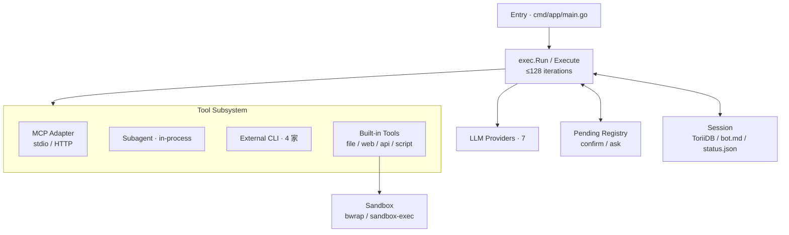

> [!NOTE]
> 此 README 由 [SKILL](https://github.com/pardnchiu/skill-readme-generate) 生成，英文版請參閱 [這裡](../README.md)。 
> 測試由 [SKILL](https://github.com/pardnchiu/skill-coverage-generate) 生成。

***

<picture style="margin-down: 1rem">

</picture>

<strong>BUILD YOUR OWN OPENCLAW WITH AGENVOY!</strong>

Logo 與封面插圖由 ChatGPT Image 2.0 生成。

***

> Go AI agent 框架，具備多 provider 路由、MCP client adapter、in-process subagent 與 OS-native 沙箱

從多家 LLM 自動派分任務、用 stdio／HTTP 雙傳輸接 MCP server、以 in-process 子 agent 取代 HTTP fan-out，整套執行皆在 OS-native 沙箱中進行。

## 目錄

- [功能特點](#功能特點)
- [架構](#架構)
- [授權](#授權)
- [貢獻者](#貢獻者)
- [Star History](#star-history)

## 功能特點

> `make build` · 安裝至 `/usr/local/bin/agen` · [完整文件](https://github.com/agenvoy/Agenvoy/wiki)

- **多 Agent 編排** 
  7 家 LLM provider（Copilot／OpenAI／Codex／Claude／Gemini／Nvidia／Compat）統一介面，planner 模型依任務自動派分；`invoke_subagent` 直呼 `exec.Execute` 不走 HTTP、繼承父 ctx 的 `AllowAll`／`WorkDir`；`cross_review_with_external_agents` 串接 codex／claude／copilot／gemini 四家外部 CLI 互審至三輪上限，全程經 pending channel registry 統一收斂人類互動點。
- **可插拔工具與沙箱** 
  `extensions/apis/*.json` 與 `extensions/scripts/<name>/tool.json` 丟入即成 tool；MCP client adapter 同時支援 stdio 與 HTTP/SSE 雙傳輸，global 與 per-session `mcp.json` 自動合併、`agen mcp` 互動式管理；`run_command`／script／scheduler 一律走 `go-pkg/sandbox`（Linux bwrap、macOS sandbox-exec），policy 在 `init()` 一次性注入無 caller 漏洞。
- **跨 Session 自學錯誤記憶** 
  ToriiDB 向量儲存 90 天 TTL、命中即 `Expire` 續期；`search_error_memory`／`search_conversation_history` 並聯 keyword + semantic（OpenAI text-embedding-3-small），window 擴展前 2 後 1 鋪片段上下文，同個雷不再踩第二次。

## 架構

> [完整架構](https://github.com/agenvoy/Agenvoy/wiki/架構)

## 授權

本專案採用 [Apache License 2.0](../LICENSE)。

## 貢獻者

想丟想法 [開個 issue](https://github.com/pardnchiu/agenvoy/issues/new) 聊聊也行。

## Star History

<a href="https://star-history.com/#pardnchiu/agenvoy&Date">
  <picture>
    <source media="(prefers-color-scheme: dark)" srcset="https://api.star-history.com/svg?repos=pardnchiu/agenvoy&type=Date&theme=dark&cache_bust=2026-05-05" />
    <source media="(prefers-color-scheme: light)" srcset="https://api.star-history.com/svg?repos=pardnchiu/agenvoy&type=Date&cache_bust=2026-05-05" />
    
  </picture>
</a>

曲線往上走 —— 那就是我們想看到的訊號。點 ★ 推它一把。

***

©️ 2026 [邱敬幃 Pardn Chiu](https://www.linkedin.com/in/pardnchiu)
