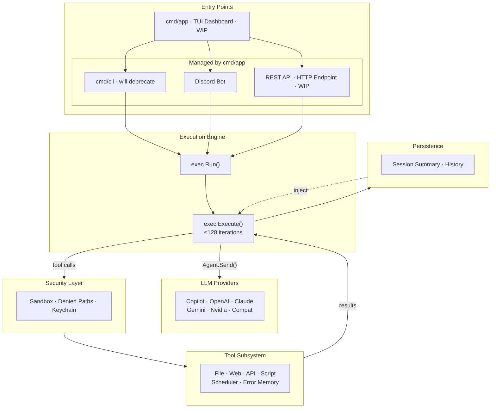
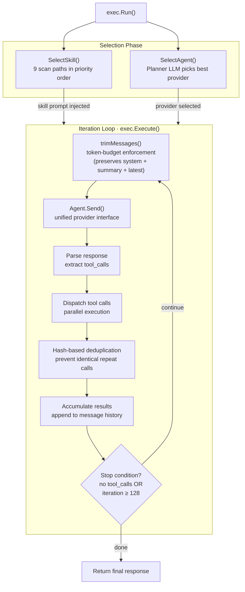
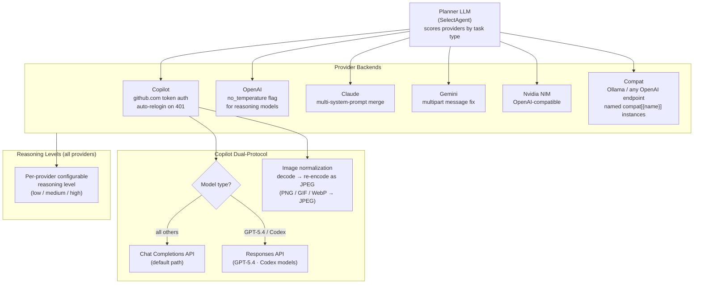
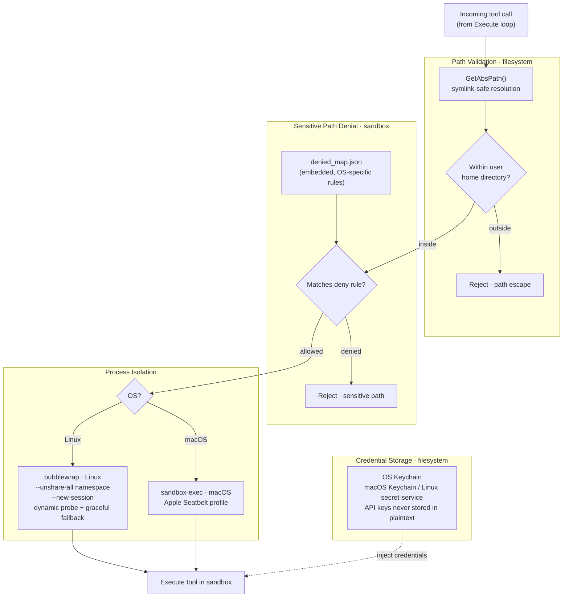

# Agenvoy — Architecture Reference

Six diagrams covering the full system, from entry points down to individual subsystems.

## 1. System Overview

High-level data flow across all major subsystems.

---

## 2. Execution Engine

Internal flow of `exec.Run()` through skill/agent selection, token trimming, and the tool-call iteration loop.

---

## 3. Provider Routing

How the Planner LLM selects a provider and how each backend handles the request.

---

## 4. Security Layer

Sandbox isolation, sensitive path denial, and credential storage.

---

## 5. Tool Subsystem

All tool categories, their discovery paths, and registration mechanism.

```mermaid
flowchart TD
    Registry["Self-registering Tool Registry\n(replaces switch routing)"]

    subgraph FileTools ["File Operations"]
        FT["read_file · write_file\npatch_edit · glob_files\nlist_files · search_content\nmove_to_trash · run_command"]
    end

    subgraph WebTools ["Web Access"]
        WT["fetch_page · headless Chrome + stealth JS\nsearch_web · Brave + DDG concurrent\ndownload_page · SHA-256 cache 1h TTL\nanalyze_youtube · metadata fetch"]
    end

    subgraph APITools ["API Extensions · apiAdapter"]
        AT["14+ embedded JSON definitions\n(CoinGecko · Wikipedia · Open-Meteo\nYahoo Finance · YouTube · etc.)"]
        UserAPI["User extensions\n~/.config/agenvoy/apis/*.json\nloaded at startup · no recompile"]
    end

    subgraph ScriptTools ["Script Extensions · scriptAdapter"]
        ST["Scan paths\n~/.config/agenvoy/script_tools/\n<workdir>/.config/agenvoy/script_tools/"]
        Manifest["tool.json manifest\nname · description · parameters schema"]
        Runner["script.js / script.py\nstdin/stdout JSON protocol\nscript_ prefix registration"]
    end

    subgraph SkillTools ["Skill Git Tools"]
        SGT["skill_git_commit\nskill_git_log\nskill_git_rollback\n(operates on skill repo path)"]
    end

    subgraph SchedulerTools ["Scheduler · scheduler"]
        SchT["cron tasks · recurring\none-time tasks\nJSON persistence · restore on restart\nDiscord callback on complete"]
        SchCRUD["add_task · update_task · delete_task\nadd_cron · update_cron · delete_cron"]
    end

    subgraph ErrorMemTools ["Error Memory"]
        EMT["Tool call fails →\npersist to tool_errors/{SHA-256}.json\nsearch_errors · recall past failures\nremember_error · persist resolution\ncross-session learning"]
    end

    Registry --> FileTools
    Registry --> WebTools
    Registry --> APITools
    Registry --> ScriptTools
    Registry --> SkillTools
    Registry --> SchedulerTools
    Registry --> ErrorMemTools

    AT --> UserAPI
    ST --> Manifest
    Manifest --> Runner
    SchT --> SchCRUD
```

---

## 6. Persistence & Memory

Session summary deep-merge, conversation history trimming, and error memory.

```mermaid
flowchart TD
    subgraph SessionSummary ["Session Summary · sessionManager"]
        SumExtract["Summary extraction\n3 independent regex patterns\n· fenced block\n· XML &lt;summary&gt; tag\n· [summary] bracket"]
        SumMerge["mergeSummary()\ndeep-merge across turns\nnew entries append\nexisting entries update in-place"]
        SumInject["Inject into next Execute()\nas system context before history"]
    end

    subgraph HistoryTrim ["Conversation History · trimMessages()"]
        Budget["MaxInputTokens()\nper-provider token budget"]
        Preserve["Always preserve\n· system prompt\n· injected summary\n· latest user message"]
        Trim["Trim oldest turns first\nuntil within budget\nellipsis markers inserted"]
        SearchHist["search_history tool\nkeyword-triggered recall\n(not full replay)"]
    end

    subgraph ErrorMemory ["Error Memory · errorMemory"]
        ErrHash["SHA-256(tool_name + args)\nper-session key"]
        ErrStore["tool_errors/{hash}.json\npersisted to filesystem"]
        ErrRecall["search_errors\nfuzzy keyword match\nacross all sessions"]
        ErrResolve["remember_error\npersist resolution decision\ncross-session reuse"]
    end

    subgraph UsageTracking ["Usage Tracking · usageManager"]
        UT["Per-model token usage\naccumulated across all\ntool-call iterations per request"]
    end

    SumExtract --> SumMerge --> SumInject
    Budget --> Preserve --> Trim
    Trim --> SearchHist
    ErrHash --> ErrStore
    ErrStore --> ErrRecall
    ErrRecall --> ErrResolve
```

