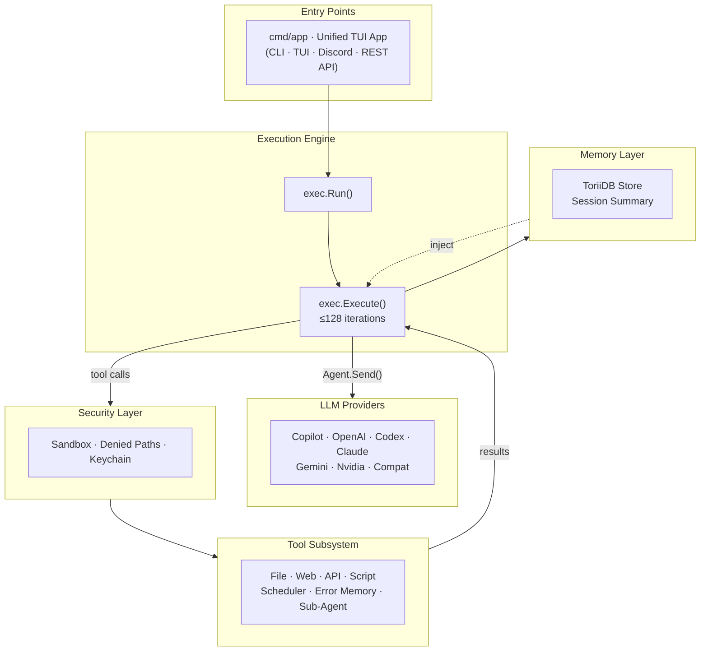
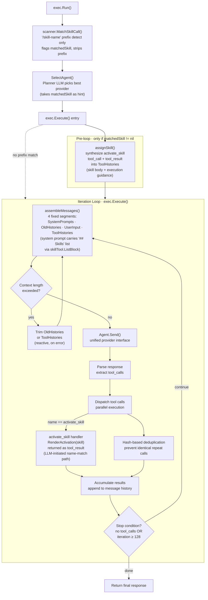
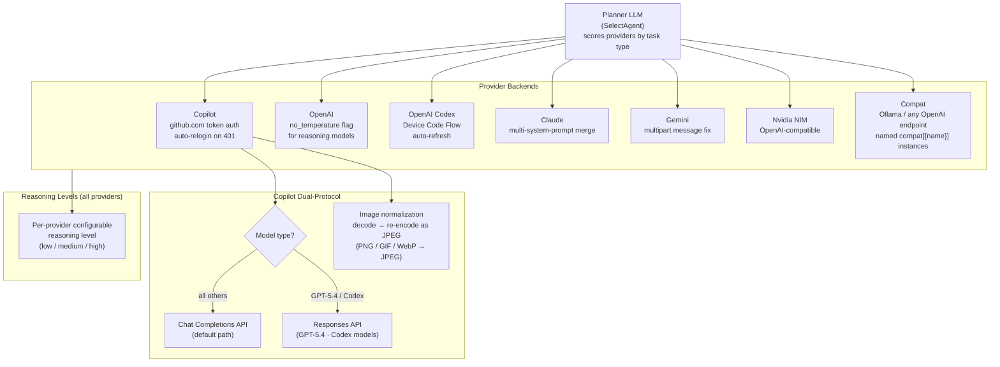
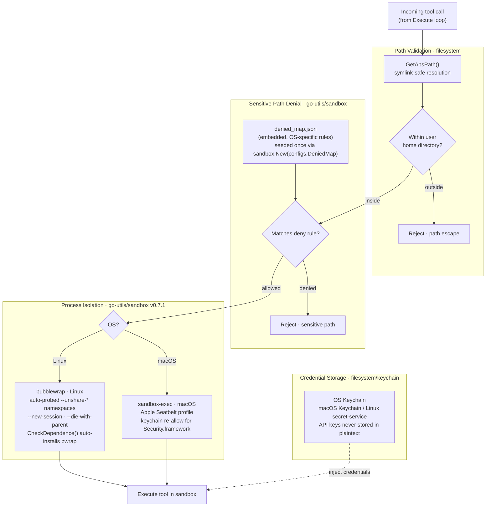
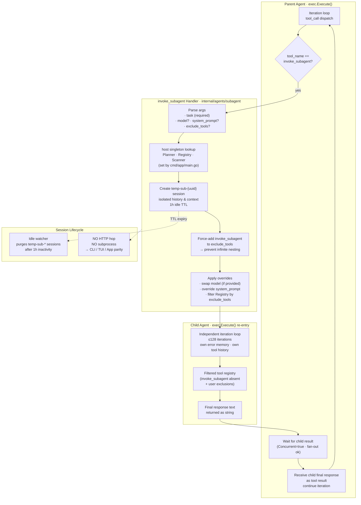
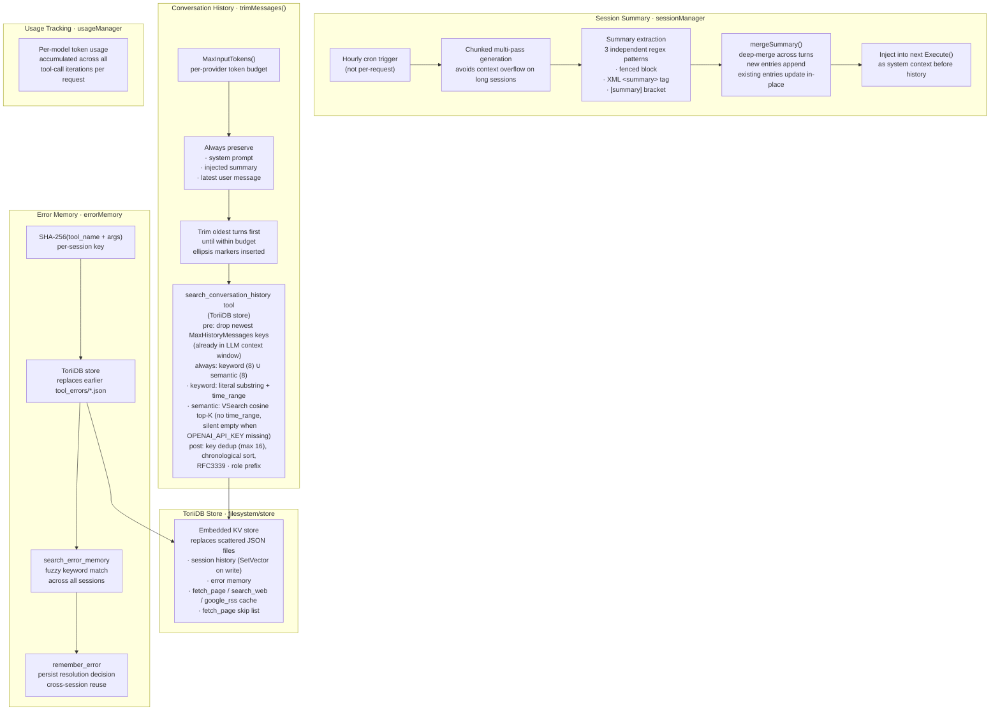
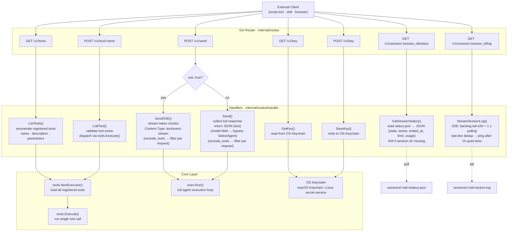

# Agenvoy — Architecture

> Back to [README](../README.md)

Nine Mermaid diagrams covering the full system, from entry points down to individual subsystems.

## 1. System Overview

High-level data flow across all major subsystems.

---

## 2. Execution Engine

Flow ordering: `exec.Run()` first detects any `/skill-name` prefix (flag only, no activation), then runs `SelectAgent()` to pick the provider, then hands off to `Execute()`. Skill activation happens **inside** the iteration loop as a tool call — never as a separate pre-call.

---

## 3. Provider Routing

How the Planner LLM selects a provider and how each backend handles the request.

---

## 4. Security Layer

Sandbox isolation, sensitive path denial, and credential storage.

---

## 5. Tool Subsystem

All tool categories, their discovery paths, and registration mechanism.

```mermaid
flowchart TD
    Registry["Self-registering Tool Registry\n(replaces switch routing)"]

    subgraph FileTools ["File Operations"]
        FT["read_file · write_file · read_image\npatch_file · glob_files\nlist_files · search_content\nmove_to_trash · run_command"]
    end

    subgraph WebTools ["Web Access (ToriiDB cached)"]
        WT["fetch_page · headless Chrome + stealth JS\nsearch_web · Google + DDG concurrent · SHA-256 cache\nfetch_google_rss · RSS feed fetch\nsave_page_to_file · raw page download\nfetch_youtube_transcript · metadata fetch"]
    end

    subgraph APITools ["API Extensions · apiAdapter"]
        AT["12+ embedded JSON definitions\n(CoinGecko · Wikipedia · Open-Meteo\nYahoo Finance · YouTube · etc.)"]
        UserAPI["User extensions\n~/.config/agenvoy/api_tools/*.json\nloaded at startup · no recompile"]
    end

    subgraph ScriptTools ["Script Extensions · scriptAdapter"]
        ST["Scan paths\n~/.config/agenvoy/script_tools/\n<workdir>/.config/agenvoy/script_tools/"]
        Manifest["tool.json manifest\nname · description · parameters schema"]
        Runner["script.js / script.py\nstdin/stdout JSON protocol\nscript_ prefix registration"]
    end

    subgraph SkillTools ["Skill Activation & Git Tools"]
        SST["activate_skill · AlwaysLoad=true · ReadOnly=true\nactivates skill by exact name from '## Skills' list\nreturns RenderActivation(skill): body + execution guidance\nauto-invoked for '/skill-name' prefix via assignSkill()\n(synthetic tool_call/tool_result into ToolHistories)"]
        SGT["skill_git_commit\nskill_git_log\nskill_git_rollback\n(operates on skill repo path)"]
    end

    subgraph SchedulerTools ["Scheduler · scheduler"]
        SchT["cron tasks · recurring\none-time tasks\nJSON persistence · restore on restart\nDiscord callback on complete"]
        SchCRUD["add_task · remove_task · list_tasks\nadd_cron · remove_cron · list_crons"]
    end

    subgraph ErrorMemTools ["Error Memory (ToriiDB)"]
        EMT["Tool call fails →\npersist to ToriiDB store\nsearch_error_memory · recall past failures\nremember_error · persist resolution\ncross-session learning"]
    end

    subgraph ExternalAgentTools ["External Agent Tools"]
        EAT["invoke_external_agent · delegate task to named external agent\ncross_review_with_external_agents · parallel cross-validation across all declared agents\nreview_result · internal priority-model review\n(claude-opus → gpt-5.4 → gemini-3.1-pro → claude-sonnet)"]
    end

    subgraph SubAgentTools ["In-Process Sub-Agent · agents/subagent"]
        SAT["invoke_subagent · Concurrent=true · ReadOnly=true\nin-process dispatch via exec.Execute() · no HTTP\nisolated temp-sub-* session · 1h idle TTL\noverrides: model · system_prompt · exclude_tools\nforce-excludes invoke_subagent to prevent recursion\nhost singleton (agents/host) for Planner · Registry · Scanner\nblank-imported in cmd/app/main.go to avoid tools → subagent cycle"]
    end

    subgraph SearchTools ["Deferred Tool Registry · searchTools"]
        SRT["search_tools · AlwaysLoad=true · ReadOnly=true\nkeyword fuzzy + 'select:<name>' direct activation\n'+term' required-match syntax · max_results configurable\ninjects matching tool schemas into current request context"]
    end

    Registry --> FileTools
    Registry --> WebTools
    Registry --> APITools
    Registry --> ScriptTools
    Registry --> SkillTools
    Registry --> SchedulerTools
    Registry --> ErrorMemTools
    Registry --> ExternalAgentTools
    Registry --> SubAgentTools
    Registry --> SearchTools
    SAT -.->|"re-enter"| Registry

    AT --> UserAPI
    ST --> Manifest
    Manifest --> Runner
    SchT --> SchCRUD
```

---

## 6. Lazy-Load Mechanism

```mermaid
flowchart TD
    subgraph ToolLazy ["Tool Schema Lazy-Load · internal/tools/executor.go"]
        ExecInit["NewExecutor()"]
        Classify{"AlwaysLoad\nflag?"}
        AlwaysReal["expose real schema\n(activate_skill · search_tools\n+ api_*, ReadOnly flagged ones)"]
        Stub["expose stub schema\n{type:object, properties:{}}\nmark StubTools[name]=true"]
        LLM1["LLM first call\noften with empty or\nbest-effort args"]
        StubHit["toolCall.go Pass 1 detects\nStubTools[name] == true"]
        Activate["dispatch search_tools\nselect:<name>\n→ injects real schema into\ncurrent request tool list"]
        DeleteStub["delete StubTools[name]\nmark activatedInBatch[name]"]
        ReInvoke["reply: '[name] tool schema\njust loaded. Re-invoke...'\nSKIP validator + executor"]
        SameBatch["same-turn dup stub calls:\nactivatedInBatch short-circuits\nto same Re-invoke reply"]
        LLM2["next iteration\nLLM sees real schema\ncalls with correct args"]
    end

    subgraph SkillLazy ["Skill Body Lazy-Load · internal/tools/skillTool"]
        SysPrompt["system prompt ##Skills list\nskillTool.ListBlock(scanner)\nname + description ≤200 runes\n(maxDescLen truncation)"]
        LLMPick["LLM matches user request\nto listed skill name\nOR '/skill-name' prefix match\n(scanner.MatchSkillCall)"]
        CallPath{"activation\npath?"}
        LLMCall["LLM calls\nactivate_skill(skill=name)"]
        AssignCall["assignSkill() synthesizes\ntool_call + tool_result\ninto ToolHistories"]
        Handler["activate_skill handler\nRenderActivation(skill):\nactive name + path\n+ SkillExecution guidance\n+ full skill body"]
        ToolResult["return as tool_result\nbinding for subsequent\niterations"]
    end

    ExecInit --> Classify
    Classify -->|"true"| AlwaysReal
    Classify -->|"false"| Stub
    Stub --> LLM1
    LLM1 --> StubHit
    StubHit --> Activate
    Activate --> DeleteStub
    DeleteStub --> ReInvoke
    ReInvoke --> LLM2
    LLM1 -.->|"dup in same batch"| SameBatch
    SameBatch --> ReInvoke

    SysPrompt --> LLMPick
    LLMPick --> CallPath
    CallPath -->|"LLM-initiated"| LLMCall
    CallPath -->|"/skill-name prefix"| AssignCall
    LLMCall --> Handler
    AssignCall --> Handler
    Handler --> ToolResult
```

Two parallel lazy-load patterns keep the system prompt minimal. **Tool schemas**: non-`AlwaysLoad` tools expose an empty stub schema (`{"type":"object","properties":{}}`) on executor init; first call triggers activation via `search_tools select:<name>` and replies `Re-invoke...` instead of running. **Skill bodies**: `## Skills` list in the system prompt only carries name + description (≤200 runes); the full body + execution guidance loads only as the `activate_skill` tool result. Same `index → activate → full content` pattern.

---

## 7. Sub-Agent Flow

End-to-end lifecycle of `invoke_subagent`: how the parent agent dispatches an in-process child via `exec.Execute()`, isolates its session, and receives its final response — all without crossing an HTTP boundary.

---

## 8. Persistence & Memory

Chunked multi-pass summary generation, conversation history trimming, and ToriiDB-backed error memory.

---

## 9. REST API Layer

HTTP endpoint routing, handler dispatch, and SSE vs. non-SSE response paths.

***

©️ 2026 [邱敬幃 Pardn Chiu](https://linkedin.com/in/pardnchiu)
