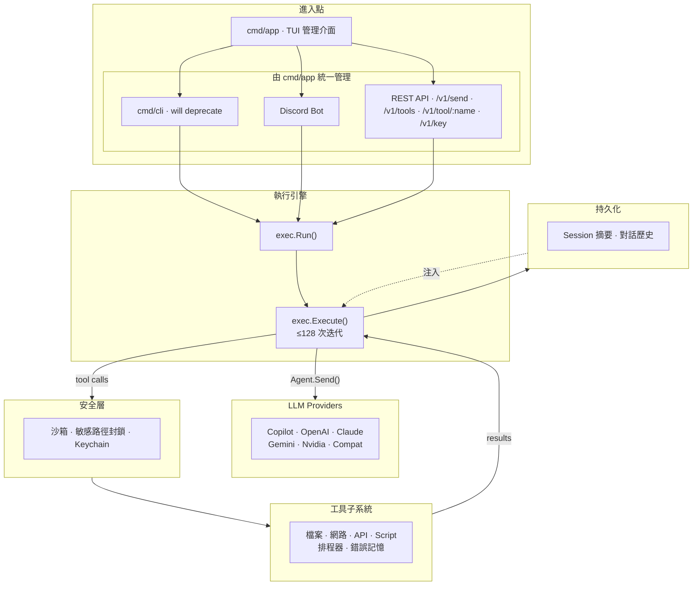
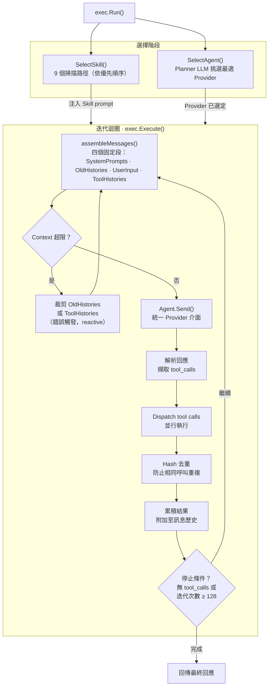
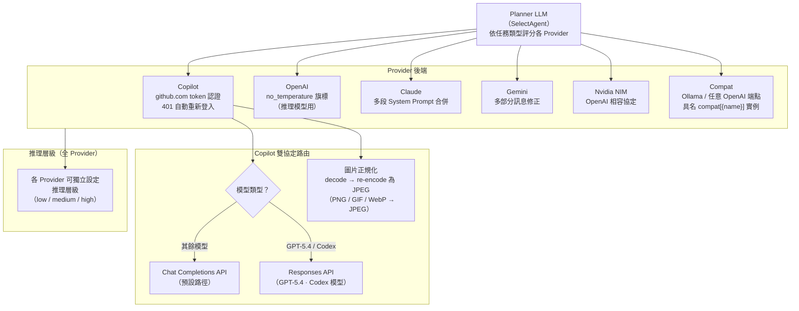
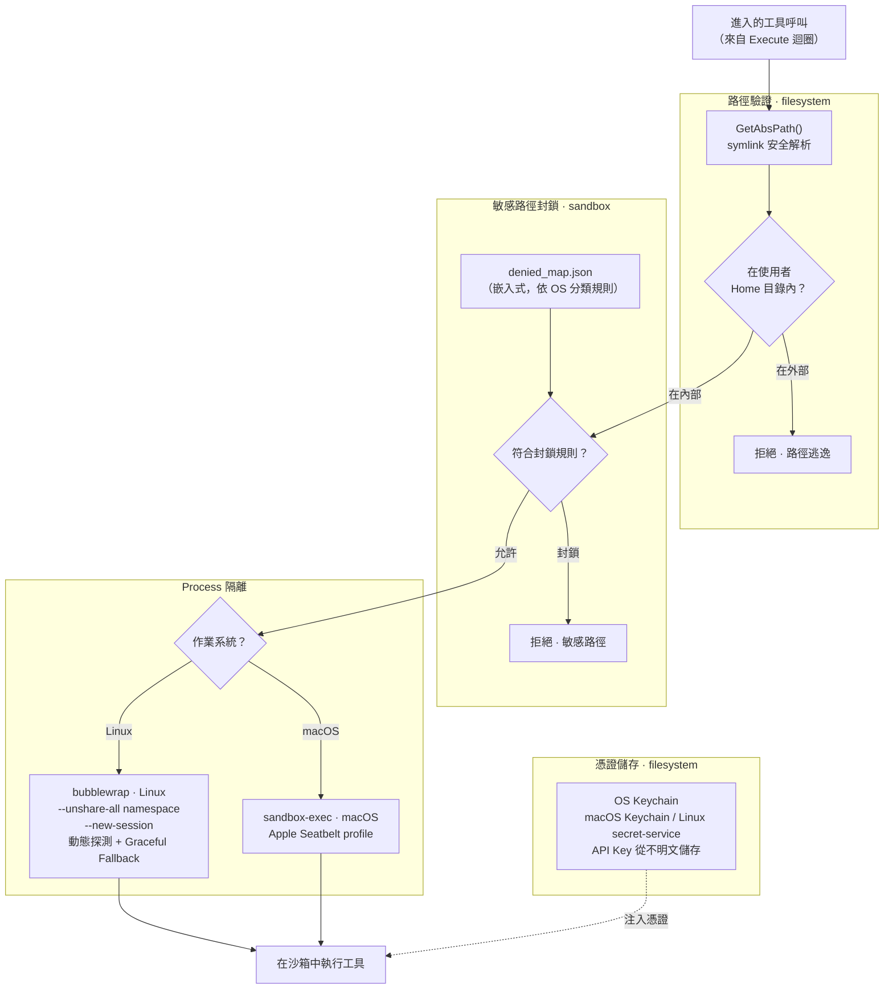
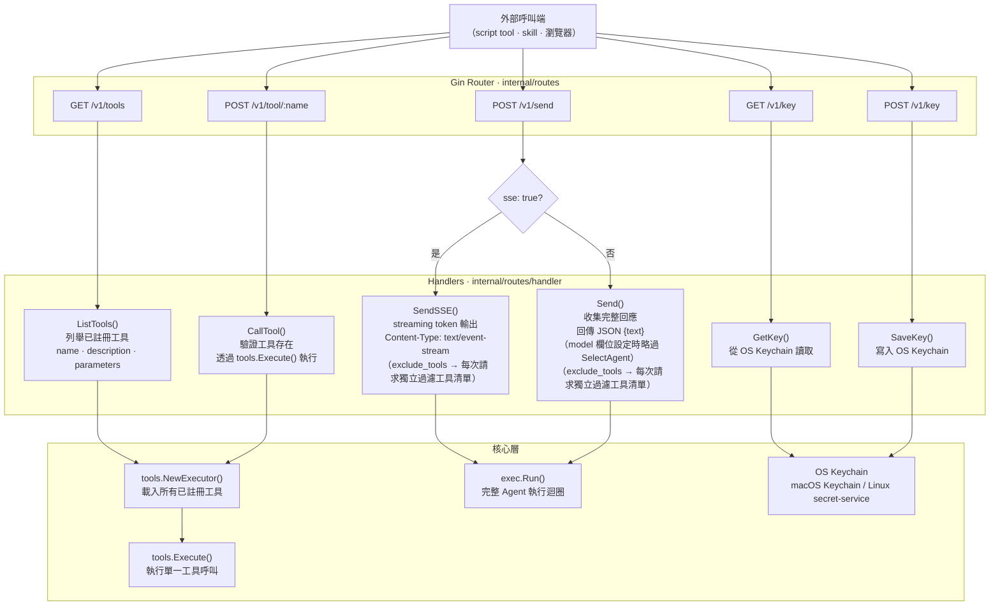

# Agenvoy — 架構參考

七張 Mermaid 圖，涵蓋從進入點到各子系統的完整系統結構。

## 1. 系統概覽

所有主要子系統的高層資料流。

---

## 2. 執行引擎

`exec.Run()` 的內部流程：Skill/Agent 選擇、Token 裁剪，及工具呼叫迭代迴圈。

---

## 3. Provider 路由

Planner LLM 如何選擇 Provider，以及各後端如何處理請求。

---

## 4. 安全層

沙箱隔離、敏感路徑封鎖與憑證儲存。

---

## 5. 工具子系統

所有工具類別、發現路徑與自註冊機制。

```mermaid
flowchart TD
    Registry["自註冊 Tool Registry\n（取代 switch routing）"]

    subgraph FileTools ["檔案操作"]
        FT["read_file · write_file\npatch_edit · glob_files\nlist_files · search_content\nmove_to_trash · run_command"]
    end

    subgraph WebTools ["網路存取"]
        WT["fetch_page · 無頭 Chrome + stealth JS · Chrome 自動偵測\nsearch_web · Brave + DDG 並行 · SHA-256 快取 5 分鐘 TTL\ngoogle_rss · RSS 訂閱擷取 · 5 分鐘快取\ndownload_page · 原始頁面下載\nanalyze_youtube · metadata 擷取"]
    end

    subgraph APITools ["API Extension · apiAdapter"]
        AT["14+ 內嵌 JSON 定義\n（CoinGecko · Wikipedia · Open-Meteo\nYahoo Finance · YouTube · 等）"]
        UserAPI["使用者自訂 Extension\n~/.config/agenvoy/api_tools/*.json\n啟動時自動載入 · 無需重新編譯"]
    end

    subgraph ScriptTools ["Script Extension · scriptAdapter"]
        ST["掃描路徑\n~/.config/agenvoy/script_tools/\n<workdir>/.config/agenvoy/script_tools/"]
        Manifest["tool.json manifest\nname · description · parameters schema"]
        Runner["script.js / script.py\nstdin/stdout JSON 協定\nscript_ 前綴自動註冊"]
    end

    subgraph SkillTools ["Skill Git 工具"]
        SGT["skill_git_commit\nskill_git_log\nskill_git_rollback\n（作用於 Skill 儲存庫路徑）"]
    end

    subgraph SchedulerTools ["排程器 · scheduler"]
        SchT["Cron 任務 · 週期性\n一次性任務\nJSON 持久化 · 重啟後恢復\n完成時 Discord 回傳"]
        SchCRUD["add_task · update_task · delete_task\nadd_cron · update_cron · delete_cron"]
    end

    subgraph ErrorMemTools ["錯誤記憶"]
        EMT["工具呼叫失敗 →\n持久化至 tool_errors/{SHA-256}.json\nsearch_errors · 回溯過去失敗\nremember_error · 持久化解決方案\n跨 Session 學習"]
    end

    subgraph ExternalAgentTools ["外部 Agent 工具"]
        EAT["call_external_agent · 委派任務至指定外部 Agent\nverify_with_external_agent · 並行交叉驗證（所有已宣告 Agent）\nreview_result · 內部優先序模型審查\n（claude-opus → gpt-5.4 → gemini-3.1-pro → claude-sonnet）"]
    end

    subgraph SearchTools ["延遲工具 Registry · searchTools"]
        SRT["search_tools · AlwaysLoad=true · ReadOnly=true\n關鍵字模糊搜尋 + 'select:<name>' 直接啟用\n'+term' 必要詞語語法 · max_results 可設定\n將匹配工具的完整 schema 注入當前請求 Context"]
    end

    Registry --> FileTools
    Registry --> WebTools
    Registry --> APITools
    Registry --> ScriptTools
    Registry --> SkillTools
    Registry --> SchedulerTools
    Registry --> ErrorMemTools
    Registry --> ExternalAgentTools
    Registry --> SearchTools

    AT --> UserAPI
    ST --> Manifest
    Manifest --> Runner
    SchT --> SchCRUD
```

---

## 6. 持久化與記憶

Session 摘要深度合併、對話歷史裁剪與錯誤記憶。

```mermaid
flowchart TD
    subgraph SessionSummary ["Session 摘要 · sessionManager"]
        SumExtract["摘要擷取\n3 個獨立 regex pattern\n· fenced block\n· XML &lt;summary&gt; tag\n· [summary] bracket"]
        SumMerge["mergeSummary()\n跨輪次深度合併\n新條目附加\n已有條目原地更新"]
        SumInject["注入至下一次 Execute()\n作為 system context 置於 history 之前"]
    end

    subgraph HistoryTrim ["對話歷史 · trimMessages()"]
        Budget["MaxInputTokens()\n各 Provider token 預算"]
        Preserve["永遠保留\n· system prompt\n· 注入的 summary\n· 最新使用者訊息"]
        Trim["從最舊輪次開始裁剪\n直到符合預算\n插入省略號標記"]
        SearchHist["search_history 工具\n關鍵字觸發式回溯\n（非全量重播）"]
    end

    subgraph ErrorMemory ["錯誤記憶 · errorMemory"]
        ErrHash["SHA-256(tool_name + args)\n每個 Session 的唯一 key"]
        ErrStore["tool_errors/{hash}.json\n持久化至檔案系統"]
        ErrRecall["search_errors\n模糊關鍵字比對\n跨所有 Session"]
        ErrResolve["remember_error\n持久化解決方案決策\n跨 Session 重用"]
    end

    subgraph UsageTracking ["用量追蹤 · usageManager"]
        UT["逐模型 token 用量\n跨所有工具呼叫迭代累計\n（每次請求）"]
    end

    SumExtract --> SumMerge --> SumInject
    Budget --> Preserve --> Trim
    Trim --> SearchHist
    ErrHash --> ErrStore
    ErrStore --> ErrRecall
    ErrRecall --> ErrResolve
```

---

## 7. REST API 層

HTTP 端點路由、Handler dispatch，以及 SSE 與非 SSE 回應路徑。

