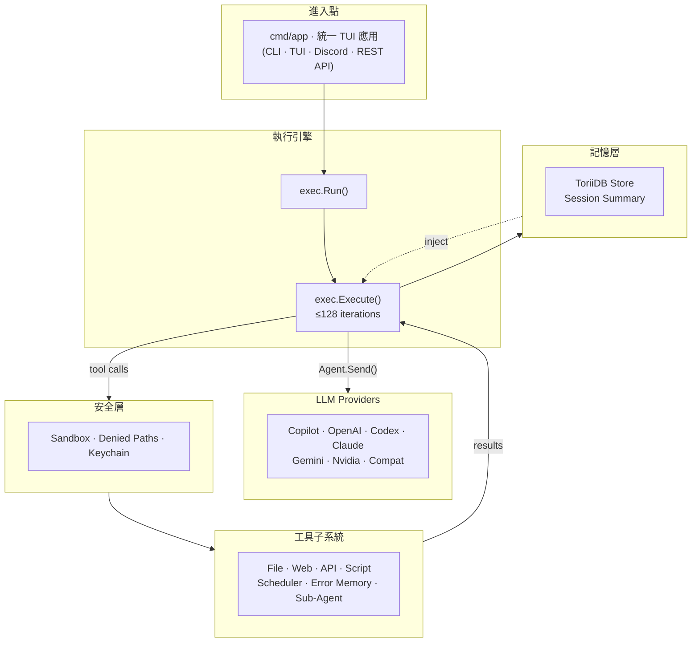
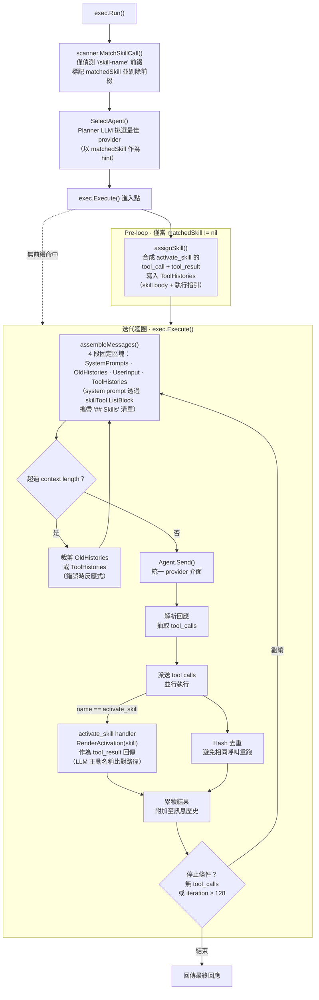
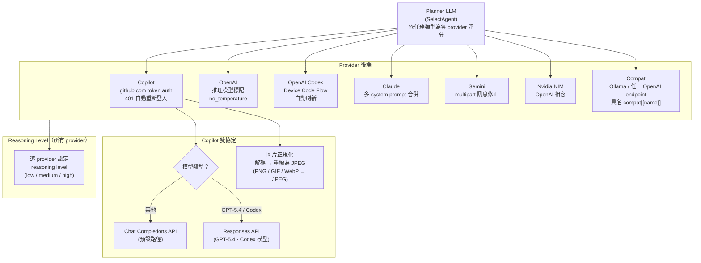
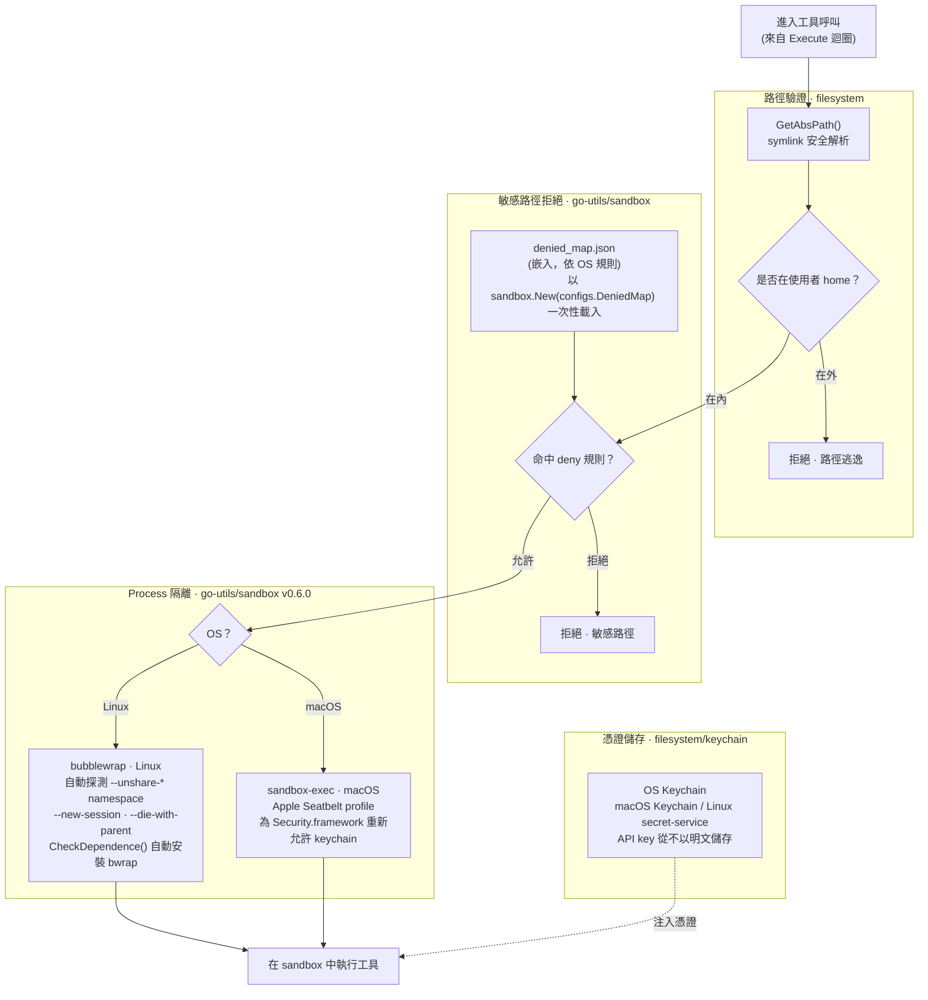
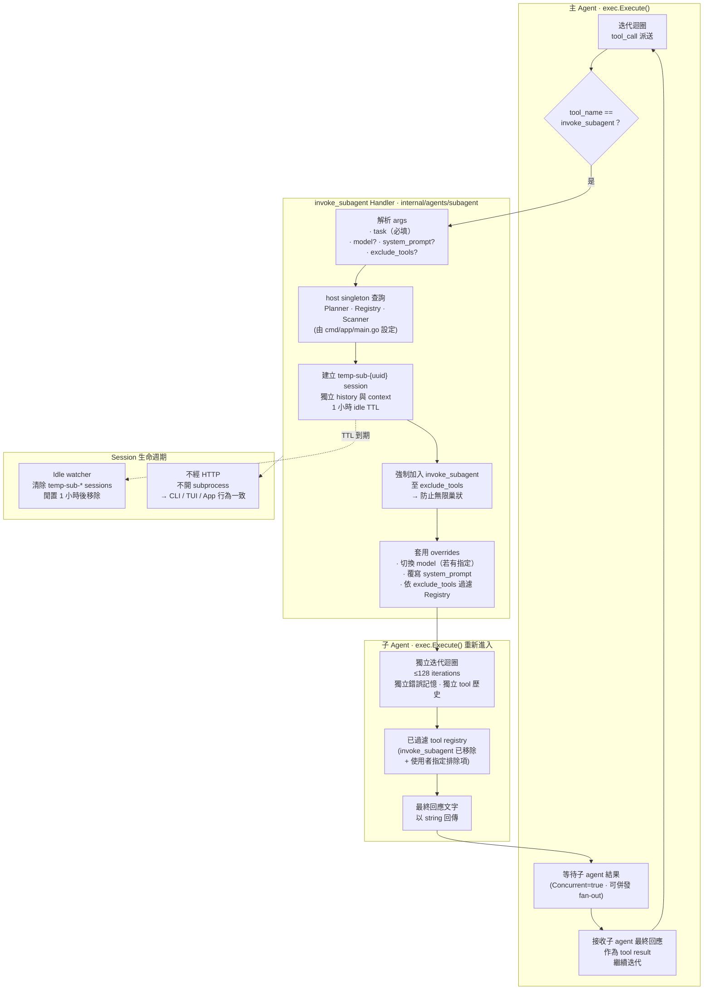
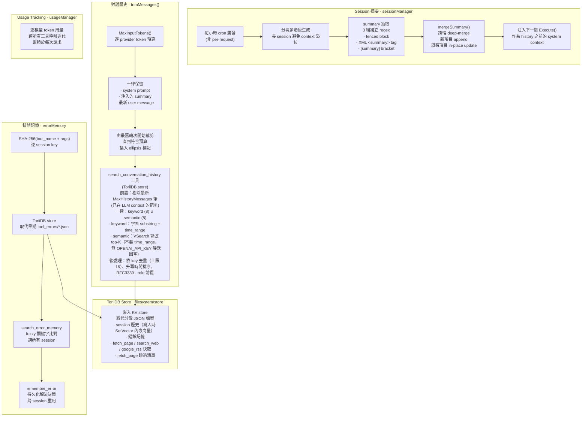
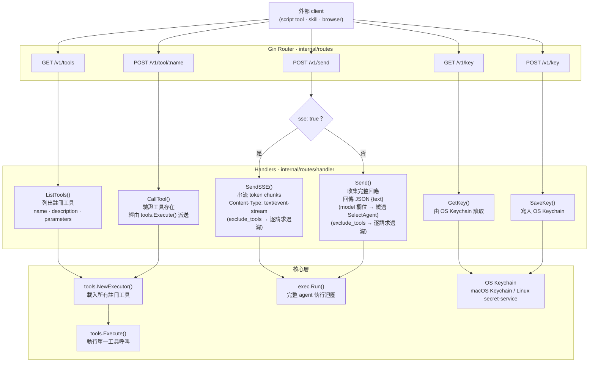

# Agenvoy — 架構

> 返回 [README](./README.zh.md)

九張 Mermaid 圖涵蓋從進入點到各子系統的完整系統結構。

## 1. 系統概覽

所有主要子系統之間的高階資料流。

---

## 2. 執行引擎

流程順序：`exec.Run()` 先偵測 `/skill-name` 前綴（僅標記，不啟用），接著 `SelectAgent()` 挑選 provider，然後交給 `Execute()`。Skill 啟用發生在**迭代迴圈內**，以工具呼叫形式完成 — 絕非獨立前置步驟。

---

## 3. Provider 路由

Planner LLM 如何挑選 provider，以及各後端如何處理請求。

---

## 4. 安全層

Sandbox 隔離、敏感路徑拒絕與憑證儲存。

---

## 5. 工具子系統

所有工具類別、其發現路徑與註冊機制。

```mermaid
flowchart TD
    Registry["自註冊 Tool Registry\n(取代 switch 路由)"]

    subgraph FileTools ["檔案操作"]
        FT["read_file · write_file · read_image\npatch_file · glob_files\nlist_files · search_content\nmove_to_trash · run_command"]
    end

    subgraph WebTools ["Web 存取（ToriiDB 快取）"]
        WT["fetch_page · headless Chrome + stealth JS\nsearch_web · Google + DDG 並行 · SHA-256 cache\nfetch_google_rss · RSS 抓取\nsave_page_to_file · 原始頁面下載\nfetch_youtube_transcript · metadata 抓取"]
    end

    subgraph APITools ["API 擴充 · apiAdapter"]
        AT["12+ 嵌入 JSON 定義\n(CoinGecko · Wikipedia · Open-Meteo\nYahoo Finance · YouTube · etc.)"]
        UserAPI["使用者擴充\n~/.config/agenvoy/api_tools/*.json\n啟動時載入 · 無需重新編譯"]
    end

    subgraph ScriptTools ["Script 擴充 · scriptAdapter"]
        ST["掃描路徑\n~/.config/agenvoy/script_tools/\n<workdir>/.config/agenvoy/script_tools/"]
        Manifest["tool.json manifest\nname · description · parameters schema"]
        Runner["script.js / script.py\nstdin/stdout JSON 協定\nscript_ 前綴註冊"]
    end

    subgraph SkillTools ["Skill 啟用與 Git 工具"]
        SST["activate_skill · AlwaysLoad=true · ReadOnly=true\n以精確名稱啟用 '## Skills' 清單中的 skill\n回傳 RenderActivation(skill)：body + 執行指引\n'/skill-name' 前綴由 assignSkill() 自動合成呼叫\n（合成 tool_call/tool_result 寫入 ToolHistories）"]
        SGT["skill_git_commit\nskill_git_log\nskill_git_rollback\n(對 skill repo 路徑操作)"]
    end

    subgraph SchedulerTools ["Scheduler · scheduler"]
        SchT["cron 任務 · 循環\n一次性任務\nJSON 持久化 · 重啟還原\n完成時 Discord callback"]
        SchCRUD["add_task · remove_task · list_tasks\nadd_cron · remove_cron · list_crons"]
    end

    subgraph ErrorMemTools ["錯誤記憶（ToriiDB）"]
        EMT["工具呼叫失敗 →\n持久化至 ToriiDB store\nsearch_error_memory · 回憶過往失敗\nremember_error · 持久化解法\n跨 session 學習"]
    end

    subgraph ExternalAgentTools ["外部 Agent 工具"]
        EAT["invoke_external_agent · 委派至具名外部 agent\ncross_review_with_external_agents · 平行跨驗證所有宣告 agent\nreview_result · 內部優先序覆核\n(claude-opus → gpt-5.4 → gemini-3.1-pro → claude-sonnet)"]
    end

    subgraph SubAgentTools ["In-Process 子 Agent · agents/subagent"]
        SAT["invoke_subagent · Concurrent=true · ReadOnly=true\n以 exec.Execute() in-process 派送 · 不走 HTTP\n獨立 temp-sub-* session · 1 小時 idle TTL\n可覆寫：model · system_prompt · exclude_tools\n強制排除 invoke_subagent 自身避免無限巢狀\nhost singleton (agents/host) 提供 Planner · Registry · Scanner\ncmd/app/main.go blank-import 註冊 · 避免 tools → subagent import cycle"]
    end

    subgraph SearchTools ["延遲工具註冊 · searchTools"]
        SRT["search_tools · AlwaysLoad=true · ReadOnly=true\nkeyword fuzzy + 'select:<name>' 直接啟用\n'+term' 必要關鍵字語法 · max_results 可設\n將符合的工具 schema 注入當前請求 context"]
    end

    Registry --> FileTools
    Registry --> WebTools
    Registry --> APITools
    Registry --> ScriptTools
    Registry --> SkillTools
    Registry --> SchedulerTools
    Registry --> ErrorMemTools
    Registry --> ExternalAgentTools
    Registry --> SubAgentTools
    Registry --> SearchTools
    SAT -.->|"重新進入"| Registry

    AT --> UserAPI
    ST --> Manifest
    Manifest --> Runner
    SchT --> SchCRUD
```

---

## 6. 延遲載入機制

```mermaid
flowchart TD
    subgraph ToolLazy ["工具 Schema 延遲載入 · internal/tools/executor.go"]
        ExecInit["NewExecutor()"]
        Classify{"AlwaysLoad\n標記？"}
        AlwaysReal["曝露真實 schema\n(activate_skill · search_tools\n+ api_*、ReadOnly 類)"]
        Stub["曝露 stub schema\n{type:object, properties:{}}\n標記 StubTools[name]=true"]
        LLM1["LLM 首次呼叫\n常以空參數或\nbest-effort 參數"]
        StubHit["toolCall.go Pass 1 偵測\nStubTools[name] == true"]
        Activate["dispatch search_tools\nselect:<name>\n→ 將真實 schema 注入\n當前請求工具清單"]
        DeleteStub["delete StubTools[name]\n標記 activatedInBatch[name]"]
        ReInvoke["回覆：'[name] tool schema\njust loaded. Re-invoke...'\n跳過 validator + executor"]
        SameBatch["同輪重複 stub 呼叫：\nactivatedInBatch 短路\n回覆相同 Re-invoke"]
        LLM2["下一輪\nLLM 看到真實 schema\n以正確參數呼叫"]
    end

    subgraph SkillLazy ["Skill Body 延遲載入 · internal/tools/skillTool"]
        SysPrompt["system prompt ##Skills 清單\nskillTool.ListBlock(scanner)\nname + description ≤200 runes\n(maxDescLen 截斷)"]
        LLMPick["LLM 依使用者請求\n配對清單中的 skill 名稱\n或 '/skill-name' 前綴\n(scanner.MatchSkillCall)"]
        CallPath{"啟用\n路徑？"}
        LLMCall["LLM 主動呼叫\nactivate_skill(skill=name)"]
        AssignCall["assignSkill() 合成\ntool_call + tool_result\n寫入 ToolHistories"]
        Handler["activate_skill handler\nRenderActivation(skill)：\n啟用名稱 + 路徑\n+ SkillExecution 指引\n+ 完整 skill body"]
        ToolResult["以 tool_result 回傳\n作為後續迭代的\n繫結指令"]
    end

    ExecInit --> Classify
    Classify -->|"true"| AlwaysReal
    Classify -->|"false"| Stub
    Stub --> LLM1
    LLM1 --> StubHit
    StubHit --> Activate
    Activate --> DeleteStub
    DeleteStub --> ReInvoke
    ReInvoke --> LLM2
    LLM1 -.->|"同批重複"| SameBatch
    SameBatch --> ReInvoke

    SysPrompt --> LLMPick
    LLMPick --> CallPath
    CallPath -->|"LLM 主動"| LLMCall
    CallPath -->|"/skill-name 前綴"| AssignCall
    LLMCall --> Handler
    AssignCall --> Handler
    Handler --> ToolResult
```

兩條並行的 lazy-load 路徑共同壓低 system prompt 體積。**工具 schema**：executor 初始化時，非 `AlwaysLoad` 的工具以空 stub schema（`{"type":"object","properties":{}}`）曝露；首次呼叫觸發 `search_tools select:<name>` 啟用並回覆 `Re-invoke...` 而非執行。**Skill body**：system prompt 的 `## Skills` 清單僅攜帶 name + description（≤200 runes）；完整 body + 執行指引僅在 `activate_skill` 被呼叫時以 tool result 回傳。兩者同一 `索引 → 啟用 → 完整內容` 模式。

---

## 7. 子 Agent 流程

`invoke_subagent` 的完整生命週期：主 agent 如何以 in-process 方式透過 `exec.Execute()` 派送子 agent、隔離 session、並接收最終回應 — 全程不跨越 HTTP 邊界。

---

## 8. 儲存與記憶

Session 摘要的分塊多階段生成、對話歷史裁剪與 ToriiDB-backed 錯誤記憶。

---

## 9. REST API 層

HTTP endpoint 路由、handler 派送以及 SSE vs 非 SSE 回應路徑。

***

©️ 2026 [邱敬幃 Pardn Chiu](https://linkedin.com/in/pardnchiu)
