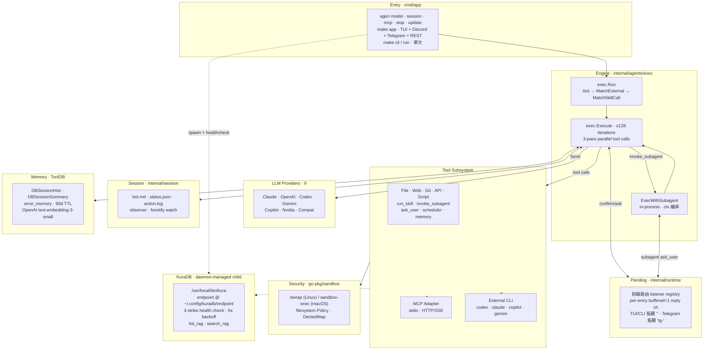

# 架構

> [English](Architecture.md)

Agenvoy 各部分的高階全景。模組級圖、sequence 流程、tool dispatch 狀態機請從本頁底部的主題頁連結進去。

## 概覽

## 分層

| 層 | Package | 職責 |
|---|---|---|
| Entry | `cmd/app` | argv 派發（`model` / `session` / `mcp` / `cli` / `run` / `stop` / `update`）；init env、sandbox、filesystem policy、MCP manager |
| Runtime singleton | `internal/runtime` | server 模式 UID lock；啟動時 SIGTERM 前一個 server |
| Engine | `internal/agents/exec` | 迭代迴圈；tool 派發；provider 路由 |
| Subagent | `internal/agents/subagent` | in-process 子 agent（不走 HTTP） |
| External agents | `internal/agents/external` | 一次性 subprocess wrapper（codex / claude / copilot / gemini） |
| Providers | `internal/agents/provider/<name>` | 統一 `Agent.Send()` 介面 |
| Tools | `internal/tools` + adapters | 內建／API／script／MCP tool 定義 |
| Sandbox | `go-pkg/sandbox` | OS-native 隔離，單一入口 `Wrap()` |
| Filesystem | `go-pkg/filesystem`（含 `reader/`）+ `internal/filesystem` | policy-aware 寫入；ToriiDB pathing |
| Session | `internal/session` | bot.md / status.json / action.log / fsnotify observer |
| Pending | `internal/runtime/pending.go` | 前綴路由 confirm/ask listener registry；各 runtime 透過 `RegisterListener(prefix)` 註冊、`PickNextFor(prefix)` 取對應條目 |
| Memory | ToriiDB（`DBSessionHist` / `DBSessionSummary` / `error_memory`） | 語意搜尋 + 90 天 TTL |
| Scheduler | `internal/runtime/scheduler.go`（+ `runtime.SchedulerWatcher` fsnotify） | scheduler skill 綁定 cron／one-shot；`{tasks,crons}.json` 變動熱重載 |
| KuraDB | `internal/runtime/kuradb/`（`kuradb.go` / `run.go`）+ `internal/runtime/kuradb/tool/` | RAG provider child process；daemon-managed spawn + 3-strike health check；endpoint 不存在時 per-turn 動態排除 tool。見 [KuraDB RAG](KuraDB-RAG.zh.md) |
| TUI | `internal/runtime/tui` | bubbletea inline-chat 前端；單一 package 設計 |

## 跨切原則

- **OS-native 沙箱優先於 Go 端 filter** —— 安全 policy 在 OS 邊界執行；新限制加進 `go-pkg/sandbox`，不加在 agenvoy caller
- **Prompt as policy** —— permission mode、敏感操作、system prompt 保護都在 `configs/prompts/`；加類別只動 prompt，不動引擎
- **Subagent in-process 優於 HTTP** —— `invoke_subagent` 直呼 `exec.Execute`，共享同一份 provider clients、sandbox、pending registry、memory 層；`AllowAll` 與 `WorkDir` 透過 ctx 傳遞
- **Read 工具 fan out、write 工具序列化** —— 併發是 opt-in，須同時「無副作用」+「上游允許併發」
- **每個關注點一層 config** —— providers 在 `configs/jsons/providors/`、MCP 在 `mcp.json`、persona 在 `bot.md`；tool 作者／使用者最多動一個檔
- **每個產物單一 source of truth** —— `~/.claude/CLAUDE.md` 鏡像至 Obsidian vault；skills 在 `~/.claude/skills/` 與 `extensions/skills/` 雙向同步

## TUI 設計決策

> 依據 pardn chiu 的理由：「bubbletea 的設計不適合切割成獨立模組相互引用，會搞得生命週期麻煩，我暫時沒心力處理」—— 此模組刻意不分割。

TUI 全部放在單一 package（`internal/runtime/tui`），**不拆 subpackage**。`internal/runtime/tui/` 底下所有檔案皆遵循此原則。

### 為什麼選 bubbletea（而不是 tview / tcell）

舊版 TUI 用 `rivo/tview`），更換原因：

- **Inline scrollback**：bubbletea 的 `tea.Println` 把字寫到終端原生的 scrollback buffer 並滾上去，與 shell 歷史共存。tview 整個畫面是它的，無法與 shell scrollback 並存。
- **lipgloss style 組合性**：邊框、padding、前後景組合乾淨，跨 component 重用方便。tview 的樣式是 tag-based，跨元件難複用。
- **bubbles 生態**：`textarea`、`spinner`、`cursor` 是直接可用的元件，視覺風格與整個 charm bracelet 一致。

代價是 bubbletea 本身是 [The Elm Architecture](https://guide.elm-lang.org/architecture/) 的 Go port —— `tea.Model` interface 設計上就是 monolithic。

### 為什麼單一 package

`tea.Model` 要求 `Update(tea.Msg) (tea.Model, tea.Cmd)` 是 model type 的 method。Method 必須跟 type 在同一 package。這造成：

- `Update` 的全部邏輯被綁在跟 model 同一 package
- 拆 sub-package 必須在第三個（root）package 寫 wrapper，並把 model 所有欄位都 export，讓 sub-package 能讀寫 state
- 目前 unexported 的型別如 `popupState`、`commandPickerState`、`viewMode` 全要變 export，等於對外開「假 API」（沒人會在 `internal/runtime/tui` 之外用）
- `send()` 與 `program atomic.Pointer[tea.Program]` 要嘛搬進 sub-package（root 用 setter 注入），要嘛留 root 但讓 handler 們 import root → 二次循環

真正 Go-style 的 TUI 應該是「每個 widget 獨立 package、自己持 state、自己渲染、自己處理事件」，bubbletea 退化成純 event loop。這個重構約 600–800 LOC、4 phase。對目前 ~1.1k LOC、單人維護的 TUI，收益不抵成本。

### 何時該重構

當以下任一條件成立，就改成 per-widget 子套件：

- TUI 超過 ~3k LOC，code review 經常卡在「這段該歸哪」
- 多人輪流動 TUI，互相踩 state
- 特定 widget 需要對 frozen state 寫獨立單元測試 —— 目前不建整個 `Model` 沒辦法測

## 延伸閱讀

| 主題 | 頁 |
|---|---|
| 迭代迴圈、三段式派發細節 | [核心概念](Core-Concepts.zh.md) |
| Provider 路由與 dispatcher | [Provider 設定](Providers.zh.md) |
| 工具 registry、擴展路徑 | [工具系統](Tools.zh.md) |
| 記憶層級與語意搜尋 | [記憶系統](Memory-System.zh.md) |
| 沙箱 policy、permission mode | [安全與沙箱](Security-and-Sandbox.zh.md) |
| MCP transport、生命週期 | [MCP 整合](MCP-Integration.zh.md) |
| KuraDB RAG 生命週期、healthcheck、`/kuradb` wizard | [KuraDB RAG](KuraDB-RAG.zh.md) |
| 架構規則與限制的真理來源 | [CLAUDE.md](https://github.com/pardnchiu/Agenvoy/blob/master/CLAUDE.md) |

***

> [!NOTE]
> 本文件由 Claude 讀取完整原始碼後自動生成。
