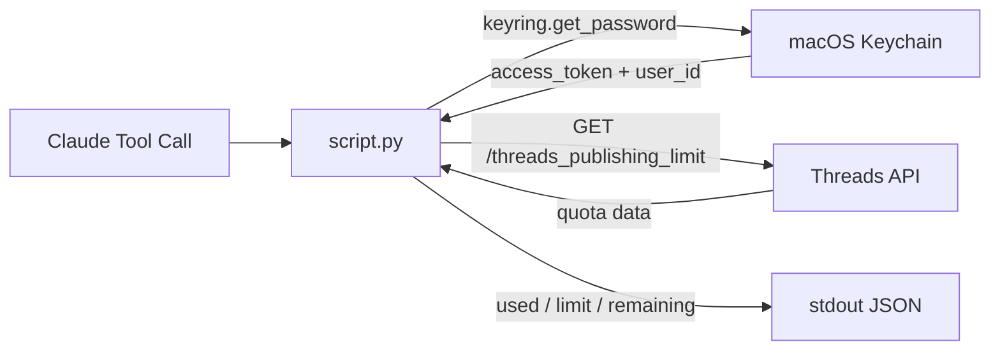

> [!NOTE]
> This README was generated by [SKILL](https://github.com/pardnchiu/skill-readme-generate). The project scripts were generated by [Claude Sonnet 4.6](https://www.anthropic.com/claude).

# threads-get-quota

> A Python Threads API extension with Keychain-based credential access, daily quota inspection, and token expiry signaling

## Table of Contents

- [Features](#features)
- [Architecture](#architecture)
- [File Structure](#file-structure)
- [License](#license)

## Features

### Keychain Credential Access

Reads `access_token` and `user_id` from macOS Keychain via `keyring` — no config files or environment variables required.

### Daily Quota Summary

Returns `used`, `limit`, `remaining`, and `window_seconds` in a single structured response, reflecting Threads' 250 posts/day cap.

### Token Expiry Signal

On HTTP error code 190, surfaces `token_expired: true` in the response so the caller can automatically trigger `threads-refresh-token` without manual intervention.

## Architecture



## File Structure

```
threads-get-quota/
├── script.py    # Main execution logic — stdin JSON in, stdout JSON out
├── tool.json    # Tool descriptor with parameter schema for Claude agent
└── LICENSE      # MIT License
```

## License

This project is licensed under the [MIT LICENSE](LICENSE).
