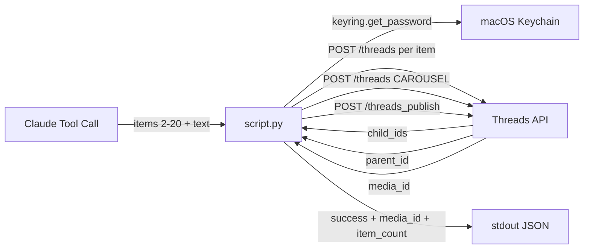

> [!NOTE]
> This README was generated by [SKILL](https://github.com/pardnchiu/skill-readme-generate). The project scripts were generated by [Claude Sonnet 4.6](https://www.anthropic.com/claude).

# threads-publish-carousel

> A Python Threads API extension with multi-item container pipeline, mixed media support, and per-item validation

## Table of Contents

- [Features](#features)
- [Architecture](#architecture)
- [File Structure](#file-structure)
- [License](#license)

## Features

### Multi-Item Container Pipeline

Creates individual child containers for each item (2–20), assembles them into a `CAROUSEL` parent container, then publishes — all in a single tool call.

### Mixed Media Support

Accepts `IMAGE` and `VIDEO` items in any combination within the same carousel, mapping each to the correct URL key (`image_url` / `video_url`) automatically.

### Per-Item Validation

Validates `media_type` and URL presence for every item before any API call, returning a precise index-scoped error on the first violation.

### Token Expiry Signal

On HTTP error code 190, surfaces `token_expired: true` so the caller can route to `threads-refresh-token` automatically.

## Architecture



## File Structure

```
threads-publish-carousel/
├── script.py    # Main execution logic — stdin JSON in, stdout JSON out
├── tool.json    # Tool descriptor with parameter schema for Claude agent
└── LICENSE      # MIT License
```

## License

This project is licensed under the [MIT LICENSE](LICENSE).
