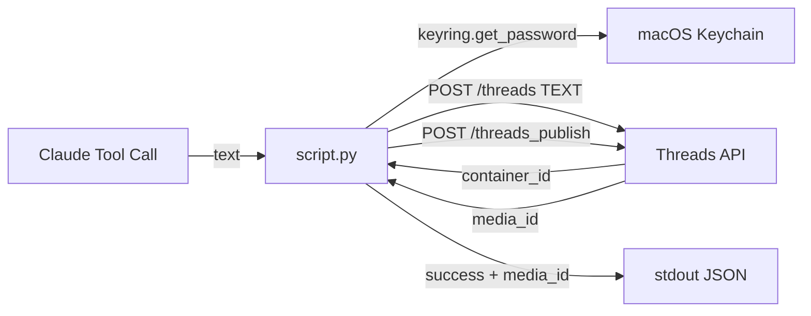

> [!NOTE]
> This README was generated by [SKILL](https://github.com/pardnchiu/skill-readme-generate). The project scripts were generated by [Claude Sonnet 4.6](https://www.anthropic.com/claude).

# threads-publish-text

> A Python Threads API extension with pre-publish validation, two-step container flow, and token expiry signaling

## Table of Contents

- [Features](#features)
- [Architecture](#architecture)
- [File Structure](#file-structure)
- [License](#license)

## Features

### Pre-Publish Validation

Enforces the 500-character limit locally before making any API call, returning a clear error immediately without consuming quota.

### Two-Step Publish Flow

Creates a `TEXT` media container first, then publishes it via a separate `threads_publish` call — matching Threads API's required sequence.

### Token Expiry Signal

On HTTP error code 190, surfaces `token_expired: true` so the caller can route to `threads-refresh-token` automatically.

### Keychain Credential Access

Reads `access_token` and `user_id` from macOS Keychain via `keyring` — no config files or environment variables required.

## Architecture



## File Structure

```
threads-publish-text/
├── script.py    # Main execution logic — stdin JSON in, stdout JSON out
├── tool.json    # Tool descriptor with parameter schema for Claude agent
└── LICENSE      # MIT License
```

## License

This project is licensed under the [MIT LICENSE](LICENSE).
