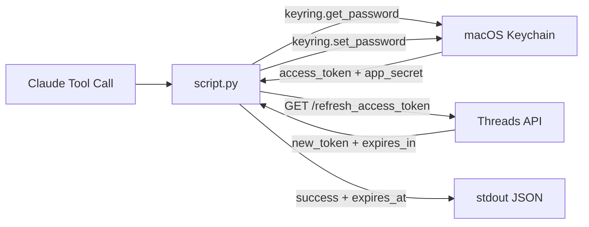

> [!NOTE]
> This README was generated by [SKILL](https://github.com/pardnchiu/skill-readme-generate). The project scripts were generated by [Claude Sonnet 4.6](https://www.anthropic.com/claude).

# threads-refresh-token

> A Python Threads API extension with automatic Keychain update, expiry timestamp reporting, and zero-config credential management

## Table of Contents

- [Features](#features)
- [Architecture](#architecture)
- [File Structure](#file-structure)
- [License](#license)

## Features

### Automatic Keychain Update

After a successful refresh, writes the new `access_token` back to macOS Keychain immediately — all downstream tools pick it up on their next call without any manual step.

### Keychain-Only Credentials

Reads both `access_token` and `app_secret` from macOS Keychain via `keyring`, keeping secrets out of environment variables and config files.

### Expiry Timestamp Reporting

Returns `expires_in` (seconds) and `expires_at` (Unix timestamp) so the caller can schedule the next refresh before the token lapses.

### Token Expiry Signal on Failure

If the refresh itself fails with HTTP 190, surfaces `token_expired: true` to indicate the current token is already dead and cannot be self-renewed.

## Architecture



## File Structure

```
threads-refresh-token/
├── script.py    # Main execution logic — stdin JSON in, stdout JSON out
├── tool.json    # Tool descriptor with parameter schema for Claude agent
└── LICENSE      # MIT License
```

## License

This project is licensed under the [MIT LICENSE](LICENSE).
