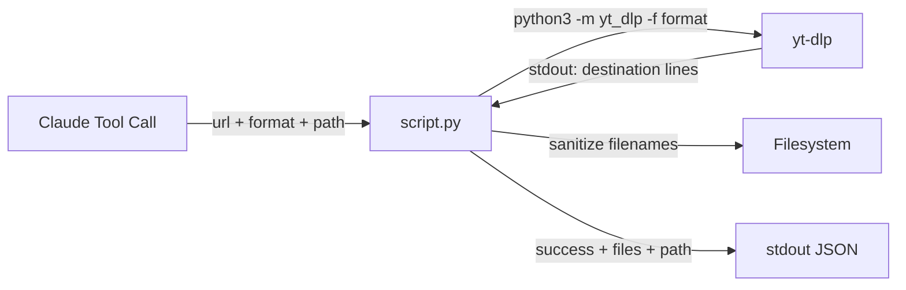

> [!NOTE]
> This README was generated by [SKILL](https://github.com/pardnchiu/skill-readme-generate). The project scripts were generated by [Claude Sonnet 4.6](https://www.anthropic.com/claude).

# yt-dlp-downloader

> A Python yt-dlp extension with Unicode filename sanitization, destination file tracking, and configurable format and path selection

## Table of Contents

- [Features](#features)
- [Architecture](#architecture)
- [File Structure](#file-structure)
- [License](#license)

## Features

### Unicode Filename Sanitization

Normalizes downloaded filenames to NFC and strips non-ASCII characters, preventing filesystem errors and shell incompatibilities caused by special characters in video titles.

### Destination File Tracking

Parses yt-dlp stdout to capture every output path — including post-processed files from merging or audio extraction — and returns them all in the response.

### Flexible Format Selection

Accepts any yt-dlp format string; defaults to best video + audio merged into MP4, with support for passing pre-resolved format strings from `yt-dlp-info`.

### Configurable Output Path and Template

Supports custom download directory and yt-dlp filename template, defaulting to `~/Downloads` and `%(title)s.%(ext)s`.

### 5-Minute Timeout Guard

Terminates the yt-dlp subprocess after 300 seconds and returns a structured error, preventing indefinitely stalled tool calls.

## Architecture



## File Structure

```
yt-dlp-downloader/
├── script.py    # Main execution logic — stdin JSON in, stdout JSON out
├── tool.json    # Tool descriptor with parameter schema for Claude agent
└── LICENSE      # MIT License
```

## License

This project is licensed under the [MIT LICENSE](LICENSE).
