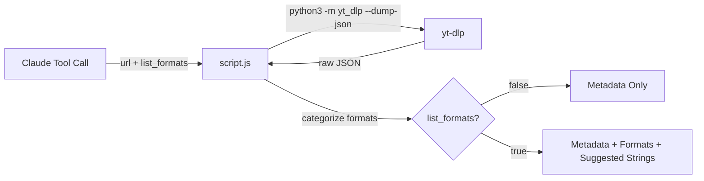

> [!NOTE]
> This README was generated by [SKILL](https://github.com/pardnchiu/skill-readme-generate), get the ZH version from [here](./doc/README.zh.md). The project scripts were generated by [Claude Sonnet 4.6](https://www.anthropic.com/claude).

# yt-dlp-info

> A Node.js yt-dlp extension with zero-download metadata inspection, smart format categorization, and recommended format string generation

## Table of Contents

- [Features](#features)
- [Architecture](#architecture)
- [File Structure](#file-structure)
- [License](#license)

## Features

> [Documentation](./doc/doc.md)

### Zero-Download Metadata Inspection

Retrieves complete video metadata using yt-dlp `--dump-json` without triggering any download — ideal for previewing before committing to a download.

### Smart Format Categorization

Automatically splits available formats into three groups — video-only, audio-only, and combined — making it straightforward to pick the right format for any use case.

### Recommended Format String Generation

Derives ready-to-use yt-dlp format strings for best quality, 1080p, 720p, and audio-only, so callers can pass them directly to a downloader without manual resolution lookup.

### Pre-Download Companion Design

Designed as the first step before calling yt-dlp-downloader: confirm what formats exist and which format string to use before any data transfer begins.

### Structured JSON Output

Returns a compact, predictable JSON object with title, channel, duration, view count, upload date, thumbnail URL, and extractor — ready for downstream processing or display.

## Architecture



## File Structure

```
yt-dlp-info/
├── script.js       # Main execution logic — stdin JSON in, stdout JSON out
├── tool.json       # Tool descriptor with parameter schema for Claude agent
└── LICENSE         # MIT License
```

## License

This project is licensed under the [MIT LICENSE](LICENSE).
