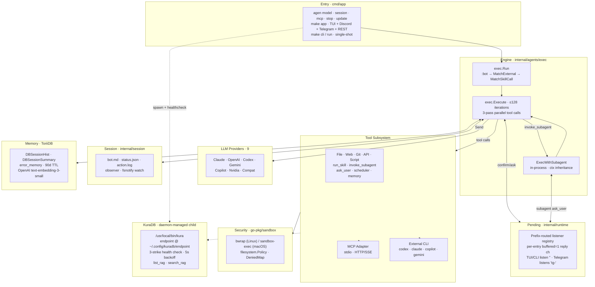

# Architecture

A high-level view of how Agenvoy fits together. For per-module diagrams, sequence flows, and the tool-dispatch state machine, jump into the topic-specific pages.

## Overview

## Layers

| Layer | Package | Responsibility |
|---|---|---|
| Entry | `cmd/app` | argv dispatch (`model` / `session` / `mcp` / `cli` / `run` / `stop` / `update`); init env, sandbox, filesystem policy, MCP manager |
| Runtime singleton | `internal/runtime` | server-mode UID lock; SIGTERM prior server on startup |
| Engine | `internal/agents/exec` | iteration loop; tool dispatch; provider routing |
| Subagent | `internal/agents/subagent` | in-process child agent (no HTTP) |
| External agents | `internal/agents/external` | one-shot subprocess wrappers (codex / claude / copilot / gemini) |
| Providers | `internal/agents/provider/<name>` | unified `Agent.Send()` interface |
| Tools | `internal/tools` + adapters | built-in / API / script / MCP tool definitions |
| Sandbox | `go-pkg/sandbox` | OS-native isolation, single entry `Wrap()` |
| Filesystem | `go-pkg/filesystem` (+ `reader/`) + `internal/filesystem` | policy-aware writes; ToriiDB pathing |
| Session | `internal/session` | bot.md / status.json / action.log / fsnotify observer |
| Pending | `internal/runtime/pending.go` | prefix-routed confirm/ask listener registry; per-runtime listener via `RegisterListener(prefix)`, claim via `PickNextFor(prefix)` |
| Memory | ToriiDB (`DBSessionHist` / `DBSessionSummary` / `error_memory`) + go-sqlkit (SQLite FTS5 archive) | semantic search + 90-day TTL + full-text persistent archive |
| Scheduler | `internal/runtime/scheduler.go` (+ `runtime.SchedulerWatcher` fsnotify) | cron / one-shot tasks bound to scheduler skills; hot-reload on `{tasks,crons}.json` change |
| KuraDB | `internal/runtime/kuradb/` (`kuradb.go` / `run.go`) + `internal/runtime/kuradb/tool/` | RAG provider child process; daemon-managed spawn + 3-strike health check; per-turn dynamic tool exclusion when endpoint missing |
| TUI | `internal/runtime/tui` | bubbletea inline-chat front-end; single-package by design |

## Cross-cutting principles

- **OS-native sandbox over Go-side filters** — security policy is enforced at the OS boundary; new restrictions go into `go-pkg/sandbox`, not into agenvoy callers
- **Prompt as policy** — permission mode, sensitive operations, and system-prompt protection live in `configs/prompts/`; adding a category means editing the prompt, not the engine
- **In-process over HTTP for subagents** — `invoke_subagent` calls `exec.Execute` directly, sharing the same provider clients, sandbox, pending registry, and memory layer; `AllowAll` and `WorkDir` flow through ctx
- **Read tools fan out, write tools serialize** — concurrency is opt-in and requires both "no side effects" and "upstream allows parallelism"
- **One config layer per concern** — provider credentials in OS keychain, registered models in `config.json`, MCP in `mcp.json`, persona in `bot.md`; each tool author / user touches at most one file
- **Single source of truth per artifact** — `~/.claude/CLAUDE.md` mirrors to the global Obsidian vault; skills mirror between `~/.claude/skills/` and `extensions/skills/`

## TUI design choices

> Per pardn chiu: *"bubbletea isn't designed to be split into separate modules that reference each other — splitting it would make the lifecycle a mess. I don't have the bandwidth to handle it right now."* This module is intentionally kept undivided.

The TUI lives in a single package (`internal/runtime/tui`) and is **not** split into subpackages. Every file under `internal/runtime/tui/` follows this principle.

### Why bubbletea (not tview / tcell)

The previous TUI used `rivo/tview`. It was replaced because:

- **Inline scrollback**: bubbletea's `tea.Println` writes lines that scroll into the terminal's native buffer above the input box. tview owns the entire screen and can't co-exist with shell scrollback.
- **lipgloss styling primitives**: borders, padding, foreground/background composition compose cleanly. tview styles are tag-based and harder to reuse across components.
- **bubbles ecosystem**: `textarea`, `spinner`, `cursor` are drop-in components that match the rest of the charm-bracelet style.

The cost is that bubbletea is a Go port of [The Elm Architecture](https://guide.elm-lang.org/architecture/) — its `tea.Model` interface is monolithic by design.

### Why a single package

`tea.Model` requires `Update(tea.Msg) (tea.Model, tea.Cmd)` to be a method on the model type. Methods must live in the same package as the type. This forces:

- All `Update` logic in the same package as the model
- Splitting into subpackages requires a wrapper in a third (root) package, plus exporting **every** model field so the sub-packages can read/write state
- Currently `unexported` types like `popupState`, `commandPickerState`, `viewMode` would have to become exported, creating an "API" that no one outside `internal/runtime/tui` will ever consume
- `send()` and `program atomic.Pointer[tea.Program]` either move into a sub-package (root sets via setter API) or stay in root and force handlers to import root, which creates a second cycle

A real Go-style TUI would build per-domain widget packages (each owning its state struct, render method, and event handler) with bubbletea acting only as event loop. That refactor is a 600-800 LOC rewrite split into 4 phases. For the current ~1.1k LOC TUI maintained by one developer, the gain doesn't justify the cost.

### When to revisit

Switch to per-domain widget packages when **any one** of:

- TUI exceeds ~3k LOC and code review keeps stalling on "where does this belong"
- Multiple developers regularly touch the TUI and step on each other's state
- Specific widgets need independent unit tests against frozen state — currently impossible without instantiating the whole `Model`

***

> [!NOTE]
> This document was auto-generated by Claude after reading the full source code.
